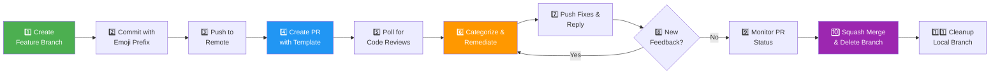

This page introduces the **tupacalypse187-claude-skills** repository — a collection of plugins and tools that extend [Claude Code](https://claude.com/claude-code) with automated git workflow capabilities. The centerpiece is a plugin called **git-workflow** that orchestrates the entire feature development lifecycle — from branch creation through commit, pull request, code review remediation, merge, and cleanup — all triggered by natural language or slash commands. You'll learn what the project does, why it exists, how its pieces fit together, and where to go next.

Sources: [README.md](README.md#L1-L7), [CLAUDE.md](CLAUDE.md#L5-L8)

---

## The Problem It Solves

Every developer who uses pull requests knows the ritual: create a branch, stage files, write a commit message, push, open a PR with a decent description, wait for CI, address review feedback, push again, wait for CI again, merge, and clean up branches. Each step is simple in isolation, but together they form a repetitive, error-prone sequence that interrupts actual coding. Forgetting the `Co-authored-by` trailer, using inconsistent commit message formats, or neglecting to delete stale branches are common small mistakes that compound over time.

This project solves that problem by encoding the **entire PR lifecycle into a Claude Code plugin** — a set of markdown-based instructions that Claude reads and executes on your behalf. You describe what you want in plain English (or use a slash command), and Claude carries out the multi-step workflow consistently, every time. There is no compiled code, no runtime dependencies beyond `git` and the GitHub CLI (`gh`). The plugin is pure documentation that teaches Claude Code how to be a disciplined collaborator.

Sources: [CLAUDE.md](CLAUDE.md#L5-L8), [git-workflow-local/README.md](git-workflow-local/README.md#L1-L4)

---

## How It Works — The Big Picture

At a high level, the git-workflow plugin defines an **11-step pipeline** that runs inside your Claude Code session. Each step is a discrete git or GitHub CLI operation, and the pipeline is designed to run from start to finish without manual intervention.

The diagram below shows the full lifecycle. You can enter at any stage using natural language or a slash command, or invoke the complete flow end-to-end.



**Key idea:** Steps 5–8 form a *remediation loop*. Claude waits for reviews, fixes issues, replies to every comment, and checks again — up to 5 iterations — before proceeding to merge. This loop is what makes the plugin genuinely useful for team workflows: it doesn't just create a PR and stop, it shepherds the PR through review to completion.

Sources: [git-workflow-local/skills/git-workflow/SKILL.md](git-workflow-local/skills/git-workflow/SKILL.md#L12-L28)

---

## Project Structure

The repository is intentionally flat and minimal. There is no build system, no `node_modules`, and no compiled output. Every component is a markdown file that Claude Code interprets as an instruction set.

```
.
├── .claude-plugin/
│   └── marketplace.json              # Marketplace listing (plugin registry entry)
├── CLAUDE.md                         # Repository-level guidance for Claude Code
├── README.md                         # Human-facing repository overview
├── eng.traineddata                   # OCR training data (utility file)
├── pr-monitor-merge.sh               # Standalone bash script for PR polling/auto-merge
│
└── git-workflow-local/               # 📦 The plugin directory
    ├── .claude-plugin/
    │   └── plugin.json               # Plugin identity & metadata (version, author, keywords)
    ├── commands/                     # Slash command definitions (user-facing entry points)
    │   ├── gw-flow.md                #   /gw-flow   → full 6-step workflow
    │   ├── gw-branch.md              #   /gw-branch → create feature branch
    │   ├── gw-commit.md              #   /gw-commit → emoji conventional commit
    │   ├── gw-pr.md                  #   /gw-pr     → create PR with template
    │   ├── gw-remediate.md           #   /gw-remediate → poll & fix review comments
    │   └── gw-merge.md               #   /gw-merge  → monitor checks & squash merge
    └── skills/
        └── git-workflow/
            └── SKILL.md              # Complete 11-step skill definition (the "brain")
```

The **dual-layer architecture** is worth noting: `commands/` provides concise, action-oriented slash commands (6 steps each), while `skills/git-workflow/SKILL.md` provides the exhaustive 11-step reference with all edge cases, troubleshooting, and examples. When you type `/gw-flow`, Claude reads the command file; when you use natural language like "complete git workflow for adding dark mode," Claude consults the skill definition.

Sources: [CLAUDE.md](CLAUDE.md#L9-L29), [README.md](README.md#L1-L42)

---

## Key Features at a Glance

| Feature | What It Does | Why It Matters |
|---------|-------------|----------------|
| **Natural Language Triggers** | Describe what you want in plain English; Claude interprets and executes | No memorization of commands — just talk to Claude |
| **6 Slash Commands** | `/gw-flow`, `/gw-branch`, `/gw-commit`, `/gw-pr`, `/gw-remediate`, `/gw-merge` | Quick access for repeatable operations |
| **Emoji Conventional Commits** | 11 commit types, each with a unique emoji prefix (e.g., `✨ feat:`, `🐛 fix:`) | Consistent, scannable git history |
| **Structured PR Templates** | Auto-generated PR bodies with Summary, Changes, Verification, and Sources sections | Professional PRs with real diff-derived content — no placeholders |
| **Review Remediation Loop** | Polls for review comments, categorizes them, fixes code, replies, and re-checks (up to 5 rounds) | Handles the most tedious part of the PR process automatically |
| **PR Status Monitoring** | Polls `mergeStateStatus` every 10 seconds, up to 10 minutes | Waits for CI to go from `UNSTABLE` → `CLEAN` without babysitting |
| **Squash Merge + Cleanup** | Merges with `--squash --delete-branch`, then deletes the local branch | Keeps the default branch history linear and tidy |
| **Standalone Script** | `pr-monitor-merge.sh` works outside Claude Code with just `gh` and `git` | Useful for CI pipelines or terminal-only environments |
| **Co-authored-by Attribution** | AI-assisted commits include `Co-authored-by: Claude <noreply@anthropic.com>` | Transparent AI collaboration tracking |
| **Version Bumping** | Plugin version increments in both `marketplace.json` and `plugin.json` before push | Semantic versioning for the plugin itself |

Sources: [git-workflow-local/README.md](git-workflow-local/README.md#L137-L148), [git-workflow-local/skills/git-workflow/SKILL.md](git-workflow-local/skills/git-workflow/SKILL.md#L86-L99), [CLAUDE.md](CLAUDE.md#L32-L38), [pr-monitor-merge.sh](pr-monitor-merge.sh#L1-L7)

---

## Who Is This For?

This project is for any developer who uses **Claude Code** and works with **GitHub pull requests**. It's especially valuable if you:

- Work on feature branches and want a consistent, repeatable workflow
- Collaborate with AI assistants and want co-authored commits to be transparent
- Find yourself writing the same commit message format, PR template, and review response patterns every day
- Want to reduce the cognitive overhead of the PR lifecycle so you can focus on writing code

The plugin requires no programming to install or use. It works with any repository that uses GitHub as its remote and has the GitHub CLI (`gh`) authenticated. If you can run `git push` and `gh pr create` in your terminal, you can use this plugin.

Sources: [README.md](README.md#L11-L24), [git-workflow-local/README.md](git-workflow-local/README.md#L7-L15)

---

## Two Entry Points: Plugin vs. Script

The project offers two distinct ways to automate PR workflows, each suited to a different context:

| Aspect | Claude Code Plugin | Standalone Script |
|--------|--------------------|--------------------|
| **Entry point** | Natural language or `/gw-*` commands | `./pr-monitor-merge.sh <PR_NUMBER>` |
| **Scope** | Full 11-step lifecycle | Steps 9–11 only (monitor, merge, cleanup) |
| **Review handling** | Automatic categorization, code fixes, replies | None (expects reviews already resolved) |
| **Dependencies** | Claude Code + `git` + `gh` | `bash` + `git` + `gh` only |
| **Best for** | Interactive development inside Claude Code | CI pipelines, scripts, terminal-only workflows |

The plugin is the primary tool; the script is a lightweight companion for situations where Claude Code isn't available.

Sources: [git-workflow-local/commands/gw-flow.md](git-workflow-local/commands/gw-flow.md#L1-L7), [pr-monitor-merge.sh](pr-monitor-merge.sh#L1-L6)

---

## Reading Guide — Where to Go Next

Now that you understand what the project does and why it exists, here is the recommended path through the documentation:

1. **[Quick Start: Installing and Using the Git Workflow Plugin](2-quick-start-installing-and-using-the-git-workflow-plugin)** — Install the plugin and run your first workflow in under 5 minutes.
2. **[Triggering Workflows with Natural Language](3-triggering-workflows-with-natural-language)** — Learn the natural language phrases that trigger each workflow stage.
3. **[Slash Commands Quick Reference](4-slash-commands-quick-reference)** — A concise lookup table for all six `/gw-*` commands with their arguments and examples.

Once you're comfortable with the basics, the **Deep Dive** section covers the architecture, each workflow step in detail, the standalone script, troubleshooting, and more — starting with [Repository Architecture and Plugin Structure](5-repository-architecture-and-plugin-structure).