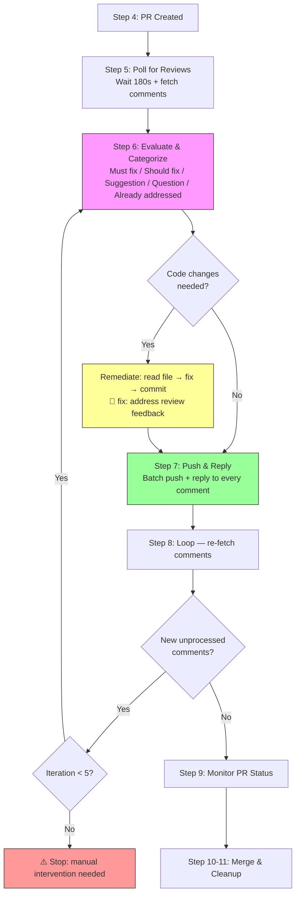
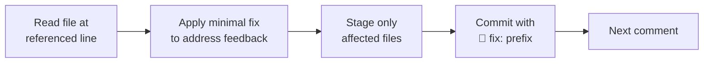
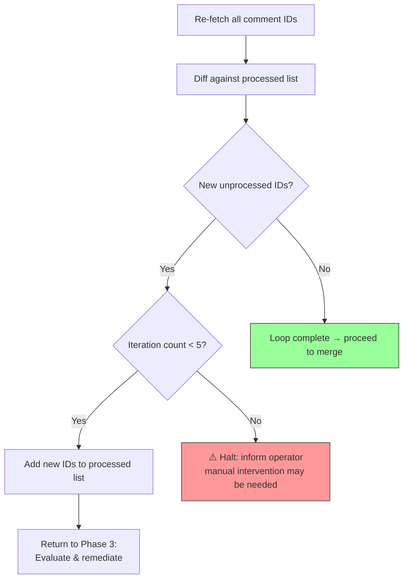

The review remediation phase is the critical bridge between PR submission and merge — it transforms passive code submission into an active feedback loop. This page covers the `/gw-remediate` command's **seven-phase lifecycle**: waiting for reviews, fetching structured comment data, triaging feedback into five severity categories, applying minimal targeted fixes, pushing batched commits with emoji conventions, replying to every reviewer comment with commit hash attribution, and iterating up to five rounds until the PR reaches a clean state. Understanding this cycle is essential for maintaining reviewer trust and keeping PR throughput high.

Sources: [gw-remediate.md](git-workflow-local/commands/gw-remediate.md#L1-L10), [SKILL.md](git-workflow-local/skills/git-workflow/SKILL.md#L249-L258)

## Where Remediation Fits in the 11-Step Workflow

Review remediation occupies **Steps 5–8** of the full git-workflow skill. It activates automatically after PR creation when invoked through `/gw-flow`, or independently via `/gw-remediate` when you need to address feedback on an existing PR. The remediation loop is mandatory — the `/gw-flow` command enforces sequential execution of all steps and explicitly warns operators not to stop after PR creation.

The following diagram shows the remediation phases in context of the broader workflow:



Sources: [SKILL.md](git-workflow-local/skills/git-workflow/SKILL.md#L14-L27), [gw-flow.md](git-workflow-local/commands/gw-flow.md#L108-L172)

## Invoking the Remediation Command

The `/gw-remediate` command can be triggered in two ways: as an automatic step within `/gw-flow` (Step 5), or as a standalone invocation when you need to re-engage with review feedback on an already-open PR. The standalone command accepts two arguments — a required PR number and an optional `wait_seconds` parameter that defaults to 180 seconds.

| Invocation Method | Trigger | Use Case |
|---|---|---|
| `/gw-flow <description>` | Automatic, Step 5 of 6 | New feature/fix going through the full pipeline |
| `/gw-remediate <pr_number>` | Direct slash command | Existing PR that received new review feedback |
| `/gw-remediate <pr_number> <seconds>` | Direct with custom wait | Adjusting poll delay for slow reviewers |
| Natural language | "Fix review comments on PR #123" | Skill-based triggering via SKILL.md matching |

Sources: [gw-remediate.md](git-workflow-local/commands/gw-remediate.md#L1-L10), [SKILL.md](git-workflow-local/skills/git-workflow/SKILL.md#L48-L52)

## Phase 1: Wait for Reviews

After PR creation, the workflow enters a deliberate **180-second sleep** to allow reviewers time to read and comment on the changes. This configurable delay prevents premature polling — fetching comments before reviewers have had a chance to provide feedback would result in an empty comment set and a false "all clear" signal. The countdown is displayed to the operator to maintain visibility into the wait state.

```bash
echo "⏳ Waiting ${WAIT_SECONDS:-180} seconds for code reviews to complete..."
sleep ${WAIT_SECONDS:-180}
```

The default 180-second window balances two competing concerns: giving reviewers adequate time to compose thoughtful inline comments, while keeping the overall PR cycle time low. For teams with known slow review cadences, the `wait_seconds` argument can be increased. For rapid review cycles (e.g., pair programming follow-ups), a shorter delay keeps the pipeline moving.

Sources: [gw-remediate.md](git-workflow-local/commands/gw-remediate.md#L18-L27), [SKILL.md](git-workflow-local/skills/git-workflow/SKILL.md#L249-L256)

## Phase 2: Fetch Review Comments

Once the wait period elapses, the system fetches three distinct data streams from the GitHub API. Each stream serves a specific purpose in the evaluation phase. The key architectural decision here is **filtering out reply threads** — by selecting only comments where `in_reply_to_id == null`, the system isolates original reviewer observations from follow-up discussion, ensuring each feedback point is processed exactly once.

| API Call | Purpose | Key Fields Extracted |
|---|---|---|
| `pulls/$PR_NUMBER/comments` | Inline code-level review comments | `id`, `path`, `line`, `body` |
| `issues/$PR_NUMBER/comments` | General PR-level comments | `id`, `body` |
| `pr view $PR_NUMBER --json reviews` | Review state (APPROVED/CHANGES_REQUESTED) | `state`, `body`, `author` |

The inline comments endpoint returns comments anchored to specific file paths and line numbers — these are the primary targets for code remediation. The issue comments endpoint captures general discussion that may or may not require code changes. The review state endpoint provides the overall disposition (APPROVED, CHANGES_REQUESTED, COMMENTED, PENDING) which influences whether the PR can proceed after fixes.

**Critical implementation detail**: An empty list of processed comment IDs is initialized at this point. This list is the deduplication mechanism that prevents the remediation loop from re-processing the same feedback in subsequent iterations.

```bash
# Resolve the repo slug (e.g. "owner/repo")
REPO_SLUG=$(gh repo view --json nameWithOwner --jq '.nameWithOwner')

# Inline code-level review comments (originals only, not replies)
gh api repos/$REPO_SLUG/pulls/$PR_NUMBER/comments \
  --jq '.[] | select(.in_reply_to_id == null) | {id: .id, path: .path, line: .line, body: .body}'

# General PR comments
gh api repos/$REPO_SLUG/issues/$PR_NUMBER/comments --jq '.[] | {id: .id, body: .body}'

# Review state
gh pr view $PR_NUMBER --json reviews --jq '.reviews[] | {state: .state, body: .body, author: .author.login}'
```

Sources: [gw-remediate.md](git-workflow-local/commands/gw-remediate.md#L29-L50), [SKILL.md](git-workflow-local/skills/git-workflow/SKILL.md#L258-L278)

## Phase 3: Evaluate and Categorize Feedback

Each fetched comment passes through a **five-category triage system** that determines the appropriate response strategy. This categorization is the decision engine of the remediation loop — it prevents overreaction to stylistic suggestions while ensuring critical bugs receive immediate attention.

| Category | Severity | Action Required | Typical Examples |
|---|---|---|---|
| **Must fix** | Critical | Code change required | Bugs, security vulnerabilities, logic errors, broken tests |
| **Should fix** | High | Code change recommended | Code style violations, poor naming, missing error handling, performance issues |
| **Suggestion** | Low | Apply judgment | Alternative approaches, nicer patterns, optional improvements |
| **Question** | Info | Reply only, no code change | Reviewer asking for clarification on intent or design decisions |
| **Already addressed** | None | Reply only | Comment refers to code that was already fixed in a prior commit |

The evaluation process for each comment follows a strict three-step protocol: (1) read the comment body to understand the reviewer's intent, (2) map the feedback to one of the five categories above, and (3) determine whether the response requires a code change or just a textual reply. This triage ensures that the remediation engine produces the minimal set of changes needed to satisfy all reviewer concerns — nothing more, nothing less.

Sources: [gw-remediate.md](git-workflow-local/commands/gw-remediate.md#L52-L63), [SKILL.md](git-workflow-local/skills/git-workflow/SKILL.md#L282-L293)

## Phase 4: Remediate Code

For every comment categorized as requiring code changes, the system executes a focused remediation cycle. The guiding principle is **minimal targeted intervention** — fix exactly what was requested without refactoring surrounding code, bundling unrelated changes, or making speculative improvements. Each fix follows a disciplined sequence:



Each code fix produces its own commit with the `🐛 fix:` emoji prefix and a description referencing the review nature of the change. The commit message format is fixed: `🐛 fix: address review feedback - <brief description>`. This convention makes review-fix commits immediately identifiable in the git log, distinguishing them from original feature work.

| Review Comment Type | Expected Commit Type | Emoji Commit Example |
|---|---|---|
| Code style issue | `style` | `🎨 style: fix indentation in auth handler` |
| Bug report | `fix` | `🐛 fix: address review feedback - null check for user input` |
| Missing tests | `test` | `✅ test: add edge case coverage for parser` |
| Documentation gap | `docs` | `📝 docs: clarify return type in JSDoc` |
| Performance concern | `perf` | `⚡️ perf: replace linear scan with hashmap lookup` |
| Refactoring request | `refactor` | `♻️ refactor: extract validation into helper function` |

**One commit per logical fix** is the cardinal rule — unrelated review fixes must never be bundled into a single commit. However, all fix commits are accumulated and pushed in a single batch operation (Phase 5) to avoid spamming CI pipelines.

```bash
# For each comment requiring changes:
git add <changed-files>
git commit -m "🐛 fix: address review feedback - <brief description>"
```

Sources: [gw-remediate.md](git-workflow-local/commands/gw-remediate.md#L65-L79), [SKILL.md](git-workflow-local/skills/git-workflow/SKILL.md#L294-L308), [gw-flow.md](git-workflow-local/commands/gw-flow.md#L138-L149)

## Phase 5: Push and Reply to Every Comment

After all fix commits are staged locally, the system performs a **single batch push** and then replies to every comment — both the ones that received code fixes and the ones that only needed acknowledgment. This two-part operation is atomic from the reviewer's perspective: they see both the code changes and the explanatory replies appear simultaneously.

The push step is conditional: **if no code changes were needed** (all comments were questions, suggestions, or already-addressed items), the push is skipped entirely. This prevents unnecessary CI triggers on no-op cycles.

```bash
# Push only if changes exist
git push

# Compute the fix hash for reply attribution
FIX_HASH=$(git rev-parse --short HEAD)
```

The reply protocol uses three distinct formats, each designed for a specific response category:

| Reply Type | Format | When Used |
|---|---|---|
| **Fix applied** | `✅ Fixed in <short_hash> — <what was changed>` | Code was modified to address the comment |
| **Question answered** | `💡 <answer to the question>` | Reviewer asked for clarification, no code change |
| **Suggestion declined** | `🙏 Good suggestion, but <reason>. Happy to revisit if needed.` | Suggestion was acknowledged but not applied |

Replying to inline review comments uses the GitHub Pull Request Review Comments API with `in_reply_to` threading, which correctly nests the reply under the original comment. General PR comments use the Issues Comments API, which creates a new top-level comment (a GitHub API limitation — the Issues API does not support threaded replies).

```bash
# Reply to inline review comment (threaded reply)
gh api repos/$REPO_SLUG/pulls/$PR_NUMBER/comments \
  --method POST \
  --field body="✅ Fixed in $FIX_HASH. <describe what was actually changed>" \
  --field in_reply_to=$COMMENT_ID

# Reply to general PR comment (new top-level comment)
gh api repos/$REPO_SLUG/issues/$PR_NUMBER/comments \
  --method POST \
  --field body="✅ Addressed in $FIX_HASH. <describe what was actually changed>"
```

**Every comment must receive a reply** — unacknowledged review feedback erodes reviewer trust and leaves the PR in an ambiguous state. The `in_reply_to=$COMMENT_ID` field uses the literal numeric ID captured during Phase 2, ensuring replies land in the correct thread.

Sources: [gw-remediate.md](git-workflow-local/commands/gw-remediate.md#L81-L116), [SKILL.md](git-workflow-local/skills/git-workflow/SKILL.md#L312-L343)

## Phase 6: Re-monitor PR Status

After fixes are pushed, the system enters a **CI monitoring loop** that polls the PR's `mergeStateStatus` every 10 seconds for up to 60 iterations (approximately 10 minutes). This is not a passive wait — each poll checks whether all CI checks have transitioned to a passing state on the new commits.

The `mergeStateStatus` field in the GitHub API reports one of several states, and the remediation loop specifically watches for the transition to `CLEAN`:

| Status | Meaning | Remediation Action |
|---|---|---|
| `UNKNOWN` | Status not yet determined | Continue polling |
| `UNSTABLE` | Checks have not passed yet | Continue polling |
| `BEHIND` | Branch is behind base branch | May require rebase (see [Troubleshooting](16-troubleshooting-merge-conflicts-behind-branch-hook-failures)) |
| `BLOCKED` | Blocked by failing checks | Investigate CI failures |
| `DIRTY` | Merge conflict detected | Resolve conflicts (see [Troubleshooting](16-troubleshooting-merge-conflicts-behind-branch-hook-failures)) |
| `DRAFT` | PR is in draft state | Requires manual action |
| `CLEAN` | All checks passed | Proceed to merge evaluation |

```bash
for i in {1..60}; do
  pr_status=$(gh pr view $PR_NUMBER --json mergeStateStatus --jq '.mergeStateStatus')
  if [ "$pr_status" = "CLEAN" ]; then
    echo "✅ All checks passed after remediation!"
    break
  fi
  echo "⏳ Waiting for checks... ($i/60) - status: $pr_status"
  sleep 10
done
```

Once checks pass, the system checks whether the PR requires re-approval after the push (some repository branch protection rules dismiss approvals on new pushes). If both conditions are met — checks green and approval present — the workflow offers to proceed to merge.

Sources: [gw-remediate.md](git-workflow-local/commands/gw-remediate.md#L118-L136), [SKILL.md](git-workflow-local/skills/git-workflow/SKILL.md#L372-L403)

## Phase 7: The Iteration Loop

The defining characteristic of this remediation system is its **closed-loop feedback architecture**. After pushing fixes and monitoring CI, the system re-fetches all review comments and compares the returned IDs against the processed list maintained since Phase 2. Any comment ID not present in the processed list represents new feedback — either a follow-up observation on the original code or a response to the remediation commits themselves.



The **maximum iteration cap of 5** is a safeguard against infinite loops. In pathological scenarios — such as a reviewer who continuously finds new issues with each fix round — the system halts after five complete remediation cycles and informs the operator that manual intervention may be required. This prevents automated workflows from running indefinitely while still accommodating the common case of 1–2 rounds of follow-up feedback.

```bash
# Re-fetch to detect new comments (compare against previously seen IDs)
gh api repos/$REPO_SLUG/pulls/$PR_NUMBER/comments \
  --jq '.[] | select(.in_reply_to_id == null) | .id'
```

The processed-ID tracking protocol works as follows: (1) initialize an empty list before Phase 3 begins, (2) append each comment's numeric `id` to the list as it is processed, (3) on re-fetch in Phase 7, compute the set difference between new IDs and processed IDs, (4) only process IDs that appear in the new set but not in the processed set.

Sources: [gw-remediate.md](git-workflow-local/commands/gw-remediate.md#L138-L158), [SKILL.md](git-workflow-local/skills/git-workflow/SKILL.md#L347-L368)

## Operational Rules and Constraints

The remediation system operates under eight strict rules that preserve both code quality and reviewer relationships. These rules are non-negotiable constraints enforced by the command specification.

| Rule | Rationale |
|---|---|
| **Always reply to every comment** | Unacknowledged feedback erodes reviewer trust; every comment gets a response |
| **Make minimal changes** | Fix exactly what was requested — no speculative improvements or drive-by refactoring |
| **One commit per logical fix** | Unrelated review fixes must not be bundled; each gets its own commit |
| **Preserve existing functionality** | Do not refactor surrounding code unless the reviewer explicitly requested it |
| **Batch push after all fixes** | Accumulate fix commits locally, push once to avoid spamming CI pipelines |
| **Don't push if no changes needed** | If all comments are questions or already-addressed, skip the push entirely |
| **Respect reviewer intent** | When feedback is ambiguous, ask for clarification rather than guessing |
| **Maximum 5 iterations** | Hard stop after 5 remediation rounds; escalate to manual intervention |

Sources: [gw-remediate.md](git-workflow-local/commands/gw-remediate.md#L159-L168), [SKILL.md](git-workflow-local/skills/git-workflow/SKILL.md#L551-L560)

## GitHub API Endpoints Used

The remediation command relies on three distinct GitHub API endpoints, each serving a specific role in the comment lifecycle. Understanding the API surface area helps with troubleshooting and extending the system.

| Endpoint | HTTP Method | Purpose | Key Parameters |
|---|---|---|---|
| `repos/{owner}/{repo}/pulls/{pr_number}/comments` | `GET` | Fetch inline code review comments | Filters `in_reply_to_id == null` for originals |
| `repos/{owner}/{repo}/issues/{pr_number}/comments` | `GET` | Fetch general PR-level comments | Returns all issue comments |
| `repos/{owner}/{repo}/pulls/{pr_number}/comments` | `POST` | Reply to inline review comment | `in_reply_to=<id>` for threading |
| `repos/{owner}/{repo}/issues/{pr_number}/comments` | `POST` | Reply to general PR comment | Creates new top-level comment (API limitation) |
| `gh pr view {pr} --json reviews` | — | Get review state and approval status | Returns `state`, `body`, `author` per review |
| `gh pr view {pr} --json mergeStateStatus` | — | Poll CI check status | Returns one of: CLEAN, UNSTABLE, BLOCKED, etc. |

Sources: [gw-remediate.md](git-workflow-local/commands/gw-remediate.md#L36-L48), [gw-remediate.md](git-workflow-local/commands/gw-remediate.md#L99-L110), [SKILL.md](git-workflow-local/skills/git-workflow/SKILL.md#L258-L278)

## Next Steps

Once the remediation loop converges — all comments addressed, all checks passing, no new feedback — the PR is ready for the final phases of the pipeline:

- **[PR Status Monitoring and Automated Merge](11-pr-status-monitoring-and-automated-merge)** — Details on the monitoring loop, squash merge strategy, and branch protection interaction
- **[Post-Merge Branch Cleanup](12-post-merge-branch-cleanup)** — Local and remote branch deletion after a successful merge
- **[Troubleshooting: Merge Conflicts, Behind Branch, Hook Failures](16-troubleshooting-merge-conflicts-behind-branch-hook-failures)** — Resolving common issues that arise during remediation (behind base branch, merge conflicts, failed CI checks)