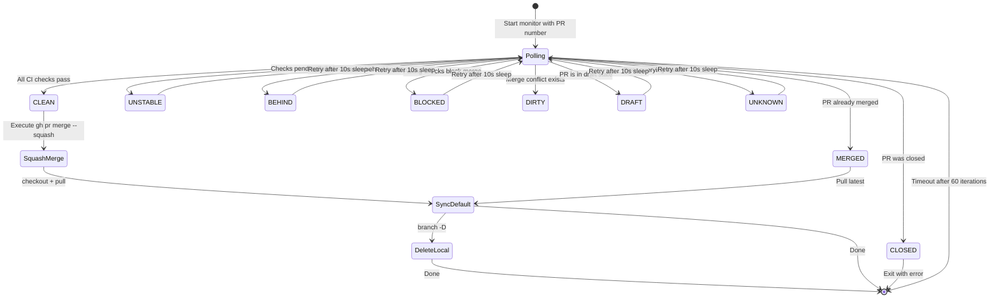

Once review remediation is complete, the workflow transitions into a **polling-based status monitor** that watches GitHub's `mergeStateStatus` field until CI checks converge to a mergeable state, then executes a squash merge with automatic branch cleanup. This stage is triggered by the `/gw-merge` slash command, embedded as Step 6 of the `/gw-flow` full-pipeline command, and also available as the standalone [pr-monitor-merge.sh](pr-monitor-merge.sh) script. The monitoring loop is deliberately self-contained — it requires only a PR number and an optional commit subject, making it usable both inside the automated pipeline and as an ad-hoc tool invoked from the terminal.

Sources: [gw-merge.md](git-workflow-local/commands/gw-merge.md#L1-L10), [SKILL.md](git-workflow-local/skills/git-workflow/SKILL.md#L24-L28)

## The Monitoring State Machine

GitHub exposes the `mergeStateStatus` field on every pull request, and this workflow polls it at a fixed 10-second interval for up to 60 iterations (a 10-minute ceiling). Each poll result maps to one of nine discrete states that drive the control flow of the monitor. Understanding this state machine is essential for diagnosing why a PR may stall or fail to merge.



The loop exits through five distinct terminal paths: **CLEAN** triggers the merge pipeline, **MERGED** skips directly to syncing the default branch, **CLOSED** aborts with an error, **timeout** reports the stale status, and any other non-terminal state (`UNSTABLE`, `BEHIND`, `BLOCKED`, `DIRTY`, `DRAFT`, `UNKNOWN`) simply re-queues after the 10-second sleep. The complete state taxonomy is documented in the table below.

Sources: [gw-merge.md](git-workflow-local/commands/gw-merge.md#L25-L33), [SKILL.md](git-workflow-local/skills/git-workflow/SKILL.md#L372-L403)

## Merge State Reference

Each `mergeStateStatus` value signals a specific condition. The monitor treats only `CLEAN` as the green light for merge; `MERGED` and `CLOSED` are short-circuit exits that skip the merge entirely.

| Status | Meaning | Monitor Action | Requires Human Intervention |
|--------|---------|----------------|-----------------------------|
| `CLEAN` | All checks passed, PR is mergeable | Execute squash merge | No |
| `MERGED` | PR was already merged (possibly by another maintainer) | Sync default branch, exit | No |
| `CLOSED` | PR was closed without merging | Abort with exit code 1 | Yes — investigate why it was closed |
| `UNSTABLE` | CI checks are pending or have failed | Continue polling | Possibly — check `gh pr checks` if it persists |
| `BEHIND` | Feature branch is behind the base branch | Continue polling | Yes — typically needs a rebase or merge from base |
| `BLOCKED` | Blocked by failing required checks | Continue polling | Yes — check `gh pr checks` for failures |
| `DIRTY` | Merge conflict between feature and base branch | Continue polling | Yes — requires manual conflict resolution |
| `DRAFT` | PR is still in draft state | Continue polling | Yes — PR must be marked ready for review |
| `UNKNOWN` | Error querying the status (network, permissions) | Continue polling | Possibly — check `gh auth status` and network |

Sources: [gw-merge.md](git-workflow-local/commands/gw-merge.md#L25-L33), [SKILL.md](git-workflow-local/skills/git-workflow/SKILL.md#L397-L403)

## The Polling Loop in Detail

The core polling mechanism is a bounded `for` loop that queries `gh pr view` for the `mergeStateStatus` JSON field, extracts it with `jq`, and branches on the result. The loop is identical across all three invocation surfaces — the `/gw-merge` command, the full `/gw-flow` pipeline, and the standalone shell script — with minor differences in error handling and the merge trigger.

The `/gw-merge` command breaks out of the loop on `CLEAN` and then performs the merge as a separate block, adding an explicit timeout check after the loop exits to distinguish a genuine `CLEAN` exit from a fall-through:

```bash
for i in {1..60}; do
  pr_status=$(gh pr view $PR_NUMBER --json mergeStateStatus --jq '.mergeStateStatus')

  if [ "$pr_status" = "CLEAN" ]; then
    echo "✅ All checks passed!"
    break
  fi

  if [ "$pr_status" = "MERGED" ]; then
    echo "✅ PR already merged!"
    git checkout "$DEFAULT_BRANCH" && git pull
    exit 0
  fi

  if [ "$pr_status" = "CLOSED" ]; then
    echo "❌ PR was closed!"
    exit 1
  fi

  echo "⏳ Waiting... ($i/60) - status: $pr_status"
  sleep 10
done

# Post-loop: verify CLEAN (not timeout fall-through)
if [ "$pr_status" != "CLEAN" ]; then
  echo "❌ Timed out waiting for checks to pass!"
  exit 1
fi
```

The standalone `pr-monitor-merge.sh` script takes a slightly different approach: it performs the merge *inside* the `CLEAN` branch and exits immediately with `exit 0`, keeping all logic within the loop body rather than splitting it across a post-loop check.

Sources: [gw-merge.md](git-workflow-local/commands/gw-merge.md#L37-L89), [pr-monitor-merge.sh](pr-monitor-merge.sh#L25-L69), [gw-flow.md](git-workflow-local/commands/gw-flow.md#L179-L194)

## Merge Execution Strategy

When the `CLEAN` state is confirmed, the workflow executes a **squash merge** that collapses the entire branch history — including any remediation fix commits — into a single commit on the default branch. This is a deliberate design choice: squash merges keep the mainline history linear and readable, while the original granular commits remain accessible through the PR's conversation thread.

The merge command accepts an optional `--subject` parameter that overrides the default commit message (which would otherwise be the PR title):

| Parameter | Behavior | When to Use |
|-----------|----------|-------------|
| `--squash` | Combines all branch commits into one | Always (default strategy) |
| `--delete-branch` | Deletes the remote branch after merge | Always (keeps remote clean) |
| `--subject <msg>` | Override the squash commit subject | When you want a custom message; omit to use PR title with its emoji prefix |

Within the full `/gw-flow` pipeline, the merge subject is constructed from the same emoji and type determined back in Step 2 of the workflow, ensuring consistency between the original commit, the PR title, and the final merged commit:

```bash
gh pr merge $PR_NUMBER --squash --delete-branch --subject "<EMOJI> <TYPE>: $1"
```

When invoked through `/gw-merge` or `pr-monitor-merge.sh`, the subject defaults to the PR title if the optional `commit_subject` argument is omitted.

Sources: [gw-merge.md](git-workflow-local/commands/gw-merge.md#L75-L80), [gw-flow.md](git-workflow-local/commands/gw-flow.md#L185-L188), [SKILL.md](git-workflow-local/skills/git-workflow/SKILL.md#L407-L419)

## Post-Merge Synchronization

Immediately after the merge completes, the workflow performs three housekeeping operations in strict sequence: (1) check out the default branch, (2) pull the latest changes from the remote (which now includes the freshly merged commit), and (3) delete the local feature branch. The head branch name is resolved before the monitoring loop begins — using `gh pr view` with the `headRefName` field — so it remains available for cleanup even after the remote branch is deleted by the merge.

```bash
# Pre-resolve branch name (before monitoring starts)
HEAD_BRANCH=$(gh pr view $PR_NUMBER --json headRefName --jq '.headRefName')

# ... monitoring loop ...

# Post-merge cleanup
git checkout "$DEFAULT_BRANCH"
git pull
git branch -D "$HEAD_BRANCH" 2>/dev/null || true
```

The `2>/dev/null || true` guard ensures the cleanup is non-fatal — if the local branch was never created on this machine (e.g., the merge was triggered by the standalone script from a different clone), the deletion simply no-ops.

Sources: [pr-monitor-merge.sh](pr-monitor-merge.sh#L19-L48), [gw-merge.md](git-workflow-local/commands/gw-merge.md#L41-L42), [gw-merge.md](git-workflow-local/commands/gw-merge.md#L82-L89)

## Invocation Surfaces Compared

The monitoring-and-merge logic is embedded in three distinct surfaces, each optimized for a different usage context. The table below maps the key behavioral differences.

| Aspect | `/gw-merge` Command | `/gw-flow` Step 6 | `pr-monitor-merge.sh` |
|--------|--------------------|--------------------|----------------------|
| **Invocation** | Claude slash command | Automatic, after Step 5 remediation | `./pr-monitor-merge.sh <PR> [subject]` |
| **Merge location** | Post-loop block | Inline in `CLEAN` branch | Inline in `CLEAN` branch |
| **Timeout handling** | Explicit post-loop check | Implicit (loop ends) | Implicit (loop ends) |
| **Branch cleanup** | Included | Included | Included |
| **Error handling** | `set -e` inherited from Claude session | Inherited | `set -e` at script top |
| **Default branch detection** | Not shown (assumed set) | Set in Step 1 | Auto-detected via `git remote show origin` |
| **Use case** | Ad-hoc merge of a known PR | Full automated pipeline | CI/terminal one-shot execution |

Sources: [gw-merge.md](git-workflow-local/commands/gw-merge.md#L1-L90), [gw-flow.md](git-workflow-local/commands/gw-flow.md#L174-L197), [pr-monitor-merge.sh](pr-monitor-merge.sh#L1-L74)

## Diagnosing Stalled Monitors

When the polling loop does not converge to `CLEAN` within the 10-minute window, the most common root causes map directly to specific non-terminal states. The following diagnostic table provides targeted remediation commands for each state.

| Symptom | Likely State | Diagnostic Command | Resolution |
|---------|-------------|-------------------|------------|
| CI never turns green | `UNSTABLE` or `BLOCKED` | `gh pr checks $PR_NUMBER` | Fix the failing check, push a new commit |
| Branch diverges from base | `BEHIND` | `gh pr view $PR_NUMBER --json behindBy` | Rebase or merge from the default branch |
| Conflicting files detected | `DIRTY` | `git diff "$DEFAULT_BRANCH"...HEAD --check` | Resolve conflicts manually, then push |
| PR accidentally left as draft | `DRAFT` | `gh pr ready $PR_NUMBER` | Mark the PR as ready for review |
| Network or auth issues | `UNKNOWN` | `gh auth status` | Re-authenticate with `gh auth login` |

For deeper troubleshooting of specific failure modes like merge conflicts and behind-branch issues, see [Troubleshooting: Merge Conflicts, Behind Branch, Hook Failures](16-troubleshooting-merge-conflicts-behind-branch-hook-failures).

Sources: [SKILL.md](git-workflow-local/skills/git-workflow/SKILL.md#L563-L592), [gw-merge.md](git-workflow-local/commands/gw-merge.md#L25-L33)

## What Comes Next

After the merge completes and the local default branch is synchronized, the workflow has one remaining task: ensuring that the local feature branch is fully removed. The branch cleanup step — documented in [Post-Merge Branch Cleanup](12-post-merge-branch-cleanup) — handles both the graceful `-d` deletion and the forced `-D` fallback, plus pruning any stale remote-tracking references. For a broader view of the `gh` CLI operations that power this entire monitoring stage, refer to [GitHub CLI (gh) Commands Used Throughout the Workflow](14-github-cli-gh-commands-used-throughout-the-workflow).