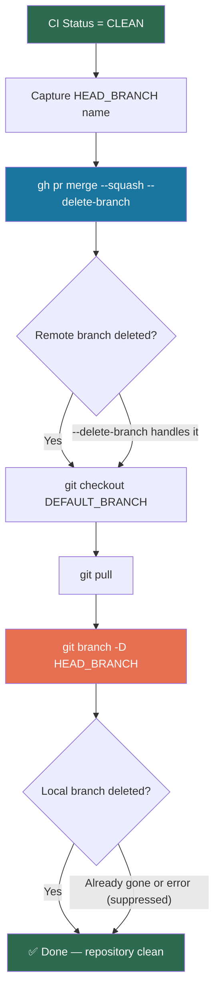

Post-merge branch cleanup is the final step of the 11-step feature development workflow — the moment where your repository returns to a clean, ready-for-the-next-feature state. Once a pull request passes all CI checks and is squash-merged into the default branch, the system automatically tears down both the remote and local feature branches, then syncs your working copy with the freshly updated default branch. This page covers the exact sequence of operations, the underlying Git mechanics, the commands involved, and the edge cases you should be aware of when things don't go according to plan.

Sources: [SKILL.md](git-workflow-local/skills/git-workflow/SKILL.md#L426-L443)

## Why Branch Cleanup Matters

Every feature branch is a temporary workspace. Leaving branches behind after merge pollutes the repository's namespace, confuses `git branch` listings, and can lead to accidental commits against stale heads. The workflow enforces cleanup as a **mandatory final step** — not an optional housekeeping task. The `gw-merge` command and `gw-flow` command both embed cleanup logic directly into their merge sequences, ensuring that no merged PR ever leaves a dangling branch behind.

Sources: [SKILL.md](git-workflow-local/skills/git-workflow/SKILL.md#L618-L625)

## The Three-Phase Cleanup Sequence

Post-merge cleanup is not a single command — it is a carefully ordered sequence of three operations that must execute in a specific order. Each phase depends on the state established by the previous one. The following flowchart illustrates the complete sequence from the moment CI checks report `CLEAN` through to the final confirmation message.



**Phase 1 — Merge and Remote Deletion.** The `gh pr merge` command performs a squash merge (collapsing all feature commits into a single commit on the default branch) and simultaneously deletes the remote branch via the `--delete-branch` flag. This is the only command that touches GitHub's servers during cleanup.

**Phase 2 — Local Sync.** The local working copy switches to the default branch (`git checkout`) and pulls the latest changes (`git pull`), bringing the local repository into alignment with the remote after the merge.

**Phase 3 — Local Branch Deletion.** The local feature branch is force-deleted with `git branch -D`, which removes the branch reference even if it has unmerged commits. This is safe because the squash merge has already incorporated all changes into the default branch.

Sources: [gw-merge.md](git-workflow-local/commands/gw-merge.md#L66-L91), [SKILL.md](git-workflow-local/skills/git-workflow/SKILL.md#L399-L443)

## Pre-Cleanup: Capturing the Branch Name

A subtle but critical detail — the feature branch name must be captured **before** the merge command runs. After `gh pr merge --delete-branch` executes, the remote branch is gone, and while the local branch still exists temporarily, the canonical source of truth for the branch name is the PR itself. The workflow resolves this by querying the PR's `headRefName` field at the start of the monitoring loop, well before any merge operation.

```bash
# Capture branch name from the PR metadata (before merge)
HEAD_BRANCH=$(gh pr view $PR_NUMBER --json headRefName --jq '.headRefName')
```

This pattern appears identically in both the `gw-merge` command and the standalone `pr-monitor-merge.sh` script, ensuring the branch name is always available for the final local deletion step regardless of how the merge is triggered.

Sources: [gw-merge.md](git-workflow-local/commands/gw-merge.md#L44-L46), [pr-monitor-merge.sh](pr-monitor-merge.sh#L24-L25), [gw-flow.md](git-workflow-local/commands/gw-flow.md#L186-L187)

## Phase 1: Squash Merge and Remote Branch Deletion

The merge command uses `--squash` to combine all feature branch commits into a single commit on the default branch, preserving a clean linear history. The `--delete-branch` flag instructs GitHub to delete the remote branch reference immediately after the merge completes. Both flags are applied in a single `gh pr merge` invocation:

```bash
# Standard merge (GitHub defaults the commit subject to the PR title)
gh pr merge $PR_NUMBER --squash --delete-branch

# Merge with explicit commit subject
gh pr merge $PR_NUMBER --squash --delete-branch --subject "✨ feat: add user authentication"
```

The optional `--subject` flag overrides the default commit message. When omitted, GitHub uses the PR title as the squash commit subject — which is ideal because the PR title already carries the correct emoji/type prefix from the PR creation step (see [Creating Pull Requests with Structured Templates](9-creating-pull-requests-with-structured-templates)). The `gw-flow` command passes the original commit subject through explicitly, while the `gw-merge` command accepts it as an optional argument.

| Merge Strategy | Flag | Effect on History | When to Use |
|---|---|---|---|
| Squash | `--squash` | Collapses all commits into one | **Default and recommended** for this workflow |
| Merge commit | `--merge` | Preserves full branch history | For release branches or long-lived features |
| Rebase | `--rebase` | Replays commits linearly | When individual commits have distinct value |

Sources: [gw-merge.md](git-workflow-local/commands/gw-merge.md#L66-L72), [SKILL.md](git-workflow-local/skills/git-workflow/SKILL.md#L399-L418), [gw-flow.md](git-workflow-local/commands/gw-flow.md#L191-L192)

## Phase 2: Syncing the Local Default Branch

After the squash merge completes on GitHub, the local repository is out of date — it still points to the pre-merge commit on the default branch. Two commands bring the local state into alignment:

```bash
# Switch to the default branch
git checkout "$DEFAULT_BRANCH"

# Pull the squash merge commit from remote
git pull
```

The default branch name is auto-detected at the start of every workflow invocation using `git remote show origin`, so this step works correctly regardless of whether the repository uses `main`, `master`, or any other default branch name. After `git pull`, the local default branch includes the freshly merged squash commit and is ready for the next feature branch.

Sources: [gw-merge.md](git-workflow-local/commands/gw-merge.md#L74-L76), [pr-monitor-merge.sh](pr-monitor-merge.sh#L52-L55), [SKILL.md](git-workflow-local/skills/git-workflow/SKILL.md#L428-L434)

## Phase 3: Local Feature Branch Deletion

The final operation removes the local branch reference using force-delete:

```bash
git branch -D "$HEAD_BRANCH" 2>/dev/null || true
```

This command uses `-D` (uppercase) rather than `-d` (lowercase) for an important reason: `-d` performs a safety check that refuses to delete branches with unmerged commits, while `-D` bypasses that check entirely. Force deletion is safe here because the squash merge has already incorporated all changes into the default branch — there is nothing to lose. The error suppression (`2>/dev/null || true`) handles edge cases where the branch was already deleted or never existed locally (for example, if the merge was performed from a different clone).

The distinction between `-d` and `-D` is worth understanding: if you ever run cleanup manually and encounter a "not fully merged" error with `-d`, it means Git believes some commits on that branch have not been merged — which should never happen in this workflow because the squash merge captures everything. Using `-D` is the correct choice for automated cleanup.

Sources: [gw-merge.md](git-workflow-local/commands/gw-merge.md#L78-L79), [SKILL.md](git-workflow-local/skills/git-workflow/SKILL.md#L434-L443), [pr-monitor-merge.sh](pr-monitor-merge.sh#L57-L59)

## Execution Contexts: Three Paths to Cleanup

Branch cleanup executes differently depending on which workflow entry point triggered it. Understanding these contexts is essential for debugging and for knowing which log output to expect.

**Path 1 — `/gw-merge` command (standalone merge).** This is the dedicated merge-and-cleanup command. It monitors a single PR's CI status, merges when `CLEAN`, and performs all three cleanup phases. Use this when the PR was created and reviewed outside of the automated workflow, or when you need to merge an existing PR by number.

**Path 2 — `/gw-flow` command (full workflow, Step 6).** The full workflow's final step embeds the same merge-and-cleanup logic inline. After the review remediation loop completes (Step 5), the workflow transitions directly into monitoring and cleanup without requiring a separate command invocation. The branch name variable `$HEAD_BRANCH` is already in scope from the flow's earlier steps.

**Path 3 — `pr-monitor-merge.sh` standalone script.** The standalone shell script at the repository root provides the same merge-and-cleanup logic as a directly executable bash script, independent of any Claude Code skill or plugin. It accepts a PR number and optional commit subject as command-line arguments, making it suitable for CI/CD pipelines or manual terminal use.

| Path | Trigger | Branch Name Source | Typical Use Case |
|---|---|---|---|
| `/gw-merge` | Claude Code slash command | `gh pr view --json headRefName` | Merge an existing PR by number |
| `/gw-flow` | Claude Code slash command | Already in scope from Step 1 | Full automated feature delivery |
| `pr-monitor-merge.sh` | Shell execution | `gh pr view --json headRefName` | CI/CD pipeline or manual terminal |

Sources: [gw-merge.md](git-workflow-local/commands/gw-merge.md#L1-L91), [gw-flow.md](git-workflow-local/commands/gw-flow.md#L183-L197), [pr-monitor-merge.sh](pr-monitor-merge.sh#L1-L75)

## Edge Cases and Failure Modes

**PR already merged (`MERGED` status).** If someone merges the PR through GitHub's web interface before the automated cleanup runs, the monitoring loop detects the `MERGED` status and falls back to a sync-only path — checkout the default branch, pull, and exit. No local branch deletion is attempted because the branch name may no longer be resolvable from the PR. This graceful fallback prevents errors when multiple automation systems or humans interact with the same PR.

Sources: [gw-merge.md](git-workflow-local/commands/gw-merge.md#L53-L58), [pr-monitor-merge.sh](pr-monitor-merge.sh#L44-L48)

**PR was closed without merging (`CLOSED` status).** The monitoring loop exits immediately with an error. No merge or cleanup occurs — the branch remains intact for potential re-use or manual deletion.

Sources: [gw-merge.md](git-workflow-local/commands/gw-merge.md#L60-L63), [pr-monitor-merge.sh](pr-monitor-merge.sh#L50-L52)

**Timeout after 10 minutes.** The polling loop runs 60 iterations with 10-second intervals (600 seconds total). If CI checks never reach `CLEAN`, the command exits with guidance to check the PR status manually. The branch is preserved for human investigation.

Sources: [gw-merge.md](git-workflow-local/commands/gw-merge.md#L82-L87), [pr-monitor-merge.sh](pr-monitor-merge.sh#L70-L73)

**Local branch not found during deletion.** The `2>/dev/null || true` suppression handles cases where the local branch reference does not exist — this can happen if the PR was created from a fork, if the branch was manually deleted, or if the workflow is running in an environment that doesn't have the feature branch checked out locally. The cleanup is considered successful regardless.

Sources: [gw-merge.md](git-workflow-local/commands/gw-merge.md#L78-L79), [SKILL.md](git-workflow-local/skills/git-workflow/SKILL.md#L440-L443)

**Remote branch not deleted by `--delete-branch`.** In rare cases (insufficient GitHub permissions, branch protection rules), the `--delete-branch` flag may fail silently. The workflow includes a manual fallback command in its Quick Reference section: `git push origin --delete feat/descriptive-name`. This is the escape hatch for manual remediation.

Sources: [SKILL.md](git-workflow-local/skills/git-workflow/SKILL.md#L436-L443)

## Complete Cleanup Command Reference

The following table collects every command involved in the post-merge cleanup sequence, along with its purpose and the failure mode it handles.

| Command | Purpose | Failure Handling |
|---|---|---|
| `HEAD_BRANCH=$(gh pr view $PR --json headRefName --jq '.headRefName')` | Capture branch name before merge | Empty string fallback |
| `gh pr merge $PR --squash --delete-branch` | Squash merge + remote deletion | Fails if PR not mergeable |
| `git checkout "$DEFAULT_BRANCH"` | Switch to default branch | Fails if dirty working tree |
| `git pull` | Sync with post-merge remote | Fails if network or auth issues |
| `git branch -D "$HEAD_BRANCH"` | Delete local feature branch | Suppressed with `2>/dev/null \|\| true` |
| `git push origin --delete "$HEAD_BRANCH"` | Manual remote deletion fallback | Manual escape hatch only |

Sources: [gw-merge.md](git-workflow-local/commands/gw-merge.md#L44-L89), [SKILL.md](git-workflow-local/skills/git-workflow/SKILL.md#L426-L443), [pr-monitor-merge.sh](pr-monitor-merge.sh#L24-L68)

## What Comes Next

After cleanup completes, your working directory is on the default branch with the latest merged code, and both the remote and local feature branches are gone. The repository is in a clean state, ready for the next feature cycle. If you encounter issues during cleanup — merge conflicts, behind-branch status, or hook failures — refer to [Troubleshooting: Merge Conflicts, Behind Branch, Hook Failures](16-troubleshooting-merge-conflicts-behind-branch-hook-failures) for detailed resolution steps. For an alternative approach to PR monitoring and merge that works outside of Claude Code, see [The Standalone PR Monitor Script (pr-monitor-merge.sh)](13-the-standalone-pr-monitor-script-pr-monitor-merge-sh).