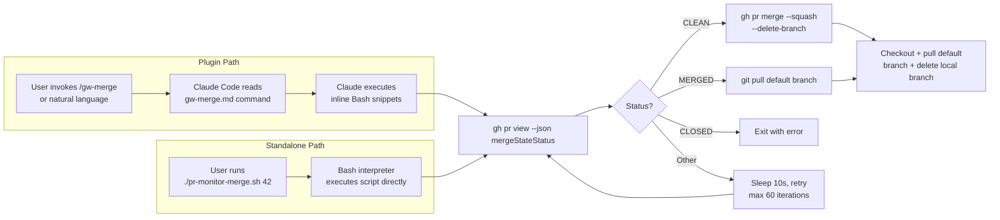
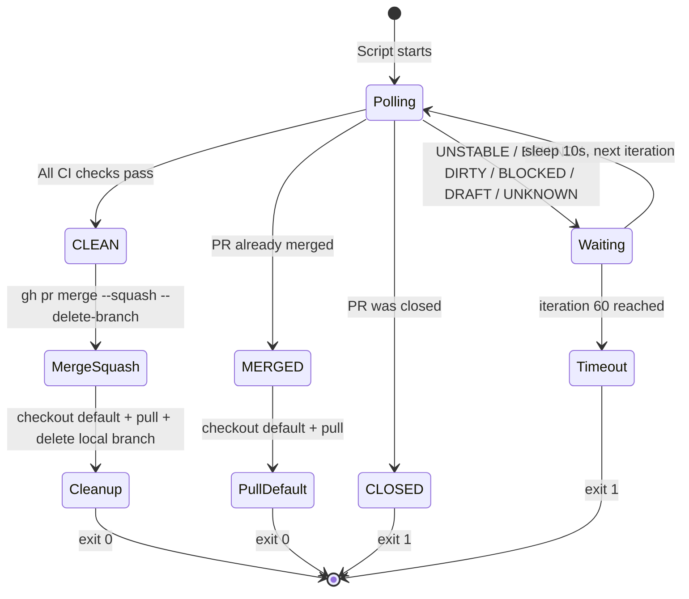

`pr-monitor-merge.sh` is a self-contained 74-line Bash script that automates the final phase of the pull request lifecycle — polling GitHub for CI check completion, performing a squash merge, and cleaning up both remote and local branches. Unlike the rest of this project's tooling, which operates as Markdown-based skill definitions consumed by Claude Code, this script runs directly from any terminal that has `git` and the GitHub CLI (`gh`) installed. It is the executable counterpart to the monitoring and merge logic embedded in the `/gw-merge` slash command and the 11-step workflow defined in [SKILL.md](git-workflow-local/skills/git-workflow/SKILL.md). The script lives at the repository root alongside the plugin directory, making it immediately accessible for ad-hoc use without any plugin installation.

Sources: [pr-monitor-merge.sh](pr-monitor-merge.sh#L1-L74), [CLAUDE.md](CLAUDE.md#L28-L28)

## How the Script Relates to the Plugin Workflow

Before diving into the script's internals, it is important to understand where it sits in the overall architecture. The git-workflow plugin offers two mechanisms for PR monitoring and merging: the **plugin-driven path** (invoked through Claude Code via `/gw-merge` or natural language) and the **standalone path** (this script, invoked directly from the shell). Both paths execute logically identical operations — poll `mergeStateStatus`, merge with `--squash --delete-branch`, pull the default branch, and delete the local feature branch — but they differ in their execution context. The plugin path relies on Claude Code interpreting the [gw-merge.md](git-workflow-local/commands/gw-merge.md) command definition and executing the Bash snippets inline; the standalone path runs as a single atomic process with its own error handling and timeout behavior.



Sources: [pr-monitor-merge.sh](pr-monitor-merge.sh#L25-L69), [gw-merge.md](git-workflow-local/commands/gw-merge.md#L36-L90)

## Prerequisites and Invocation

The script requires two external tools: `git` (any recent version) and `gh` (GitHub CLI, authenticated with `gh auth login`). It must be run from inside a Git repository that has a remote named `origin` pointing to a GitHub-hosted repository. The script is already marked executable (`chmod +x`), so invocation is straightforward:

```bash
# Basic usage — merge PR #13 with GitHub's default squash subject (the PR title)
./pr-monitor-merge.sh 13

# With custom commit subject for the squash merge
./pr-monitor-merge.sh 13 'feat: Add user-friendly error handling'
```

The script accepts two positional arguments, documented in its usage banner:

| Argument | Required | Description |
|----------|----------|-------------|
| `PR_NUMBER` | **Yes** | The numeric pull request ID to monitor and merge |
| `COMMIT_SUBJECT` | No | Custom subject line passed to `gh pr merge --subject`. When omitted, GitHub defaults to the PR title |

If `PR_NUMBER` is missing, the script prints usage instructions and exits with code 1. The argument validation and usage message are defined early in the script to fail fast before any network calls are made.

Sources: [pr-monitor-merge.sh](pr-monitor-merge.sh#L3-L17)

## The Monitoring Loop: Polling Strategy and State Machine

The core of the script is a `for` loop iterating from 1 to 60 with a `sleep 10` between each iteration, yielding a maximum wait time of **600 seconds (10 minutes)**. On each iteration, the script queries GitHub for the PR's `mergeStateStatus` field and branches based on the returned value:



The script recognizes **four terminal states** and **one retry state**. The terminal states are: `CLEAN` (proceed to merge), `MERGED` (already merged — pull and finish), `CLOSED` (fail immediately), and timeout after 60 iterations (fail with guidance message). Every other status — `UNSTABLE`, `BEHIND`, `DIRTY`, `BLOCKED`, `DRAFT`, or `UNKNOWN` — falls through to the retry path. This design means the script will keep polling through transient CI failures, eventual-consistency delays in GitHub's status computation, and draft states, all of which might resolve within the 10-minute window.

A critical implementation detail: the `gh pr view` command is wrapped with `2>/dev/null || echo "UNKNOWN"`. This ensures that if `gh` encounters a network error, authentication failure, or rate limit, the loop treats it as a transient `UNKNOWN` status rather than crashing due to `set -e`. This defensive pattern keeps the script resilient during brief network interruptions.

Sources: [pr-monitor-merge.sh](pr-monitor-merge.sh#L25-L69), [SKILL.md](git-workflow-local/skills/git-workflow/SKILL.md#L396-L403)

## Merge Execution and Branch Cleanup

When the PR reaches `CLEAN` status, the script proceeds to merge. The merge strategy is always **squash merge** (`--squash` flag), consistent with the project-wide convention documented in [CLAUDE.md](CLAUDE.md#L36-L36). The `--delete-branch` flag tells GitHub to delete the remote feature branch immediately after merging. If a `COMMIT_SUBJECT` was provided as the second argument, it is forwarded via `--subject`; otherwise, the squash commit defaults to the PR title, which already carries the correct emoji/type prefix from the PR creation step in the workflow.

After the merge completes, the script performs a three-step local cleanup: (1) check out the default branch, (2) `git pull` to fast-forward to the new squash commit, and (3) `git branch -D` to forcibly delete the local feature branch. The branch name for deletion was resolved earlier — at script startup — via `gh pr view --json headRefName --jq '.headRefName'`, stored in the `HEAD_BRANCH` variable. The `2>/dev/null || true` guard on the branch deletion prevents a non-zero exit if the local branch was never checked out locally or was already deleted.

Sources: [pr-monitor-merge.sh](pr-monitor-merge.sh#L19-L52)

## Default Branch Detection

Before any monitoring begins, the script detects the repository's default branch by querying the Git remote configuration:

```bash
DEFAULT_BRANCH=$(git remote show origin 2>/dev/null | grep 'HEAD branch' | sed 's/.*: //' || echo "main")
```

This parses the output of `git remote show origin` to extract the `HEAD branch` line (e.g., `HEAD branch: main`), falling back to `"main"` if the command fails. The detected value is used later when checking out and pulling after the merge. This mirrors the identical detection logic in the plugin's [gw-merge.md](git-workflow-local/commands/gw-merge.md#L38-L39) and [SKILL.md](git-workflow-local/skills/git-workflow/SKILL.md#L58-L59).

Sources: [pr-monitor-merge.sh](pr-monitor-merge.sh#L7-L8)

## Exit Codes and Error Handling

The script uses `set -e` at the top, which causes immediate termination on any unhandled command failure. Combined with the explicit exit codes in the monitoring loop, the script communicates its outcome clearly:

| Exit Code | Condition | Meaning |
|-----------|-----------|---------|
| `0` | `CLEAN` status detected, merge succeeded, cleanup complete | Full success |
| `0` | `MERGED` status detected, pull succeeded | PR already merged, local repo updated |
| `1` | `CLOSED` status detected | PR was closed without merging |
| `1` | 60 iterations exhausted (10-minute timeout) | CI checks never passed within the window |
| `1` (via `set -e`) | Unhandled command failure | Network error, auth failure, or unexpected `gh`/`git` error |

The timeout message includes an actionable suggestion: `Run 'gh pr view $PR_NUMBER' to check status`, guiding the user toward manual diagnosis. This is a deliberate design choice — rather than silently exiting, the script tells you exactly what to do next.

Sources: [pr-monitor-merge.sh](pr-monitor-merge.sh#L5-L74)

## Comparison: Standalone Script vs. Plugin `/gw-merge`

Although both the script and the `/gw-merge` command perform the same logical operation, there are meaningful differences in their architecture and behavior:

| Aspect | `pr-monitor-merge.sh` | `/gw-merge` (Plugin) |
|--------|----------------------|----------------------|
| **Execution context** | Direct Bash process | Claude Code interprets Markdown, runs inline Bash |
| **Atomicity** | Single script, `set -e`, runs as one process | Claude may interleave reasoning between commands |
| **Merge integration** | Monitoring + merge in one script | Monitoring and merge are separate code blocks in the Markdown |
| **Error recovery** | `|| echo "UNKNOWN"` keeps loop alive on transient failures | Claude can dynamically adapt to errors |
| **Timeout handling** | Hard 60-iteration / 10-minute limit | Same limit, but Claude could be interrupted by the user |
| **Custom subject** | Via second positional argument | Via `commit_subject` argument in command frontmatter |
| **Branch cleanup** | Automatic local branch deletion built in | Local branch deletion is a separate step |
| **Dependencies** | `bash`, `git`, `gh` | Claude Code + plugin system + `git` + `gh` |

The standalone script is the right choice when you want a single, predictable command you can run from any terminal — CI pipelines, local development, or scripting environments. The plugin path is the right choice when you are already inside a Claude Code session and want the AI to handle the full workflow end-to-end.

Sources: [pr-monitor-merge.sh](pr-monitor-merge.sh#L1-L74), [gw-merge.md](git-workflow-local/commands/gw-merge.md#L1-L90)

## Practical Usage Patterns

**Pattern 1 — Quick merge after manual review.** You've reviewed the PR yourself, CI is running, and you want to fire-and-forget the wait:

```bash
./pr-monitor-merge.sh 42
# Script polls for up to 10 minutes, merges when ready, cleans up
```

**Pattern 2 — Custom squash commit message.** When you need to control the resulting commit message on the default branch:

```bash
./pr-monitor-merge.sh 42 'feat: implement OAuth2 PKCE flow for all providers'
```

**Pattern 3 — CI pipeline integration.** The script's exit codes make it suitable for use in automation:

```bash
./pr-monitor-merge.sh 42 && echo "Deploy triggered" || echo "Merge failed — manual check needed"
```

**Pattern 4 — Multiple PRs in sequence.** Since the script exits cleanly, you can chain merges:

```bash
for pr in 40 41 42; do
  ./pr-monitor-merge.sh "$pr" || break
done
```

Sources: [pr-monitor-merge.sh](pr-monitor-merge.sh#L3-L16)

## Related Pages

- [PR Status Monitoring and Automated Merge](11-pr-status-monitoring-and-automated-merge) — The conceptual explanation of monitoring and merge within the 11-step workflow
- [Post-Merge Branch Cleanup](12-post-merge-branch-cleanup) — Detailed walkthrough of branch cleanup operations (Step 11)
- [GitHub CLI (gh) Commands Used Throughout the Workflow](14-github-cli-gh-commands-used-throughout-the-workflow) — Reference for all `gh` commands, including `gh pr view --json mergeStateStatus` and `gh pr merge --squash`
- [Troubleshooting: Merge Conflicts, Behind Branch, Hook Failures](16-troubleshooting-merge-conflicts-behind-branch-hook-failures) — Diagnosing `DIRTY`, `BEHIND`, and other non-CLEAN states