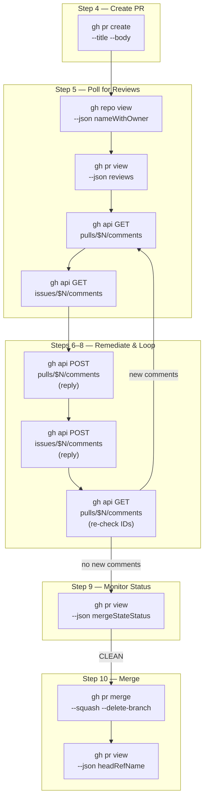

This page is a consolidated reference for every GitHub CLI (`gh`) invocation used across the 11-step feature development workflow, the individual slash commands, and the standalone monitoring script. Rather than scattering command details across individual step documentation, this page serves as the single source of truth for syntax, flags, JSON field selectors, and the API endpoints the workflow relies on. Each command is mapped to the workflow phase where it executes, making it straightforward to trace from "what does this step do?" to "what `gh` call does it make?"

Sources: [SKILL.md](git-workflow-local/skills/git-workflow/SKILL.md#L1-L659), [gw-flow.md](git-workflow-local/commands/gw-flow.md#L1-L197), [gw-merge.md](git-workflow-local/commands/gw-merge.md#L1-L91), [gw-pr.md](git-workflow-local/commands/gw-pr.md#L1-L110), [gw-remediate.md](git-workflow-local/commands/gw-remediate.md#L1-L168), [pr-monitor-merge.sh](pr-monitor-merge.sh#L1-L75)

## Command Inventory at a Glance

The workflow depends on a focused set of six `gh` subcommands — three high-level PR commands (`pr create`, `pr view`, `pr merge`), one repository introspection command (`repo view`), one CI inspection command (`pr checks`), and the general-purpose `api` command for direct REST endpoint access. The table below lists every distinct invocation alongside the workflow step that triggers it and the source file where it is defined.

| Command | Workflow Step(s) | Purpose |
|---------|-------------------|---------|
| `gh repo view --json nameWithOwner --jq` | Step 5 (fetch), Step 5–8 (loop) | Resolve the `owner/repo` slug for API endpoint construction |
| `gh pr list` | Step 5 | List open PRs for context |
| `gh pr create --title … --body …` | Step 4 | Create PR with structured template |
| `gh pr view $N` (plain) | Step 5, debugging | View PR details in terminal |
| `gh pr view $N --json mergeStateStatus --jq` | Step 9, Step 10, monitoring loop | Poll CI merge-readiness status |
| `gh pr view $N --json headRefName --jq` | Step 10, Step 11 | Retrieve head branch name for cleanup |
| `gh pr view $N --json reviews --jq` | Step 5 | Fetch review state (APPROVED, CHANGES_REQUESTED, etc.) |
| `gh pr view $N --json status --jq` | Quick reference | Get PR status as JSON |
| `gh pr checks` | Quick reference | View CI check status |
| `gh pr merge $N --squash --delete-branch` | Step 10 | Squash-merge PR and delete remote branch |
| `gh pr merge $N --squash --delete-branch --subject` | Step 10 (with subject) | Squash-merge with custom commit subject |
| `gh api repos/$SLUG/pulls/$N/comments` (GET) | Step 5, Step 8 | Fetch inline review comments |
| `gh api repos/$SLUG/issues/$N/comments` (GET) | Step 5, Step 8 | Fetch general PR comments |
| `gh api repos/$SLUG/pulls/$N/comments` (POST) | Step 7 | Reply to inline review comment |
| `gh api repos/$SLUG/issues/$N/comments` (POST) | Step 7 | Post acknowledgment for general PR comment |

Sources: [SKILL.md](git-workflow-local/skills/git-workflow/SKILL.md#L536-L547), [SKILL.md](git-workflow-local/skills/git-workflow/SKILL.md#L260-L277), [gw-flow.md](git-workflow-local/commands/gw-flow.md#L84-L86), [gw-flow.md](git-workflow-local/commands/gw-flow.md#L126-L135), [gw-merge.md](git-workflow-local/commands/gw-merge.md#L42-L79), [pr-monitor-merge.sh](pr-monitor-merge.sh#L20-L37)

## Command Lifecycle Map

The following diagram shows which `gh` commands execute at each stage of the workflow. This visual mapping clarifies the command sequencing and makes it easy to locate the relevant section for any given invocation.



Sources: [SKILL.md](git-workflow-local/skills/git-workflow/SKILL.md#L249-L277), [SKILL.md](git-workflow-local/skills/git-workflow/SKILL.md#L312-L353), [SKILL.md](git-workflow-local/skills/git-workflow/SKILL.md#L372-L419), [gw-flow.md](git-workflow-local/commands/gw-flow.md#L68-L196)

## Repository Introspection: `gh repo view`

Before any API calls can be constructed, the workflow must resolve the repository's full `owner/repo` slug. This value is injected into every `gh api` endpoint path that follows. The resolution happens once at the start of the review polling phase and is reused throughout the remediation loop.

```bash
REPO_SLUG=$(gh repo view --json nameWithOwner --jq '.nameWithOwner')
# Example output: "tupacalypse187/tupacalypse187-claude-skills"
```

**Why not hardcode?** The slug is derived dynamically so the workflow works identically across forks and cloned repositories without configuration changes. The `--json nameWithOwner` flag returns a single-field JSON object, and `--jq '.nameWithOwner'` extracts the string value directly.

Sources: [SKILL.md](git-workflow-local/skills/git-workflow/SKILL.md#L262-L262), [gw-remediate.md](git-workflow-local/commands/gw-remediate.md#L37-L37), [gw-flow.md](git-workflow-local/commands/gw-flow.md#L126-L126)

## PR Creation: `gh pr create`

The PR is created with an explicit `--title` and `--body` using a Bash heredoc. There is no interactive prompt — every field is pre-filled from the actual `git diff` analysis. The workflow mandates that the title carries an emoji conventional-commit prefix (e.g., `✨ feat: add login flow`), and the body follows a four-section template (Summary, Changes, Verification, Sources).

```bash
gh pr create \
  --title "✨ feat: add JWT token validation" \
  --body "$(cat <<EOF
## 📝 Summary
[Real content from diff analysis]

## 🔄 Changes
[Bullet points from diff]

## ✅ Verification
[Runnable steps]

## 🔗 Sources
[Issue references, links]

---
🤖 Generated with [Claude Code](https://claude.com/claude-code)
EOF
)"
```

**Key flags:**

| Flag | Purpose | Notes |
|------|---------|-------|
| `--title` | PR title with emoji prefix | Derived from primary commit type |
| `--body` | Markdown body via heredoc | Four-section structured template |
| `--draft` | Create as draft PR | Optional; passed via `$DRAFT_FLAG` in `/gw-pr` |

The `gh pr create` command outputs the PR URL (e.g., `https://github.com/owner/repo/pull/42`). The workflow extracts the numeric PR number from this URL using pattern matching — `PR_NUMBER=42` — and immediately feeds it into the review polling loop without requiring manual intervention.

Sources: [SKILL.md](git-workflow-local/skills/git-workflow/SKILL.md#L159-L183), [gw-pr.md](git-workflow-local/commands/gw-pr.md#L84-L106), [gw-flow.md](git-workflow-local/commands/gw-flow.md#L84-L108)

## PR Inspection: `gh pr view`

The `gh pr view` command is the workflow's most versatile `gh` invocation. It serves four distinct purposes depending on which JSON fields are requested. The table below breaks down each variant by its `--json` selector, `--jq` filter, and the workflow context in which it runs.

| Variant | Full Command | Used In | Returns |
|---------|-------------|---------|---------|
| **Merge status** | `gh pr view $N --json mergeStateStatus --jq '.mergeStateStatus'` | Step 9, monitoring loop | One of: `CLEAN`, `UNSTABLE`, `BEHIND`, `BLOCKED`, `DIRTY`, `DRAFT`, `UNKNOWN` |
| **Head branch** | `gh pr view $N --json headRefName --jq '.headRefName'` | Step 10, Step 11 | Branch name string (e.g., `feat/user-auth`) |
| **Review state** | `gh pr view $N --json reviews --jq '.reviews[] \| {state, body, author}'` | Step 5 | Array of review objects with state, body, author |
| **Plain view** | `gh pr view $N` | Debugging, status checks | Formatted terminal output |

### Merge State Status Values

The `mergeStateStatus` field drives the polling loop in Step 9 and the standalone script. Understanding each value is critical for diagnosing workflow stalls:

| Status | Meaning | Workflow Action |
|--------|---------|-----------------|
| `CLEAN` | All checks passed, branch is mergeable | Proceed to `gh pr merge` |
| `UNSTABLE` | Checks pending or failed | Continue polling (10s interval) |
| `BEHIND` | Branch is behind the base branch | Needs `git merge` with base before merge |
| `BLOCKED` | Blocked by failing required checks | Needs investigation, may require fixes |
| `DIRTY` | Merge conflict exists | Needs manual conflict resolution |
| `DRAFT` | PR is in draft state | Not ready for merge |
| `UNKNOWN` | Status not yet determined | Continue polling |
| `MERGED` | PR already merged | Switch to default branch and pull |
| `CLOSED` | PR was closed without merging | Exit with error |

Sources: [SKILL.md](git-workflow-local/skills/git-workflow/SKILL.md#L380-L403), [SKILL.md](git-workflow-local/skills/git-workflow/SKILL.md#L277-L277), [SKILL.md](git-workflow-local/skills/git-workflow/SKILL.md#L490-L490), [gw-merge.md](git-workflow-local/commands/gw-merge.md#L42-L67), [gw-remediate.md](git-workflow-local/commands/gw-remediate.md#L47-L47), [pr-monitor-merge.sh](pr-monitor-merge.sh#L20-L26)

## Direct API Access: `gh api`

Four `gh api` endpoints form the backbone of the review remediation cycle. The workflow uses both GET (fetching comments) and POST (replying to comments) against GitHub's REST API, with `--jq` filters to extract only the fields needed.

### Fetching Review Comments (GET)

Two separate endpoints cover the two types of PR comments GitHub supports. Inline code-level comments (left on specific lines of the diff) are fetched from the Pull Requests API, while general PR comments (not attached to code) are fetched from the Issues API.

**Inline code review comments:**

```bash
gh api repos/$REPO_SLUG/pulls/$PR_NUMBER/comments \
  --jq '.[] | select(.in_reply_to_id == null) | {id: .id, path: .path, line: .line, body: .body}'
```

The `select(.in_reply_to_id == null)` filter is critical — it excludes reply comments so the workflow only processes original reviewer feedback. Each returned object contains the `id` (needed for replying), `path` (file location), `line` (line number), and `body` (comment text).

**General PR comments:**

```bash
gh api repos/$REPO_SLUG/issues/$PR_NUMBER/comments \
  --jq '.[] | {id: .id, body: .body}'
```

General comments have fewer fields because they are not attached to specific code locations.

**Re-check for new comments (loop iteration):**

```bash
gh api repos/$REPO_SLUG/pulls/$PR_NUMBER/comments \
  --jq '.[] | select(.in_reply_to_id == null) | .id'
```

This lightweight variant returns only comment IDs, allowing the remediation loop to compare against the set of already-processed IDs and detect new feedback without re-downloading full comment bodies.

### Replying to Comments (POST)

After code fixes are pushed, the workflow replies to every comment with the fix commit hash and a description of what changed.

**Reply to inline review comment:**

```bash
FIX_HASH=$(git rev-parse --short HEAD)

gh api repos/$REPO_SLUG/pulls/$PR_NUMBER/comments \
  --method POST \
  --field body="✅ Fixed in $FIX_HASH. <describe what was actually changed>" \
  --field in_reply_to=$COMMENT_ID
```

The `--field in_reply_to=$COMMENT_ID` creates a threaded reply under the original comment. The `$COMMENT_ID` is the numeric `id` captured during the GET fetch phase.

**Reply to general PR comment:**

```bash
gh api repos/$REPO_SLUG/issues/$PR_NUMBER/comments \
  --method POST \
  --field body="✅ Addressed in $FIX_HASH. <describe what was actually changed>"
```

Note the absence of `--field in_reply_to` here — this is a GitHub API limitation. The Issues API creates a new top-level comment rather than a threaded reply. The workflow compensates by including the fix hash in the message body for traceability.

### API Endpoint Summary

| Method | Endpoint | Purpose | Key Fields |
|--------|----------|---------|------------|
| GET | `repos/$SLUG/pulls/$N/comments` | Fetch inline review comments | `id`, `path`, `line`, `body`, `in_reply_to_id` |
| GET | `repos/$SLUG/issues/$N/comments` | Fetch general PR comments | `id`, `body` |
| POST | `repos/$SLUG/pulls/$N/comments` | Reply to inline comment | `body`, `in_reply_to` |
| POST | `repos/$SLUG/issues/$N/comments` | Post acknowledgment comment | `body` |

Sources: [SKILL.md](git-workflow-local/skills/git-workflow/SKILL.md#L271-L277), [SKILL.md](git-workflow-local/skills/git-workflow/SKILL.md#L329-L338), [SKILL.md](git-workflow-local/skills/git-workflow/SKILL.md#L353-L353), [gw-remediate.md](git-workflow-local/commands/gw-remediate.md#L41-L47), [gw-remediate.md](git-workflow-local/commands/gw-remediate.md#L100-L109), [gw-remediate.md](git-workflow-local/commands/gw-remediate.md#L150-L150), [gw-flow.md](git-workflow-local/commands/gw-flow.md#L129-L135), [gw-flow.md](git-workflow-local/commands/gw-flow.md#L161-L170)

## PR Merge: `gh pr merge`

When the `mergeStateStatus` reaches `CLEAN`, the workflow executes a squash merge with automatic branch deletion. The command has two variants depending on whether a custom commit subject is provided.

```bash
# Default: uses PR title as commit subject (recommended)
gh pr merge $PR_NUMBER --squash --delete-branch

# With custom subject
gh pr merge $PR_NUMBER --squash --delete-branch --subject "$COMMIT_SUBJECT"
```

**Flag breakdown:**

| Flag | Behavior |
|------|----------|
| `--squash` | Combines all branch commits into a single commit on the base branch |
| `--delete-branch` | Deletes the remote branch after successful merge |
| `--subject` | Overrides the default squash commit subject (defaults to PR title) |

The workflow intentionally omits `--subject` when no custom subject is given, because the PR title already carries the correct emoji/type prefix (e.g., `✨ feat: add login flow`). This preserves the conventional-commit format in the base branch history without duplication.

**Merge strategy comparison** (for reference, though `--squash` is the workflow default):

| Strategy | Flag | Effect | When to Use |
|----------|------|--------|-------------|
| Squash | `--squash` | Single commit, clean history | Default for all feature PRs |
| Merge commit | `--merge` | Full commit history preserved | Large PRs with meaningful intermediate commits |
| Rebase | `--rebase` | Linear history, all commits | When individual commits matter and are clean |

Sources: [SKILL.md](git-workflow-local/skills/git-workflow/SKILL.md#L409-L419), [gw-merge.md](git-workflow-local/commands/gw-merge.md#L76-L80), [gw-flow.md](git-workflow-local/commands/gw-flow.md#L186-L186), [pr-monitor-merge.sh](pr-monitor-merge.sh#L34-L37)

## Standalone Script: `pr-monitor-merge.sh`

The standalone [pr-monitor-merge.sh](pr-monitor-merge.sh) script encapsulates the monitoring-and-merge cycle (Steps 9–11) into a self-contained Bash script. It uses the same `gh` commands as the main workflow but adds error handling and timeout logic suitable for direct terminal execution.

The script resolves the head branch name upfront (before the monitoring loop) so that local cleanup can proceed even if the PR state changes during polling:

```bash
HEAD_BRANCH=$(gh pr view "$PR_NUMBER" --json headRefName --jq '.headRefName' 2>/dev/null || echo "")
```

The `2>/dev/null || echo ""` fallback ensures the script continues gracefully if the `gh` command fails (e.g., network issue, already-deleted branch). The monitoring loop polls every 10 seconds for up to 60 iterations (10 minutes), checking `mergeStateStatus` on each pass. On `CLEAN`, it executes the squash merge and proceeds to local branch cleanup. On `MERGED`, it skips directly to pulling the default branch.

Sources: [pr-monitor-merge.sh](pr-monitor-merge.sh#L20-L37), [pr-monitor-merge.sh](pr-monitor-merge.sh#L55-L59)

## Quick Reference Card

For developers who need a fast lookup without reading the full breakdown, here is the condensed command reference as it appears in the workflow's built-in quick reference section.

**PR Operations:**

```bash
gh pr create                           # Create PR interactively
gh pr list                             # List open PRs
gh pr view <number>                    # View PR details
gh pr merge <number> --squash          # Merge PR with squash
gh pr checks                           # View CI status
gh pr view <number> --json status      # Get PR status as JSON
```

**Status & Monitoring:**

```bash
# Poll merge readiness (use in loop)
gh pr view $N --json mergeStateStatus --jq '.mergeStateStatus'

# Get head branch for cleanup
gh pr view $N --json headRefName --jq '.headRefName'

# Check review state
gh pr view $N --json reviews --jq '.reviews[] | {state: .state, body: .body}'
```

**API (Review Remediation):**

```bash
# Resolve repo slug first
REPO_SLUG=$(gh repo view --json nameWithOwner --jq '.nameWithOwner')

# Fetch inline review comments
gh api repos/$REPO_SLUG/pulls/$N/comments --jq '.[] | select(.in_reply_to_id == null) | {id, path, line, body}'

# Fetch general PR comments
gh api repos/$REPO_SLUG/issues/$N/comments --jq '.[] | {id, body}'

# Reply to inline comment
gh api repos/$REPO_SLUG/pulls/$N/comments --method POST --field body="✅ Fixed in $HASH." --field in_reply_to=$ID

# Post general acknowledgment
gh api repos/$REPO_SLUG/issues/$N/comments --method POST --field body="✅ Addressed in $HASH."
```

Sources: [SKILL.md](git-workflow-local/skills/git-workflow/SKILL.md#L536-L547), [SKILL.md](git-workflow-local/skills/git-workflow/SKILL.md#L260-L277)

## Authentication and Prerequisites

All `gh` commands require an authenticated GitHub CLI session. Before running any workflow step, ensure `gh auth status` returns a valid login. The workflow makes no explicit authentication calls — it relies on the pre-existing `gh` session. Token permissions needed include `repo` (for PR creation, merging, and API access), `read:org` (for organization repos), and `workflow` (if CI checks trigger GitHub Actions).

The `--jq` flag used throughout requires `jq`-compatible filter syntax. The `gh` CLI includes a built-in `jq` interpreter, so no separate `jq` installation is required for these commands to work.

Sources: [SKILL.md](git-workflow-local/skills/git-workflow/SKILL.md#L536-L547)

---

**Next reads:** For the complete 11-step workflow context where these commands execute, see [The 11-Step Feature Development Workflow](7-branch-creation-and-naming-conventions). For the standalone script that packages the monitoring commands, see [The Standalone PR Monitor Script (pr-monitor-merge.sh)](13-the-standalone-pr-monitor-script-pr-monitor-merge-sh). For troubleshooting common failures like `DIRTY` merge status or `BEHIND` branch issues, see [Troubleshooting: Merge Conflicts, Behind Branch, Hook Failures](16-troubleshooting-merge-conflicts-behind-branch-hook-failures).