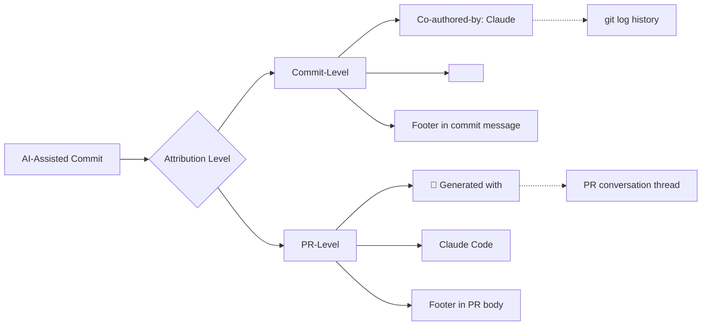
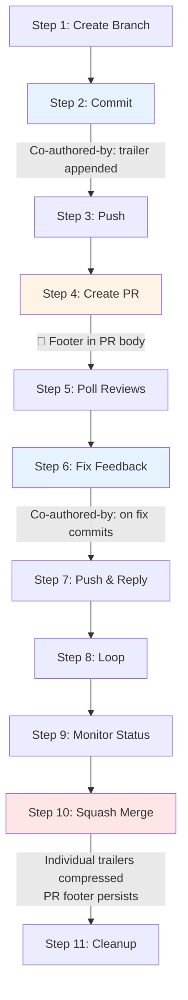

Transparent attribution is the foundation of trustworthy AI-assisted development. This page explains how the git-workflow plugin implements co-authorship attribution across two distinct levels — the **commit-level** `Co-authored-by:` trailer and the **PR-level** Claude Code footer — and why both matter for a clean, honest contribution history.

Sources: [CLAUDE.md](CLAUDE.md#L37-L37), [gw-commit.md](git-workflow-local/commands/gw-commit.md#L37-L52)

---

## Why Attribution Matters

When a human and an AI assistant collaborate on code, both parties contribute intellectual work: the human provides intent, context, and judgment; the AI provides implementation speed, pattern recall, and syntactic precision. The `Co-authored-by:` trailer makes this collaboration visible in the git history without diminishing either contributor's role. GitHub recognizes these trailers natively — they appear in commit details, feed into contribution graphs, and are indexed by git tooling like `git log --format="%b"` and `git shortlog`. Omitting the trailer creates an invisible dependency: future readers auditing blame history or bisecting regressions cannot distinguish human-authored logic from AI-suggested code, which undermines trust in the commit log as a forensic record.

Sources: [SKILL.md](git-workflow-local/skills/git-workflow/SKILL.md#L123-L131), [CLAUDE.md](CLAUDE.md#L37-L37)

---

## The Dual Attribution Model

The plugin enforces attribution at two levels, each serving a different audience and granularity. The diagram below shows how these two mechanisms operate in parallel throughout the workflow:



| Attribution Level | Location | Format | Purpose |
|---|---|---|---|
| **Commit-level** | Commit message footer | `Co-authored-by: Claude <noreply@anthropic.com>` | Permanent record in git history; recognized by GitHub contribution graph |
| **PR-level** | PR body footer | `🤖 Generated with [Claude Code](https://claude.com/claude-code)` | Signals AI-assisted tooling in the PR conversation; visible on GitHub's PR UI |

The commit-level trailer is a **git-native convention** — it follows the trailer format defined in [Git's documentation](https://git-scm.com/docs/git-interpret-trailers) and is parsed by `git interpret-trailers`. The PR-level footer is a **Markdown convention** embedded in the PR description template, providing a human-readable attribution that persists even when commits are squashed during merge.

Sources: [SKILL.md](git-workflow-local/skills/git-workflow/SKILL.md#L107-L122), [gw-pr.md](git-workflow-local/commands/gw-pr.md#L100-L106), [gw-flow.md](git-workflow-local/commands/gw-flow.md#L101-L105)

---

## Commit-Level Attribution: The Co-authored-by Trailer

### Exact Format

The trailer must appear as the last line of the commit message, after a blank line that separates it from the body. The format is fixed — do not modify the name or email address:

```
Co-authored-by: Claude <noreply@anthropic.com>
```

There is exactly one space after the colon, and the angle brackets around the email address are required. Git and GitHub both parse this specific pattern; deviations (missing brackets, changed email, extra whitespace) will cause the trailer to be ignored by GitHub's contribution graph.

Sources: [gw-commit.md](git-workflow-local/commands/gw-commit.md#L49-L52), [SKILL.md](git-workflow-local/skills/git-workflow/SKILL.md#L119-L121)

### Where It Appears in a Commit Message

The `Co-authored-by:` trailer belongs in the **footer** section of a full-format commit message. The structural anatomy is:

```
✨ feat(auth): add JWT token validation          ← Subject (emoji + type + scope + description)
                                                 ← Blank line
Implement JWT token validation middleware that:  ← Body (explains WHY and HOW)
- Validates token signature and expiration
- Extracts user claims from payload
- Adds user context to request object

This improves security by ensuring all protected
routes validate authentication tokens properly.
                                                 ← Blank line
Co-authored-by: Claude <noreply@anthropic.com>   ← Footer (metadata trailers)
```

For simple commits that don't warrant a body, the trailer follows the subject directly:

```bash
git commit -m "✨ feat: add user authentication

Co-authored-by: Claude <noreply@anthropic.com>"
```

Sources: [SKILL.md](git-workflow-local/skills/git-workflow/SKILL.md#L107-L121), [gw-commit.md](git-workflow-local/commands/gw-commit.md#L49-L52)

### When to Include It

The rule is straightforward: **include the `Co-authored-by:` footer on every AI-assisted commit**. An AI-assisted commit is any commit where Claude Code (or another AI coding assistant) contributed to the code being committed — whether generating the implementation, suggesting the approach, or writing the commit message itself. The plugin's best practices checklist makes this explicit with a ✅ marker.

| Scenario | Include Trailer? | Reason |
|---|---|---|
| Claude writes the code | ✅ Yes | AI is a co-author of the implementation |
| Claude refactors existing code | ✅ Yes | AI materially changed the code |
| Claude writes the commit message only | ✅ Yes | AI contributed to the commit artifact |
| Human writes code and message unassisted | ❌ No | No AI involvement |
| Human writes code, asks Claude to review before committing | ✅ Yes | AI review influenced the final committed code |

Sources: [SKILL.md](git-workflow-local/skills/git-workflow/SKILL.md#L130-L130), [gw-commit.md](git-workflow-local/commands/gw-commit.md#L37-L38)

---

## How the Plugin Enforces Attribution

The co-authored-by convention is woven into every command that creates commits or PRs. Here is how each entry point handles it:

### `/gw-commit` Command

The commit command's instructions explicitly direct Claude to append the trailer when the commit is AI-assisted. Step 5 of the command's instructions reads: *"Create commit with `Co-authored-by:` footer if AI-assisted."* The command template includes the full example with the trailer pre-formatted in the heredoc, so Claude Code naturally includes it when executing the workflow.

Sources: [gw-commit.md](git-workflow-local/commands/gw-commit.md#L37-L52)

### `/gw-flow` Full Workflow

The full workflow command delegates to the same commit pattern. In Step 2, it instructs: *"Analyze `git status` and `git diff --staged` to determine the commit type, then use the matching emoji."* Because this step is always executed by Claude Code, the resulting commit is by definition AI-assisted and the trailer is included.

Sources: [gw-flow.md](git-workflow-local/commands/gw-flow.md#L41-L59)

### SKILL.md Best Practices Checklist

The skill definition includes the trailer in its best practices checklist alongside other mandatory conventions like present tense, imperative mood, and character limits:

```
- ✅ Use present tense, imperative mood ("add" not "added")
- ✅ Keep first line under 50 characters (72 max)
- ✅ Capitalize first letter
- ✅ No period at end of subject line
- ✅ Use scope for context (e.g., `feat(auth):`)
- ✅ Include `Co-authored-by:` footer for AI-assisted commits
```

This checklist is loaded into Claude Code's context whenever the git-workflow skill is triggered, making the convention a first-class part of the agent's instructions rather than an afterthought.

Sources: [SKILL.md](git-workflow-local/skills/git-workflow/SKILL.md#L123-L131)

### `CLAUDE.md` Repository-Level Convention

The repository's `CLAUDE.md` file — which Claude Code reads automatically for every session — declares the convention at the project level: *"AI-assisted commits include `Co-authored-by: Claude <noreply@anthropic.com>`."* This ensures that even when using ad-hoc natural language commands outside the `/gw-*` slash commands, Claude Code is aware of the attribution requirement.

Sources: [CLAUDE.md](CLAUDE.md#L37-L37)

---

## PR-Level Attribution: The Claude Code Footer

In addition to the commit-level trailer, every PR created through the plugin includes a Markdown footer in the PR body:

```markdown
---

🤖 Generated with [Claude Code](https://claude.com/claude-code)
```

This footer serves a distinct purpose from the `Co-authored-by:` trailer. While the commit trailer lives inside `git log` and is visible primarily to developers reading commit history, the PR footer is displayed prominently on GitHub's pull request interface. It is visible to reviewers, project maintainers, and anyone browsing the repository's merged PRs — an audience that may never inspect individual commit messages.

The PR footer is especially important because of the plugin's **squash merge** strategy. When a PR is merged with `gh pr merge --squash`, GitHub collapses all commits into a single squash commit. The individual `Co-authored-by:` trailers from each commit are lost unless manually included in the squash commit message. The PR footer, however, persists in the PR conversation thread regardless of merge strategy, providing a permanent attribution marker at the PR level.

Sources: [gw-pr.md](git-workflow-local/commands/gw-pr.md#L100-L106), [gw-flow.md](git-workflow-local/commands/gw-flow.md#L101-L105)

---

## Squash Merge and Trailer Preservation

The git-workflow plugin defaults to **squash merging** (`gh pr merge --squash --delete-branch`). This has a side effect that developers should understand: the squash commit produced by GitHub does not automatically carry forward the `Co-authored-by:` trailers from the individual commits. GitHub generates the squash commit message from the PR title and body by default.

The mitigation is dual-layered, as described in the sections above: the PR body footer survives the squash and remains in the merged PR record, while the individual commit history (with trailers intact) is preserved in the PR's commit timeline on GitHub. For teams that require `Co-authored-by:` trailers on the default branch's squash commits, the `--subject` flag on `gh pr merge` can be used to customize the squash message, though this plugin omits it and lets GitHub default to the PR title.

Sources: [gw-merge.md](git-workflow-local/commands/gw-merge.md#L75-L80), [SKILL.md](git-workflow-local/skills/git-workflow/SKILL.md#L407-L419)

---

## Attribution Flow Through the Complete Workflow

The following diagram shows where each attribution mechanism is injected during the 11-step feature development workflow:



Every commit created during the workflow — whether the initial feature commit in Step 2 or a review-fix commit in Step 6 — carries the `Co-authored-by:` trailer because Claude Code is the agent executing the commit. The PR body, created in Step 4, carries the Claude Code Markdown footer. Both layers persist independently through the merge.

Sources: [SKILL.md](git-workflow-local/skills/git-workflow/SKILL.md#L77-L131), [gw-flow.md](git-workflow-local/commands/gw-flow.md#L41-L59)

---

## Common Questions

| Question | Answer |
|---|---|
| Can I change the email address? | No. `noreply@anthropic.com` is the standard email for Claude; changing it breaks GitHub's recognition of the trailer. |
| Does the trailer count toward GitHub contributions? | Yes. GitHub's contribution graph counts commits that include a `Co-authored-by:` trailer with a recognized email as contributions for both authors. |
| What if I commit manually without Claude? | If no AI assisted the commit, omit the trailer. The convention applies only to AI-assisted commits. |
| Do squash merges lose the trailers? | The individual commit trailers are compressed into the squash commit's body by GitHub. The PR-level footer survives the merge. See the [Squash Merge and Trailer Preservation](#squash-merge-and-trailer-preservation) section for details. |
| Can I add multiple co-authors? | Yes. The git trailer format supports multiple `Co-authored-by:` lines. Add one per co-author on separate lines in the footer. |

Sources: [CLAUDE.md](CLAUDE.md#L37-L37), [SKILL.md](git-workflow-local/skills/git-workflow/SKILL.md#L119-L121)

---

## What to Read Next

- [Emoji Conventional Commits: Types, Format, and Best Practices](8-emoji-conventional-commits-types-format-and-best-practices) — The commit message structure that the `Co-authored-by:` trailer fits into, including the full anatomy diagram
- [Creating Pull Requests with Structured Templates](9-creating-pull-requests-with-structured-templates) — How the PR-level Claude Code footer is generated from the actual branch diff
- [The 11-Step Feature Development Workflow](7-branch-creation-and-naming-conventions) — The complete workflow where both attribution layers are applied at every stage
- [Troubleshooting: Merge Conflicts, Behind Branch, Hook Failures](16-troubleshooting-merge-conflicts-behind-branch-hook-failures) — Resolving issues that may affect commit message integrity during conflict resolution