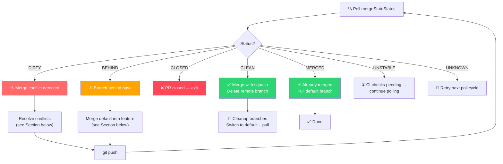
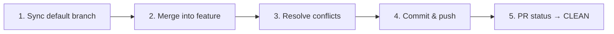
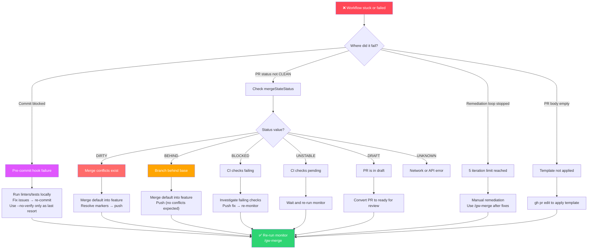

The git workflow plugin's monitoring loop surfaces six distinct PR status codes during the squash-merge lifecycle. Three of them — **DIRTY** (merge conflicts), **BEHIND** (stale branch), and blocked pre-commit hooks — require direct developer intervention. This page maps every failure status to its root cause, diagnosis steps, and verified remediation commands drawn from the plugin's own skill definition and command files. Each solution preserves the emoji conventional commit format and branch naming conventions established in [Branch Creation and Naming Conventions](7-branch-creation-and-naming-conventions) and [Emoji Conventional Commits: Types, Format, and Best Practices](8-emoji-conventional-commits-types-format-and-best-practices).

Sources: [SKILL.md](git-workflow-local/skills/git-workflow/SKILL.md#L399-L410), [gw-merge.md](git-workflow-local/commands/gw-merge.md#L27-L36)

## The PR Status Decision Landscape

The monitoring loop in both `/gw-merge` and the standalone `pr-monitor-merge.sh` polls GitHub's `mergeStateStatus` field every 10 seconds for up to 60 iterations (10 minutes). The status value determines whether the workflow proceeds automatically or halts for manual intervention. The flowchart below traces every branching path from the initial poll through resolution.



Sources: [gw-merge.md](git-workflow-local/commands/gw-merge.md#L44-L76), [pr-monitor-merge.sh](pr-monitor-merge.sh#L22-L73), [SKILL.md](git-workflow-local/skills/git-workflow/SKILL.md#L399-L410)

## Status Code Reference Table

The table below consolidates every `mergeStateStatus` value the workflow may encounter, including those that trigger automatic handling versus those requiring manual steps.

| Status | Meaning | Auto-handled? | Action Required |
|--------|---------|---------------|-----------------|
| `CLEAN` | All checks passed, ready to merge | ✅ Yes | Workflow proceeds to squash merge |
| `MERGED` | PR already merged | ✅ Yes | Pull default branch, clean up |
| `CLOSED` | PR was closed without merging | ✅ Yes | Exit with error code 1 |
| `DIRTY` | Merge conflict exists | ❌ No | Resolve conflicts manually (see below) |
| `BEHIND` | Feature branch is behind base | ❌ No | Sync with default branch (see below) |
| `BLOCKED` | Blocked by failing CI checks | ❌ No | Investigate CI failures |
| `UNSTABLE` | Checks pending or failed | ⏳ Polled | Wait for next poll cycle |
| `DRAFT` | PR is in draft state | ⏳ Polled | Convert to ready for review |
| `UNKNOWN` | Error checking status | ⏳ Polled | Retry next cycle |

Sources: [gw-merge.md](git-workflow-local/commands/gw-merge.md#L27-L36), [SKILL.md](git-workflow-local/skills/git-workflow/SKILL.md#L399-L410)

## Merge Conflicts (DIRTY Status)

A `DIRTY` status means GitHub detected that the feature branch and the base branch have conflicting changes in the same file regions. The squash merge cannot proceed until those conflicts are resolved locally and pushed back.

### Diagnosis

Run `gh pr view <PR_NUMBER>` to confirm the conflict and identify which files are affected:

```bash
# Check overall PR status
gh pr view $PR_NUMBER --json mergeStateStatus --jq '.mergeStateStatus'
# Output: "DIRTY"

# List conflicting files via GitHub's compare view
REPO_SLUG=$(gh repo view --json nameWithOwner --jq '.nameWithOwner')
gh api repos/$REPO_SLUG/pulls/$PR_NUMBER/files --jq '.[] | select(.status == "modified") | .filename'
```

### Resolution Procedure

The resolution follows a three-phase pattern: sync the default branch into your feature branch, resolve the conflict markers, and push the result back to the PR.



**Step-by-step commands:**

```bash
# 1. Update local default branch
DEFAULT_BRANCH=$(git remote show origin 2>/dev/null | grep 'HEAD branch' | sed 's/.*: //' || echo "main")
git checkout "$DEFAULT_BRANCH"
git pull origin "$DEFAULT_BRANCH"

# 2. Switch back to feature branch and merge
git checkout feat/your-branch
git merge "$DEFAULT_BRANCH"

# 3. Resolve conflicts in affected files
# Open each conflicted file and choose HEAD (your changes),
# the incoming (default branch changes), or a combination.
# Remove all conflict markers (<<<<<<<, =======, >>>>>>>)

# 4. Stage resolved files and commit
git add .
git commit -m "🔧 chore: resolve merge conflicts"

# 5. Push the resolution
git push
```

The conflict-resolution commit uses the `🔧 chore:` prefix, which aligns with the emoji conventional commit convention for maintenance tasks. After the push, the monitoring loop will pick up the updated state on its next poll and re-evaluate `mergeStateStatus`.

Sources: [SKILL.md](git-workflow-local/skills/git-workflow/SKILL.md#L581-L594)

### Common Conflict Patterns

| Pattern | Typical Cause | Resolution Strategy |
|---------|---------------|---------------------|
| Same lines in same file | Two PRs modify the same function | Manually combine both changes |
| Deleted on one side, modified on other | One branch deletes a file the other edits | Decide whether to keep or delete |
| Renamed file collision | One branch renames, other modifies | Apply rename first, then apply changes |
| Generated file conflict | Lockfiles, build artifacts | Re-generate from merged dependencies |

Sources: [SKILL.md](git-workflow-local/skills/git-workflow/SKILL.md#L581-L594), [gw-merge.md](git-workflow-local/commands/gw-merge.md#L27-L36)

## Behind Branch (BEHIND Status)

A `BEHIND` status indicates that new commits have been pushed to the base branch since your feature branch was created, and your branch has not incorporated those changes. GitHub requires the branch to be current with its base before allowing a merge — even when no conflicts exist.

### Diagnosis

```bash
# Confirm the status
gh pr view $PR_NUMBER --json mergeStateStatus --jq '.mergeStateStatus'
# Output: "BEHIND"

# Check how many commits behind
gh pr view $PR_NUMBER --json commitsBehindBy --jq '.commitsBehindBy'
```

### Resolution Procedure

Unlike merge conflicts, a behind-branch situation often resolves cleanly without manual conflict editing. The procedure is identical to the first two steps of conflict resolution but skips the conflict-resolution phase.

```bash
# 1. Update local default branch
DEFAULT_BRANCH=$(git remote show origin 2>/dev/null | grep 'HEAD branch' | sed 's.*: //')
git checkout "$DEFAULT_BRANCH"
git pull origin "$DEFAULT_BRANCH"

# 2. Switch to feature branch and merge default into it
git checkout feat/your-branch
git merge "$DEFAULT_BRANCH"

# 3. If merge succeeds cleanly (no conflicts), push immediately
git push
```

**If the merge produces conflicts**, follow the full conflict-resolution procedure from the previous section. A `BEHIND` status can escalate to `DIRTY` if overlapping changes exist.

### Behind vs. Rebase: Choosing the Right Strategy

The skill definition's "Common Gotchas" section prescribes `git merge` for behind-branch resolution. However, some teams prefer rebasing to maintain a linear history. Both approaches are valid within this workflow.

| Strategy | Command | History Shape | When to Use |
|----------|---------|---------------|-------------|
| Merge | `git merge "$DEFAULT_BRANCH"` | Preserves branch topology | Default choice; safest with existing PR comments |
| Rebase | `git rebase "$DEFAULT_BRANCH"` | Linear history | When team prefers clean history; **avoid if PR has review comments referencing line numbers** |

> **⚠️ Important:** Rebasing rewrites commit SHAs. If reviewers left inline comments referencing specific lines, those comments may become detached after a rebase. Use `git merge` instead to preserve comment anchoring during [Review Remediation](10-review-remediation-polling-categorizing-and-fixing-feedback).

Sources: [SKILL.md](git-workflow-local/skills/git-workflow/SKILL.md#L596-L605)

## Pre-commit Hook Failures

Pre-commit hooks run linters, formatters, and test suites before allowing a commit to complete. When a hook fails, `git commit` exits with a non-zero code, blocking the commit entirely. This is a local failure — it does not affect the remote PR status but prevents you from pushing changes in the first place.

### Diagnosis

The error output from `git commit` will include the specific hook that failed and its error message. Identify which hook is failing:

```bash
# Attempt the commit and read the error output
git commit -m "✨ feat: add feature"

# Common failure messages:
# "husky > pre-commit hook failed"
# "error Command failed with exit code 1"
# "✖ npm run lint found some errors"
```

### Resolution Procedures

The resolution depends on whether the failure is a legitimate code issue or a hook misconfiguration.

**Option A: Fix the underlying issue (recommended):**

```bash
# Run the same checks that the hook runs
npm run lint
npm run test

# Fix the reported issues, then re-stage and commit
git add .
git commit -m "✨ feat: add feature"
```

**Option B: Skip hooks for a single commit (emergency only):**

```bash
# The --no-verify flag bypasses all pre-commit hooks
git commit --no-verify -m "✨ feat: add feature"
```

> **⚠️ Warning:** The `--no-verify` flag should only be used when the hook failure is a false positive or when the change is non-code (e.g., updating a `.md` file that triggers a lint rule for code files). Skipping hooks in production workflows masks real issues.

Sources: [SKILL.md](git-workflow-local/skills/git-workflow/SKILL.md#L607-L616)

### Hook Failure Decision Matrix

| Hook Type | Typical Failure Cause | Resolution |
|-----------|-----------------------|------------|
| **Linter** (eslint, prettier) | Code style violations, unused variables | Run `npm run lint --fix` then re-commit |
| **Formatter** (prettier, black) | Incorrect formatting | Run `npm run format` then re-commit |
| **Unit tests** (jest, pytest) | Failing test assertions | Fix the failing test, re-commit |
| **Type checking** (tsc, mypy) | Type errors | Fix type annotations, re-commit |
| **Secret scanning** (git-secrets) | Committed API keys, tokens | Remove secrets, rotate compromised keys |
| **Custom hooks** (husky, lefthook) | Project-specific validation rules | Read the hook script, address the validation |

## Timeout During Monitoring

The monitoring loop has a hard limit of **60 iterations × 10 seconds = 10 minutes**. If CI checks do not reach `CLEAN` within this window, the script exits with a timeout error. This is not a failure of the workflow itself — it indicates that CI is slow or genuinely failing.

### Diagnosis

```bash
# Check what GitHub reports about the PR
gh pr view $PR_NUMBER

# Check specific CI check statuses
gh pr checks $PR_NUMBER

# View detailed check run results
REPO_SLUG=$(gh repo view --json nameWithOwner --jq '.nameWithOwner')
gh api repos/$REPO_SLUG/commits/$(gh pr view $PR_NUMBER --json headRefOid --jq '.headRefOid')/check-runs
```

### Resolution

| Scenario | Action |
|----------|--------|
| CI is slow but passing | Re-run the monitor: `bash pr-monitor-merge.sh $PR_NUMBER` or `/gw-merge $PR_NUMBER` |
| CI is failing | Investigate the failing check; push a fix, then re-monitor |
| Checks are queued | Wait a few minutes and re-run the monitor |
| Stuck checks | Cancel and re-trigger via GitHub Actions UI |

Sources: [gw-merge.md](git-workflow-local/commands/gw-merge.md#L70-L78), [pr-monitor-merge.sh](pr-monitor-merge.sh#L67-L75)

## Remediation Loop Exhaustion

The review remediation workflow in `/gw-remediate` has a **maximum of 5 iterations**. If reviewers keep submitting new comments on each round of fixes, the loop will terminate and hand control back to the developer. This safeguard prevents infinite back-and-forth cycles with automated agents.

### Diagnosis

The workflow will display a warning: `⚠️ Maximum remediation iterations reached. Manual review may be needed.`

### Resolution

After 5 automated rounds, switch to manual remediation using the individual commands:

```bash
# 1. Fetch remaining review comments manually
REPO_SLUG=$(gh repo view --json nameWithOwner --jq '.nameWithOwner')
gh api repos/$REPO_SLUG/pulls/$PR_NUMBER/comments --jq '.[] | select(.in_reply_to_id == null) | {id, path, line, body}'

# 2. Make targeted fixes for each remaining comment
# 3. Commit with emoji prefix
git add <changed-files>
git commit -m "🐛 fix: address review feedback - <description>"
git push

# 4. Reply to each comment
FIX_HASH=$(git rev-parse --short HEAD)
gh api repos/$REPO_SLUG/pulls/$PR_NUMBER/comments \
  --method POST \
  --field body="✅ Fixed in $FIX_HASH. <description>" \
  --field in_reply_to=$COMMENT_ID

# 5. Re-run the merge monitor
# /gw-merge $PR_NUMBER
```

Sources: [gw-remediate.md](git-workflow-local/commands/gw-remediate.md#L150-L160), [SKILL.md](git-workflow-local/skills/git-workflow/SKILL.md#L449-L470)

## PR Template Not Applied

If a PR was created without the structured template (e.g., through GitHub's web UI or without the `--body` flag), the body will be empty or malformed. This is a cosmetic issue — it does not block merging — but it violates the workflow's documentation standard.

### Resolution

Use `gh pr edit` to retroactively apply the template:

```bash
gh pr edit $PR_NUMBER --body "$(cat <<'EOF'
## 📝 Summary

[Write a one-sentence summary based on the actual changes]

## 🔄 Changes

- [List each change with emoji prefix]

## ✅ Verification

[Provide specific, runnable verification steps]

## 🔗 Sources

[Include relevant links, or omit section if none exist]

---

🤖 Generated with [Claude Code](https://claude.com/claude-code)
EOF
)"
```

For a permanent fix, add a PR template file to the repository so that any PR creation method — web UI, CLI, or API — will include it by default:

```bash
mkdir -p .github
cat > .github/pull_request_template.md << 'EOF'
## 📝 Summary

## 🔄 Changes

## ✅ Verification

## 🔗 Sources

---

🤖 Generated with [Claude Code](https://claude.com/claude-code)
EOF
```

Sources: [SKILL.md](git-workflow-local/skills/git-workflow/SKILL.md#L618-L623), [gw-pr.md](git-workflow-local/commands/gw-pr.md#L93-L110)

## Composite Troubleshooting Flowchart

The diagram below integrates all failure scenarios into a single diagnostic flow, showing how each problem is detected and which resolution path to follow.



Sources: [SKILL.md](git-workflow-local/skills/git-workflow/SKILL.md#L577-L623), [gw-merge.md](git-workflow-local/commands/gw-merge.md#L27-L78), [gw-remediate.md](git-workflow-local/commands/gw-remediate.md#L150-L160)

## Related Pages

- **[PR Status Monitoring and Automated Merge](11-pr-status-monitoring-and-automated-merge)** — the full monitoring loop implementation that surfaces the statuses described here
- **[Review Remediation: Polling, Categorizing, and Fixing Feedback](10-review-remediation-polling-categorizing-and-fixing-feedback)** — the remediation loop with its 5-iteration safeguard
- **[The Standalone PR Monitor Script (pr-monitor-merge.sh)](13-the-standalone-pr-monitor-script-pr-monitor-merge-sh)** — the standalone shell script with the same polling logic
- **[GitHub CLI (gh) Commands Used Throughout the Workflow](14-github-cli-gh-commands-used-throughout-the-workflow)** — reference for all `gh` diagnostic commands used in troubleshooting
- **[Branch Creation and Naming Conventions](7-branch-creation-and-naming-conventions)** — branch prefix conventions referenced in conflict-resolution commits