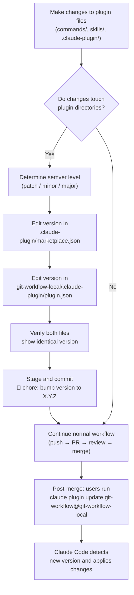
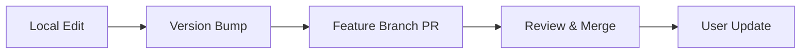

This page documents the **dual-file version bumping convention** that keeps the git-workflow plugin discoverable and updateable across the Claude Code plugin ecosystem. Because this repository is a pure-markdown plugin with no build system, test suite, or CI pipeline, the version field is the sole mechanism that signals "new content available" to installed users. Understanding when to bump, which files to touch, and how semver maps to plugin changes is essential for anyone contributing to this project.

Sources: [CLAUDE.md](CLAUDE.md#L38-L38)

## The Two-Version-File Architecture

The plugin's version is declared in **two separate JSON files** that serve different roles in the Claude Code plugin system. Both must always contain the same version string — a mismatch creates an inconsistent state where the marketplace lists one version while the plugin manifest reports another.

Sources: [.claude-plugin/marketplace.json](.claude-plugin/marketplace.json#L1-L34), [git-workflow-local/.claude-plugin/plugin.json](git-workflow-local/.claude-plugin/plugin.json#L1-L24)

| File | Scope | Audience | Purpose |
|------|-------|----------|---------|
| [`.claude-plugin/marketplace.json`](.claude-plugin/marketplace.json#L1-L34) | Repository root | Marketplace registry | Publishes the plugin listing with version, category, keywords, and the `source` path that points to the plugin directory |
| [`git-workflow-local/.claude-plugin/plugin.json`](git-workflow-local/.claude-plugin/plugin.json#L1-L24) | Plugin directory | Plugin loader | Declares the plugin's own identity, version, and metadata used by Claude Code at load time |

The `marketplace.json` acts as a **catalog index** — it tells the marketplace "here is a plugin called `git-workflow` located at `./git-workflow-local`, and its current version is `1.2.0`." The `plugin.json` acts as a **self-describing manifest** inside the plugin directory itself. Claude Code compares these version numbers against what it has cached locally to determine whether an update is needed. Without a version bump in both files, users who previously installed the plugin will never receive the new changes.

Sources: [CLAUDE.md](CLAUDE.md#L38-L38), [.claude-plugin/marketplace.json](.claude-plugin/marketplace.json#L10-L13), [git-workflow-local/.claude-plugin/plugin.json](git-workflow-local/.claude-plugin/plugin.json#L1-L4)

## When to Bump: The Trigger Condition

The convention is unambiguous: **before pushing any PR that modifies plugin files**, increment the version. The trigger scope includes these three directories:

| Directory | Contents | Examples |
|-----------|----------|---------|
| `commands/` | Slash command definitions | Adding a new `/gw-*` command, changing commit type rules, updating PR template logic |
| `skills/` | The SKILL.md workflow definition | Modifying the 11-step workflow, adding new review categories, changing polling intervals |
| `.claude-plugin/` | Plugin metadata files | Any change to `plugin.json` or `marketplace.json` itself (including version bumps) |

Changes to files **outside** these directories — such as the root `README.md`, `CLAUDE.md`, `pr-monitor-merge.sh`, or `eng.traineddata` — do not require a version bump because they do not alter the plugin's behavior or content as seen by Claude Code.

Sources: [CLAUDE.md](CLAUDE.md#L38-L38)

## Semver Strategy for a Markdown Plugin

Because this plugin contains no executable code, the traditional semver semantics (breaking API changes → major, new features → minor, bug fixes → patch) are adapted to content-level changes:

| Version Level | When to Use | Real Example from This Repository |
|---------------|-------------|-----------------------------------|
| **Patch** (`1.1.0` → `1.1.1`) | Typo fixes, wording clarifications, keyword additions that don't change workflow behavior | Adding `"review"` and `"remediation"` to the keywords list in `plugin.json` |
| **Minor** (`1.1.0` → `1.2.0`) | New commands, new workflow steps, behavioral changes to existing commands | Adding the review remediation command and restructuring the plugin directory layout |
| **Major** (`1.x.x` → `2.0.0`) | Removing a command, changing the commit format, restructuring the 11-step workflow in a backward-incompatible way | Not yet encountered in this repository's history |

The repository's version history demonstrates the pattern:

```
1.0.0  (2026-03-12)  Initial release — git workflow skill + PR monitoring script
  ↓
1.1.0  (2026-04-04)  Bug fix for skill continuation and PR template issues
  ↓
1.2.0  (2026-04-14)  Version bumping convention documented; refactor for public sharing
```

Sources: [git log](git-workflow-local/.claude-plugin/plugin.json#L1-L4), [CLAUDE.md](CLAUDE.md#L38-L38)

## The Version Bump Procedure: Step by Step

The following flowchart shows where version bumping sits within the broader feature development workflow. It is a pre-push gate — the version must be incremented and committed *before* the branch is pushed to the remote.



The concrete steps for performing a version bump:

**Step 1 — Identify the current version.** Read the `version` field from both files. If they differ, something is already wrong; synchronize them first.

**Step 2 — Choose the new version.** Apply the semver table above. For most plugin-content changes, a minor bump is appropriate.

**Step 3 — Edit both files.** Update the `version` string in both [`.claude-plugin/marketplace.json`](.claude-plugin/marketplace.json#L13) and [`git-workflow-local/.claude-plugin/plugin.json`](git-workflow-local/.claude-plugin/plugin.json#L3). The version must be identical.

**Step 4 — Commit with convention.** Stage both files and commit using the emoji conventional commit format. The commit for the `1.1.0 → 1.2.0` bump in this repository was:

```
📝 docs: add version bumping convention

Bump plugin version to 1.2.0 in both config files.

Co-authored-by: Claude <noreply@anthropic.com>
```

Note that the version bump commit itself was typed as `docs` rather than `chore`, because the bump accompanied a documentation convention addition. If the bump is purely mechanical (no accompanying convention change), `🔧 chore: bump version to X.Y.Z` is the correct commit type.

Sources: [CLAUDE.md](CLAUDE.md#L38-L38), [.claude-plugin/marketplace.json](.claude-plugin/marketplace.json#L13-L13), [git-workflow-local/.claude-plugin/plugin.json](git-workflow-local/.claude-plugin/plugin.json#L3-L3)

## The Plugin Development Lifecycle

Version bumping is one part of a larger development cycle. Because there is no build system, no test suite, and no CI pipeline, the entire development workflow is lightweight and manual:



| Stage | Action | Command or File |
|-------|--------|-----------------|
| **Local Edit** | Modify markdown files in `commands/`, `skills/`, or `.claude-plugin/` | Any text editor |
| **Version Bump** | Increment semver in both JSON files | Manual edit per the procedure above |
| **Feature Branch PR** | Create branch, commit, push, open PR | `/gw-flow`, `/gw-branch`, `/gw-commit`, `/gw-pr` |
| **Review & Merge** | Address feedback, squash-merge to default branch | `/gw-remediate`, `/gw-merge` |
| **User Update** | Installed users pull the new version | `claude plugin update git-workflow@git-workflow-local` |

The **update mechanism** is the critical last mile. After a version bump is merged into the default branch, any user who previously installed the plugin from the marketplace runs:

```bash
claude plugin update git-workflow@git-workflow-local
```

Claude Code compares the version in the remote `plugin.json` against the locally cached version. If the remote version is higher, the new plugin content is downloaded and applied. If no version bump occurred — even if the underlying markdown changed — the update is silently skipped because the version strings match.

Sources: [CLAUDE.md](CLAUDE.md#L40-L56), [git-workflow-local/README.md](git-workflow-local/README.md#L30-L36)

## Common Mistakes and How to Avoid Them

| Mistake | Consequence | Prevention |
|---------|-------------|------------|
| Bumping only one file | Marketplace and plugin disagree on version; update behavior becomes unpredictable | Always edit both [`marketplace.json`](.claude-plugin/marketplace.json#L13) and [`plugin.json`](git-workflow-local/.claude-plugin/plugin.json#L3) in the same commit |
| Forgetting to bump before push | Merged changes are invisible to installed users — they never get the update | Check `git diff --name-only` against `commands/`, `skills/`, `.claude-plugin/` before pushing |
| Bumping for non-plugin changes | Unnecessary version churn for `README.md` or `CLAUDE.md` edits that don't affect plugin behavior | Only bump when files inside the three trigger directories change |
| Using inconsistent semver | Users can't tell whether an update is breaking, additive, or cosmetic | Follow the semver strategy table — patch for metadata, minor for new content, major for removals |

Sources: [CLAUDE.md](CLAUDE.md#L38-L38)

## Testing Plugin Changes Locally

Because there is no automated test suite, plugin changes are validated through manual installation. Three installation methods are available, all documented in the repository:

```bash
# Method 1: Install from GitHub (production)
claude plugin marketplace add tupacalypse187/tupacalypse187-claude-skills
claude plugin install git-workflow@git-workflow-local

# Method 2: Install from local clone (development testing)
claude plugin marketplace add /path/to/this-repo
claude plugin install git-workflow@git-workflow-local

# Method 3: From within a Claude Code session
/plugin marketplace add tupacalypse187/tupacalypse187-claude-skills
/reload-plugins
```

After installing, invoke any slash command (e.g., `/gw-commit`) or use natural language to verify that the updated skill or command definition is being loaded correctly. If something is wrong, the plugin can be removed and reinstalled:

```bash
claude plugin uninstall git-workflow@git-workflow-local
```

Sources: [CLAUDE.md](CLAUDE.md#L43-L56), [README.md](README.md#L11-L35)

## What Comes Next

This page covered the version bumping convention and how it integrates into the development lifecycle. For the broader context of how plugin changes flow through the PR pipeline, see [The 11-Step Feature Development Workflow](7-branch-creation-and-naming-conventions) starting with branch creation. For details on the metadata fields that surround the version in each JSON file, see [Marketplace Configuration and Plugin Metadata](6-marketplace-configuration-and-plugin-metadata). If you encounter issues after a version bump where updates aren't being detected, consult [Troubleshooting: Merge Conflicts, Behind Branch, Hook Failures](16-troubleshooting-merge-conflicts-behind-branch-hook-failures).