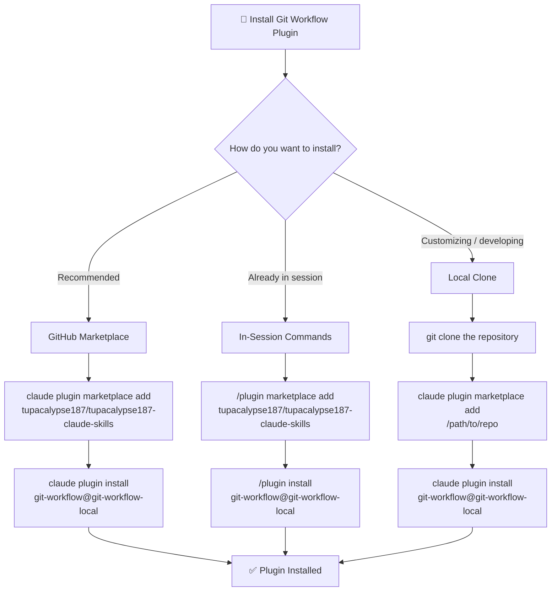
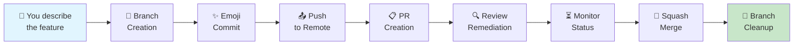

The **Git Workflow Plugin** is a Claude Code plugin that automates the entire feature development lifecycle — from branch creation through emoji conventional commits, pull request generation, review remediation, and final merge. This guide walks you through installing the plugin and running your first workflow in under five minutes. You will learn three installation methods, how to verify the plugin is active, and two ways to invoke it: natural language and slash commands.

Sources: [README.md](README.md#L1-L42), [git-workflow-local/README.md](git-workflow-local/README.md#L1-L3)

## Prerequisites

Before installing, confirm you have the following tools available in your terminal:

| Requirement | Purpose | How to Verify |
|---|---|---|
| **Claude Code CLI** | Plugin host environment | `claude --version` |
| **Git** | Version control operations | `git --version` |
| **GitHub CLI (`gh`)** | PR creation, status checks, merge | `gh --version` |
| **Authenticated GitHub account** | Push access to repositories | `gh auth status` |

The plugin itself contains **no executable code** — it is composed entirely of Markdown files (skill definitions and slash command templates) that Claude Code interprets at runtime. There is no build step, no `npm install`, and no compiled binaries.

Sources: [CLAUDE.md](CLAUDE.md#L1-L8), [git-workflow-local/README.md](git-workflow-local/README.md#L1-L3)

## Installation Methods

Three installation paths are available. The table below compares them so you can choose the one that fits your workflow:

| Method | Best For | Requires Git Clone? | Auto-Updatable? |
|---|---|---|---|
| **GitHub Marketplace** (Recommended) | Production use | No | Yes — `claude plugin update` |
| **In-Session Commands** | Quick setup during a session | No | Yes — `/plugin update` |
| **Local Clone** | Development and customization | Yes | Yes — pull changes, then update |

### Method 1: From GitHub Marketplace (Recommended)

Add the repository as a marketplace source, then install the plugin. Both commands run in your terminal:

```bash
# Step 1: Register the marketplace source
claude plugin marketplace add tupacalypse187/tupacalypse187-claude-skills

# Step 2: Install the plugin
claude plugin install git-workflow@git-workflow-local
```

Sources: [git-workflow-local/README.md](git-workflow-local/README.md#L7-L15), [README.md](README.md#L11-L18)

### Method 2: From Within a Claude Code Session

If you are already inside a Claude Code interactive session, use the slash-prefixed plugin commands instead:

```
/plugin marketplace add tupacalypse187/tupacalypse187-claude-skills
/plugin install git-workflow@git-workflow-local
```

Sources: [git-workflow-local/README.md](git-workflow-local/README.md#L17-L22)

### Method 3: From a Local Clone

For contributors who want to modify the plugin or inspect its source, install from a local directory:

```bash
# Clone the repository
git clone https://github.com/tupacalypse187/tupacalypse187-claude-skills.git
cd tupacalypse187-claude-skills

# Register the local path as a marketplace source
claude plugin marketplace add /path/to/tupacalypse187-claude-skills

# Install the plugin
claude plugin install git-workflow@git-workflow-local
```

Sources: [git-workflow-local/README.md](git-workflow-local/README.md#L24-L29), [README.md](README.md#L26-L30)

The following flowchart summarizes the decision path and commands for each installation method:



Sources: [git-workflow-local/README.md](git-workflow-local/README.md#L7-L29)

## Verifying the Installation

After installation, confirm the plugin is active by checking its metadata. The plugin is registered under the name `git-workflow` at version **1.2.0**, licensed under MIT, and categorized under "development":

| Property | Value |
|---|---|
| **Plugin Name** | `git-workflow` |
| **Version** | 1.2.0 |
| **License** | MIT |
| **Author** | cyantorno |
| **Category** | development |
| **Source Directory** | `git-workflow-local/` |

You can also try invoking a slash command — if the plugin is loaded, typing `/gw-` inside a Claude Code session should present autocomplete suggestions for all six commands.

Sources: [git-workflow-local/.claude-plugin/plugin.json](git-workflow-local/.claude-plugin/plugin.json#L1-L24), [.claude-plugin/marketplace.json](.claude-plugin/marketplace.json#L1-L34)

## Your First Workflow: A 60-Second Walkthrough

Once the plugin is installed, you have two ways to trigger workflows: **natural language** and **slash commands**. The following diagram illustrates what happens when you ask Claude Code to run the full workflow:



### Using Natural Language

Simply tell Claude Code what you want to accomplish. For example, to run the entire lifecycle for a new feature:

> "Complete git workflow for adding dark mode to the settings page"

Claude Code will automatically execute all 11 steps: create `feat/dark-mode-settings`, commit with `✨ feat(ui): add dark mode to settings page`, push, open a PR with a structured template, poll for reviews, fix any feedback, monitor CI, squash-merge, and clean up branches.

Sources: [git-workflow-local/README.md](git-workflow-local/README.md#L48-L63), [git-workflow-local/skills/git-workflow/SKILL.md](git-workflow-local/skills/git-workflow/SKILL.md#L14-L28)

### Using Slash Commands

Slash commands provide a terse, keyboard-driven alternative. Each command maps to a specific workflow stage:

| Command | What It Does | Example |
|---|---|---|
| `/gw-flow` | Full end-to-end workflow (all 11 steps) | `/gw-flow Add user authentication` |
| `/gw-branch` | Create a feature branch from the default branch | `/gw-branch user-authentication` |
| `/gw-commit` | Stage and commit with emoji conventional format | `/gw-commit` |
| `/gw-pr` | Create a PR with the structured template | `/gw-pr "feat: Add authentication"` |
| `/gw-remediate` | Poll for review comments, fix, push, and reply | `/gw-remediate 13` or `/gw-remediate 13 180` |
| `/gw-merge` | Monitor CI checks and merge when status is `CLEAN` | `/gw-merge 13` |

Both invocation styles are equivalent — use whichever feels natural. You can mix them freely within a single session.

Sources: [git-workflow-local/README.md](git-workflow-local/README.md#L137-L150), [git-workflow-local/commands/gw-flow.md](git-workflow-local/commands/gw-flow.md#L1-L7), [git-workflow-local/commands/gw-branch.md](git-workflow-local/commands/gw-branch.md#L1-L7)

## Common Phrases Quick Reference

The plugin recognizes a range of natural language phrases. Here are the most common ones organized by workflow stage:

| Workflow Stage | Phrases That Trigger It |
|---|---|
| **Full cycle** | "Complete git workflow for X" · "Run full PR cycle" · "Do the full git workflow" |
| **Branch only** | "Create a feature branch for X" · "Start a new branch" |
| **Commit only** | "Commit my changes" · "Stage and commit" |
| **PR only** | "Create a PR" · "Make a pull request" |
| **Review feedback** | "Check PR comments" · "Address review feedback" |
| **Monitor & merge** | "Monitor and merge my PR" · "Wait for checks and merge" |

**Tip:** Be specific. "Create a feature branch for S3 upload" works better than "Create a branch" because the plugin can derive a meaningful branch name (`feat/s3-upload`) from your description.

Sources: [git-workflow-local/README.md](git-workflow-local/README.md#L214-L234), [git-workflow-local/skills/git-workflow/SKILL.md](git-workflow-local/skills/git-workflow/SKILL.md#L33-L51)

## Updating and Uninstalling

### Updating

When a new version is published, update in a single command:

```bash
claude plugin update git-workflow@git-workflow-local
```

If you installed from a local clone, pull the latest changes first, then run the update command.

Sources: [git-workflow-local/README.md](git-workflow-local/README.md#L32-L36)

### Uninstalling

To remove the plugin entirely:

```bash
claude plugin uninstall git-workflow@git-workflow-local
```

Sources: [git-workflow-local/README.md](git-workflow-local/README.md#L40-L42)

## Troubleshooting Common Installation Issues

| Symptom | Likely Cause | Fix |
|---|---|---|
| `command not found: claude` | Claude Code CLI not installed | Install Claude Code first |
| `gh auth` errors during PR steps | GitHub CLI not authenticated | Run `gh auth login` |
| Slash commands not appearing | Plugin not loaded in session | Run `/reload-plugins` or restart Claude Code |
| `marketplace add` fails | Typo in repository slug | Verify: `tupacalypse187/tupacalypse187-claude-skills` |

For deeper troubleshooting of merge conflicts, behind-branch issues, and hook failures, see [Troubleshooting: Merge Conflicts, Behind Branch, Hook Failures](16-troubleshooting-merge-conflicts-behind-branch-hook-failures).

Sources: [CLAUDE.md](CLAUDE.md#L53-L58), [git-workflow-local/skills/git-workflow/SKILL.md](git-workflow-local/skills/git-workflow/SKILL.md#L564-L604)

## Where to Go Next

Now that the plugin is installed and you understand the two invocation styles, explore the specifics of each workflow stage:

- **[Triggering Workflows with Natural Language](3-triggering-workflows-with-natural-language)** — Master the phrases and patterns that reliably invoke each step.
- **[Slash Commands Quick Reference](4-slash-commands-quick-reference)** — A complete parameter-by-parameter reference for all six `/gw-*` commands.
- **[Repository Architecture and Plugin Structure](5-repository-architecture-and-plugin-structure)** — Understand how the plugin directory, marketplace config, and skill definitions relate to each other.