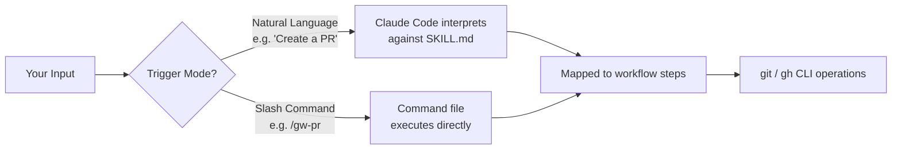

The Git Workflow plugin eliminates the need to memorize CLI flags or sequence complex git commands manually. Once installed, you interact with Claude Code using plain English — describe what you want to accomplish, and the plugin's skill definition maps your intent to the correct sequence of branch operations, commits, PR creation, review handling, and merges. This page explains the two triggering modes (natural language and slash commands), how they map to the underlying 11-step workflow, and provides practical phrase patterns you can start using immediately.

Sources: [SKILL.md](git-workflow-local/skills/git-workflow/SKILL.md#L1-L8), [README.md](git-workflow-local/README.md#L210-L237)

## How Triggering Works: The Plugin Architecture

Claude Code plugins operate on a **skill + commands** model. The skill file (`SKILL.md`) provides a comprehensive workflow definition that Claude Code reads at conversation start, establishing context about what operations are available. The command files (`gw-*.md`) provide structured entry points with declared arguments and step-by-step instructions. When you type a natural language phrase like "create a branch for my login fix," Claude Code matches your intent against these definitions and executes the corresponding steps.

The relationship between the two triggering modes is straightforward: **natural language** is interpreted semantically by Claude Code against the skill definition, while **slash commands** are explicit invocations of predefined command templates. Both modes ultimately produce the same git and `gh` CLI operations.

Sources: [SKILL.md](git-workflow-local/skills/git-workflow/SKILL.md#L1-L8), [gw-flow.md](git-workflow-local/commands/gw-flow.md#L1-L10), [plugin.json](git-workflow-local/.claude-plugin/plugin.json#L1-L25)

## The Two Triggering Modes

You have two ways to invoke the plugin's capabilities. Choose based on your preference and the level of precision you need.

| Mode | When to Use | Example |
|------|-------------|---------|
| **Natural Language** | Conversational, flexible, hands-off interaction | *"Complete git workflow for adding dark mode"* |
| **Slash Commands** | Precise control, specific step targeting, scriptable workflows | `/gw-flow Add dark mode to settings` |

**Natural language** is ideal when you want Claude Code to handle the full lifecycle or when you're exploring what the plugin can do. **Slash commands** are preferable when you need to target a specific workflow step with exact parameters, or when you want repeatable, copy-pasteable invocations.

Sources: [README.md](git-workflow-local/README.md#L185-L210), [gw-flow.md](git-workflow-local/commands/gw-flow.md#L1-L10)

## Natural Language Phrase Patterns

The skill definition documents specific phrase patterns that Claude Code recognizes. You don't need to use these exact words — Claude Code understands semantic intent — but these patterns serve as reliable starting points for a beginner.

### Full Workflow Phrases

These phrases trigger the complete branch-to-merge lifecycle (all 11 steps). Claude Code will create a branch, commit your changes, push, open a PR, wait for reviews, fix any feedback, monitor CI, merge, and clean up — all without further input.

| Phrase Pattern | What Happens |
|----------------|--------------|
| "Complete git workflow for **X**" | Runs the full 11-step lifecycle for feature X |
| "Create feature branch, commit, PR, and merge" | Full workflow with explicit step naming |
| "Run full PR cycle" | Alias for the complete workflow |
| "Do the full git workflow" | Same as above |

Sources: [SKILL.md](git-workflow-local/skills/git-workflow/SKILL.md#L44-L51)

### Individual Step Phrases

When you only need one part of the workflow, use targeted phrases. This is useful if you're managing steps manually or intervening at a specific point.

| What You Want | Phrase Example | Workflow Step |
|---------------|----------------|---------------|
| Create a branch | "Create a feature branch for **X**" | Step 1 |
| Commit changes | "Commit my changes with emoji conventional commits" | Step 2 |
| Create a PR | "Create a PR with structured template" | Step 4 |
| Check reviews | "Check for PR comments and address them" | Steps 5–8 |
| Monitor & merge | "Monitor my PR status" / "Merge the PR and cleanup" | Steps 9–11 |

Sources: [SKILL.md](git-workflow-local/skills/git-workflow/SKILL.md#L53-L65), [README.md](git-workflow-local/README.md#L210-L237)

### Review Handling Phrases

Review remediation is a key feature that sets this plugin apart. These phrases target the feedback loop specifically.

| Phrase Pattern | Behavior |
|----------------|----------|
| "Check PR comments and address them" | Waits for reviews, fetches comments, categorizes and fixes each one |
| "Fix review comments on PR **#N**" | Targets a specific PR by number |
| "Address feedback on current PR" | Operates on the most recently created PR |

Sources: [SKILL.md](git-workflow-local/skills/git-workflow/SKILL.md#L58-L63), [gw-remediate.md](git-workflow-local/commands/gw-remediate.md#L1-L10)

## Slash Commands Reference

Slash commands provide explicit, argument-driven access to each workflow stage. Each command is defined in its own markdown file under the `commands/` directory, with declared arguments and deterministic execution steps.

| Command | Arguments | Purpose |
|---------|-----------|---------|
| `/gw-flow <description>` | `description` (required) | Full workflow: branch → commit → push → PR → review → merge |
| `/gw-branch <name>` | `name` (required) | Create a feature branch from the default branch |
| `/gw-commit [message]` | `message` (optional) | Stage and commit with emoji conventional format |
| `/gw-pr [title] [--draft]` | `title` (optional), `--draft` flag | Create a PR with structured template |
| `/gw-remediate <pr#> [wait]` | `pr_number` (required), `wait_seconds` (default: 180) | Poll reviews, categorize, fix, push, reply |
| `/gw-merge <pr#> [subject]` | `pr_number` (required), `commit_subject` (optional) | Monitor checks and merge when clean |

Sources: [gw-flow.md](git-workflow-local/commands/gw-flow.md#L1-L8), [gw-branch.md](git-workflow-local/commands/gw-branch.md#L1-L8), [gw-commit.md](git-workflow-local/commands/gw-commit.md#L1-L10), [gw-pr.md](git-workflow-local/commands/gw-pr.md#L1-L9), [gw-remediate.md](git-workflow-local/commands/gw-remediate.md#L1-L10), [gw-merge.md](git-workflow-local/commands/gw-merge.md#L1-L9)

## How Natural Language Maps to the 11-Step Workflow

Understanding how your phrases map to the underlying workflow stages helps you predict what Claude Code will do and where it might pause for your input. The full workflow is defined in the skill file as 11 mandatory sequential steps, and natural language triggers select a range within that sequence.

```mermaid
flowchart TD
    subgraph "Full Workflow Trigger"
        A["Step 1: Create Branch"] --> B["Step 2: Commit Changes"]
        B --> C["Step 3: Push to Remote"]
        C --> D["Step 4: Create PR"]
        D --> E["Step 5: Poll for Reviews"]
        E --> F["Step 6: Evaluate & Remediate"]
        F --> G["Step 7: Push Fixes & Reply"]
        G --> H["Step 8: Loop for New Feedback"]
        H --> I["Step 9: Monitor Status"]
        I --> J["Step 10: Merge PR"]
        J --> K["Step 11: Cleanup Branches"]
    end

    subgraph "Branch Only Trigger"
        A
    end

    subgraph "Commit Only Trigger"
        B
    end

    subgraph "PR Only Trigger"
        D
    end

    subgraph "Review Trigger"
        E --> F --> G --> H
    end

    subgraph "Merge Trigger"
        I --> J --> K
    end
```

When you trigger the **full workflow** (e.g., "Complete git workflow for adding dark mode"), all 11 steps execute sequentially without stopping. This is by design — the skill definition includes a mandatory instruction that steps 5–11 are not optional follow-ups but required parts of the flow. When you trigger an **individual step**, only that step (and its immediate dependencies) executes.

Sources: [SKILL.md](git-workflow-local/skills/git-workflow/SKILL.md#L17-L40), [gw-flow.md](git-workflow-local/commands/gw-flow.md#L20-L27)

## Practical Example: A Full Workflow in Action

Here is a concrete walkthrough of what happens when you type a natural language trigger. This example uses a feature request to illustrate each stage.

**Your input:** *"Complete git workflow for adding dark mode to the settings page"*

| Stage | What Claude Code Does | Output You'll See |
|-------|----------------------|-------------------|
| **Branch** | Detects default branch, pulls latest, creates `feat/dark-mode-settings` | `✅ Created branch: feat/dark-mode-settings` |
| **Commit** | Stages files, detects change type, creates `✨ feat(ui): add dark mode to settings page` | Commit confirmation |
| **Push** | Pushes branch with upstream tracking | Remote tracking set |
| **PR** | Analyzes diff, generates structured PR body from real changes | PR URL with number |
| **Reviews** | Waits 180s, fetches comments, categorizes each one | Comment analysis log |
| **Remediate** | Makes minimal fixes for each actionable comment | Fix commits pushed |
| **Reply** | Replies to every comment with fix hash | Reply confirmations |
| **Monitor** | Polls status every 10s until `CLEAN` | Status countdown |
| **Merge** | Squash-merges, deletes remote branch | Merge confirmation |
| **Cleanup** | Switches to default branch, pulls, deletes local branch | `✅ Done!` |

Sources: [SKILL.md](git-workflow-local/skills/git-workflow/SKILL.md#L600-L655), [README.md](git-workflow-local/README.md#L20-L55)

## Tips for Effective Triggering

These practical tips will help you get the most reliable results from natural language interaction.

**Be specific about intent.** A phrase like "Create a feature branch for S3 upload support" produces better results than "Create a branch" because Claude Code can derive a meaningful branch name and understand the scope of work ahead.

**Include PR numbers when targeting existing PRs.** For review remediation and merge monitoring, including the PR number (e.g., "Check PR #13 for review comments") eliminates ambiguity about which PR to operate on.

**Use natural language for exploration, slash commands for precision.** If you're unsure what the plugin can do, try describing your goal in plain English. If you need exact control over which step runs and with what arguments, use the slash command form.

**The full workflow is truly full.** When you trigger the complete workflow, steps 5–11 (review handling, monitoring, merge, cleanup) always execute. There is no step where Claude Code stops and waits for you to manually trigger the next phase. If you want to stop after PR creation, use `/gw-pr` or say "Create a PR" instead of "Complete git workflow."

Sources: [README.md](git-workflow-local/README.md#L227-L240), [SKILL.md](git-workflow-local/skills/git-workflow/SKILL.md#L33-L40), [gw-flow.md](git-workflow-local/commands/gw-flow.md#L20-L27)

## Next Steps

Now that you understand how to trigger workflows, the following pages provide deeper detail on each command and workflow stage:

- **[Slash Commands Quick Reference](4-slash-commands-quick-reference)** — A compact reference card for all six slash commands with argument details and usage examples.
- **[Branch Creation and Naming Conventions](7-branch-creation-and-naming-conventions)** — Deep dive into how branches are named, prefixed, and created from the default branch.
- **[Emoji Conventional Commits: Types, Format, and Best Practices](8-emoji-conventional-commits-types-format-and-best-practices)** — Complete guide to the emoji commit format used throughout the workflow.
- **[The 11-Step Feature Development Workflow](7-branch-creation-and-naming-conventions)** — Detailed walkthrough of each step from branch creation through post-merge cleanup.