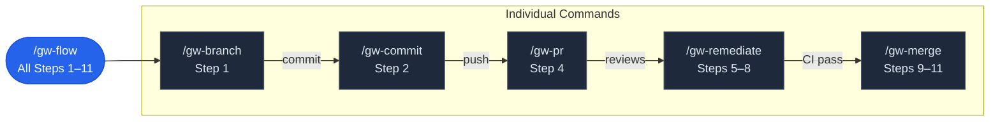

The git-workflow plugin exposes **six slash commands** — each mapped to a distinct phase of the feature development lifecycle. These commands are the plugin's executable surface: typed directly into a Claude Code session, they instruct Claude to carry out specific Git operations with embedded guardrails like emoji conventional commit formatting, structured PR templates, and automated review remediation loops. Every command lives as a Markdown file under `commands/`, with a YAML frontmatter block that declares its description and argument schema, followed by natural-language instructions that Claude interprets and executes. This page is your single-stop reference for every command's signature, behavior, arguments, and position within the larger workflow.

Sources: [CLAUDE.md](CLAUDE.md#L17-L23), [README.md](git-workflow-local/README.md#L137-L149)

## Command Catalog at a Glance

The table below captures the essential calling signature and purpose of every command. Use it as a quick lookup — each row links to the deeper breakdown further down this page.

| Command | Purpose | Required Argument(s) | Optional Argument(s) | Example |
|---------|---------|-----------------------|----------------------|---------|
| `/gw-flow` | Full lifecycle: branch → commit → push → PR → remediate → merge | `description` | — | `/gw-flow Add user authentication` |
| `/gw-branch` | Create a feature branch from the default branch | `name` | — | `/gw-branch user-authentication` |
| `/gw-commit` | Stage and commit changes with emoji conventional commits | — | `message`, `type` | `/gw-commit "add login" feat` |
| `/gw-pr` | Create a PR with a structured template | — | `title`, `draft` (`--draft` / `-d`) | `/gw-pr "feat: Add auth"` |
| `/gw-remediate` | Poll reviews, categorize feedback, fix code, push, reply | `pr_number` | `wait_seconds` (default 180) | `/gw-remediate 13` or `/gw-remediate 13 300` |
| `/gw-merge` | Monitor PR status and auto-merge squash when checks pass | `pr_number` | `commit_subject` | `/gw-merge 13` |

Sources: [gw-flow.md](git-workflow-local/commands/gw-flow.md#L1-L7), [gw-branch.md](git-workflow-local/commands/gw-branch.md#L1-L7), [gw-commit.md](git-workflow-local/commands/gw-commit.md#L1-L10), [gw-pr.md](git-workflow-local/commands/gw-pr.md#L1-L9), [gw-remediate.md](git-workflow-local/commands/gw-remediate.md#L1-L9), [gw-merge.md](git-workflow-local/commands/gw-merge.md#L1-L9)

## How the Commands Relate to the Workflow

Each command maps to one or more steps in the plugin's 11-step feature development workflow. The diagram below shows every command and the workflow phase it governs. The `/gw-flow` command is the orchestrator — it invokes *all six* steps sequentially in a single invocation, while the remaining five commands let you execute individual phases on demand.

**Reading the diagram:** The blue node (`/gw-flow`) is the all-in-one entry point that chains through every phase. The dark nodes are individually invocable commands. Arrow labels indicate what triggers the transition between phases (a manual push after `/gw-commit`, a review appearing after `/gw-pr`, and so on).

Sources: [SKILL.md](git-workflow-local/skills/git-workflow/SKILL.md#L10-L28), [gw-flow.md](git-workflow-local/commands/gw-flow.md#L22-L24)

---

## `/gw-flow` — Full Lifecycle

**Signature:** `/gw-flow <description>`

This is the orchestrator command. Given a brief description of the feature or change, it executes the entire six-phase pipeline in strict sequence: (1) create branch from the default branch, (2) stage and commit with an emoji conventional commit, (3) push to the remote with upstream tracking, (4) create a PR whose title and body are generated from the actual `git diff` output — never placeholder text, (5) poll for code review comments, evaluate and remediate each one, and (6) monitor CI status until `CLEAN`, then squash-merge and clean up branches. The command file contains an explicit **critical warning**: all six steps must run sequentially without stopping — Claude must not halt after creating the PR (Step 4).

**Behavior by step:**

| Step | Action | Key Behavior |
|------|--------|--------------|
| 1 — Branch | Detects default branch, pulls latest, creates `feat/<slug>` from description | Auto-slugs the description to kebab-case |
| 2 — Commit | Analyzes `git status` + `git diff --staged`, picks emoji/type | Same emoji/type propagates to PR title and merge subject |
| 3 — Push | `git push -u origin <branch>` | Sets upstream tracking |
| 4 — PR | `gh pr create` with diff-derived body | Extracts PR number from output URL for subsequent steps |
| 5 — Remediate | Waits 180s, fetches review comments, categorizes, fixes, pushes, replies | Loops up to 5 iterations for new feedback |
| 6 — Merge | Polls `mergeStateStatus` every 10s (up to 60 iterations) | Squash-merges, deletes branches, syncs default branch |

Sources: [gw-flow.md](git-workflow-local/commands/gw-flow.md#L9-L197)

---

## `/gw-branch` — Create Feature Branch

**Signature:** `/gw-branch <name>`

Creates a new feature branch from the repository's default branch (`main`, `master`, or whatever `HEAD` resolves to). The command auto-detects the prefix based on the name you provide — if you pass `fix-login-bug`, the prefix switches from the default `feat/` to `fix/`. If you include the prefix yourself (e.g., `feat/my-feature`), the command strips it and re-applies it to avoid duplication (`feat/feat/my-feature`).

**Supported prefixes and when they're auto-selected:**

| Prefix | Trigger Pattern | Example Input → Output Branch |
|--------|----------------|-------------------------------|
| `feat/` | Default; no matching prefix pattern | `user-auth` → `feat/user-auth` |
| `fix/` | Name starts with `fix-` | `fix-login-bug` → `fix/login-bug` |
| `docs/` | Name starts with `docs-` | `docs-api-guide` → `docs/api-guide` |
| `refactor/` | Name starts with `refactor-` | `refactor-parser` → `refactor/parser` |
| `perf/` | Name starts with `perf-` | `perf-query-opt` → `perf/query-opt` |
| `test/` | Name starts with `test-` | `test-auth-unit` → `test/auth-unit` |
| `chore/` | Name starts with `chore-` | `chore-deps-update` → `chore/deps-update` |
| `ci/` | Name starts with `ci-` | `ci-lint-action` → `ci/lint-action` |

**What it does under the hood:** detects the default branch via `git remote show origin`, checks it out and pulls, applies the correct prefix, strips any duplicate prefix from the user's input, then runs `git checkout -b`.

Sources: [gw-branch.md](git-workflow-local/commands/gw-branch.md#L13-L74)

---

## `/gw-commit` — Stage and Commit with Emoji

**Signature:** `/gw-commit [message] [type]`

Stages all changes (`git add .`) and creates a commit formatted according to the emoji conventional commits convention: `emoji type: description`. Both arguments are optional — if omitted, Claude inspects `git status` and `git diff` to auto-detect the appropriate type and generate a message.

**Auto-detection rules determine the commit type from file patterns:**

| File Pattern / Context | Auto-detected Type | Emoji |
|------------------------|--------------------|-------|
| New (untracked) files | `feat` | ✨ |
| `*.md` changes | `docs` | 📝 |
| `*.css`, `*.tsx` UI changes | `style` | 🎨 |
| `package.json` changes | `chore` | 🔧 |
| `*.yml`/`*.yaml` in `.github/` | `ci` | 👷 |
| Test files | `test` | ✅ |
| User mentions "fix", "bug", "error" | `fix` | 🐛 |
| Code refactoring (no behavior change) | `refactor` | ♻️ |
| Performance-related changes | `perf` | ⚡️ |
| Build system changes | `build` | 📦 |

When the commit is AI-assisted, the command appends a `Co-authored-by: Claude <noreply@anthropic.com>` footer automatically.

Sources: [gw-commit.md](git-workflow-local/commands/gw-commit.md#L18-L63)

---

## `/gw-pr` — Create Pull Request

**Signature:** `/gw-pr [title] [--draft | -d]`

Creates a GitHub pull request with a structured Markdown body derived from the actual branch diff — never placeholder text. Before generating the PR title and body, the command runs `git diff "$DEFAULT_BRANCH"...HEAD` and `git log "$DEFAULT_BRANCH"..HEAD` to inspect real changes. The PR title must include an emoji prefix; if the user supplies a title without one, the command adds the appropriate emoji based on diff analysis.

**PR body template structure (every section filled with real content):**

| Section | Purpose | Content Source |
|---------|---------|----------------|
| `## 📝 Summary` | One-sentence description of the change | Derived from `git diff` analysis |
| `## 🔄 Changes` | Bulleted list of meaningful changes with emoji prefixes | Each bullet maps to a distinct diff hunk |
| `## ✅ Verification` | Specific, runnable test steps | Based on what actually changed |
| `## 🔗 Sources` | Issue references, docs, related PRs | Omitted entirely if none exist |
| Footer | Claude Code attribution | Static text |

**Title rules:** If the user provides a title that already has an emoji prefix, it is used as-is. If the user provides a title without an emoji, the command prepends the correct one. If no title is given, it is derived from the most recent commit message. The `--draft` or `-d` flag creates the PR in draft state.

Sources: [gw-pr.md](git-workflow-local/commands/gw-pr.md#L23-L109)

---

## `/gw-remediate` — Review Remediation

**Signature:** `/gw-remediate <pr_number> [wait_seconds]`

The most complex command in the set. It operates in a seven-phase loop to handle code review feedback end-to-end: (1) wait the specified number of seconds (default 180) for reviews to arrive, (2) fetch all inline code comments and general PR comments via the GitHub API, (3) categorize each comment by severity, (4) make minimal code fixes for actionable feedback, (5) push all fixes in a single batch and reply to every comment, (6) re-monitor CI status, and (7) loop back to check for new comments on the fixes — up to a maximum of five iterations.

**Comment categorization determines the remediation action:**

| Category | Action | Typical Examples |
|----------|--------|-----------------|
| **Must fix** | Code change required | Bugs, security issues, logic errors, broken tests |
| **Should fix** | Code change recommended | Code style, naming, missing error handling |
| **Suggestion** | Apply judgment — may skip | Alternative approaches, nicer patterns |
| **Question** | Reply only, no code change | Reviewer asking for clarification |
| **Already addressed** | Reply only | Comment refers to code already fixed in a prior commit |

**Reply format conventions:**

| Situation | Reply Template |
|-----------|---------------|
| Fix applied | `✅ Fixed in <short_hash>. <what was changed>` |
| Question answered | `💡 <answer to the question>` |
| Suggestion declined | `🙏 Good suggestion, but <reason>. Happy to revisit if needed.` |

**Important guardrails:** every comment must receive a reply; changes are minimal and scoped to what was requested; one commit per logical fix; fixes are batched into a single push to avoid spamming CI; the loop caps at five iterations and then informs the user that manual intervention may be needed.

Sources: [gw-remediate.md](git-workflow-local/commands/gw-remediate.md#L18-L168)

---

## `/gw-merge` — Monitor and Merge

**Signature:** `/gw-merge <pr_number> [commit_subject]`

Polls a PR's `mergeStateStatus` field every 10 seconds, for up to 60 iterations (10 minutes total). When the status resolves to `CLEAN`, it performs a squash merge, deletes the remote branch, switches to the default branch, pulls the latest changes, and deletes the local feature branch. If an optional `commit_subject` is provided, it is passed as the `--subject` flag to `gh pr merge`; otherwise, GitHub defaults to the PR title (which already carries the correct emoji/type prefix).

**Status values and their meanings:**

| Status | Meaning | Command Behavior |
|--------|---------|-----------------|
| `CLEAN` | All checks passed, ready to merge | Proceed with squash merge |
| `MERGED` | PR already merged | Switch to default branch, pull, exit |
| `CLOSED` | PR was closed without merging | Exit with error |
| `DIRTY` | Merge conflict or failed checks | Continue polling until timeout |
| `BEHIND` | Branch is behind base branch | Continue polling |
| `UNSTABLE` | Checks pending or partially failed | Continue polling |
| `UNKNOWN` | Status could not be determined | Continue polling |

On timeout (all 60 iterations exhausted without `CLEAN`), the command exits with an error message suggesting the user manually check `gh pr view <PR_NUMBER>`.

Sources: [gw-merge.md](git-workflow-local/commands/gw-merge.md#L15-L90)

---

## Commit Types and Emoji Reference

Every command that creates a commit or a PR title draws from the same emoji conventional commit type table. This shared vocabulary ensures consistency across branch names, commit messages, PR titles, and squash-merge subjects throughout the entire workflow.

| Type | Emoji | Example Commit Message |
|------|-------|----------------------|
| `feat` | ✨ | `✨ feat(auth): add JWT token validation` |
| `fix` | 🐛 | `🐛 fix(api): resolve memory leak in handler` |
| `docs` | 📝 | `📝 docs: update API endpoints documentation` |
| `style` | 🎨 | `🎨 style: format code with prettier` |
| `refactor` | ♻️ | `♻️ refactor: simplify authentication logic` |
| `perf` | ⚡️ | `⚡️ perf: optimize database query performance` |
| `test` | ✅ | `✅ test: add unit tests for user service` |
| `chore` | 🔧 | `🔧 chore: update build dependencies` |
| `ci` | 👷 | `👷 ci: add GitHub Actions workflow` |
| `build` | 📦 | `📦 build: upgrade to webpack 5` |

Sources: [SKILL.md](git-workflow-local/skills/git-workflow/SKILL.md#L86-L99), [gw-commit.md](git-workflow-local/commands/gw-commit.md#L18-L29)

## Choosing the Right Command

The decision table below helps you select the correct command based on your current situation. For a complete understanding of how each command's internals work, follow the links in the **Deep Dive** column.

| Your Goal | Command to Use | When to Use It |
|-----------|---------------|----------------|
| Start and finish a feature from scratch | `/gw-flow <description>` | You have uncommitted changes and want the full pipeline |
| Just set up a branch | `/gw-branch <name>` | You want to create the branch but manage commits yourself |
| Save your current work | `/gw-commit` | You have modified files ready to stage and commit |
| Submit changes for review | `/gw-pr [title]` | Your branch has commits pushed and you need a PR |
| Handle reviewer feedback | `/gw-remediate <pr#>` | Reviews have arrived on an open PR |
| Ship a reviewed PR | `/gw-merge <pr#>` | The PR is approved and you want to wait for CI then merge |

Remember that natural-language prompts also trigger the same operations — [Triggering Workflows with Natural Language](3-triggering-workflows-with-natural-language) covers the full list of phrases Claude recognizes. For a detailed walkthrough of each workflow phase, continue to the **Deep Dive** section starting with [Repository Architecture and Plugin Structure](5-repository-architecture-and-plugin-structure).