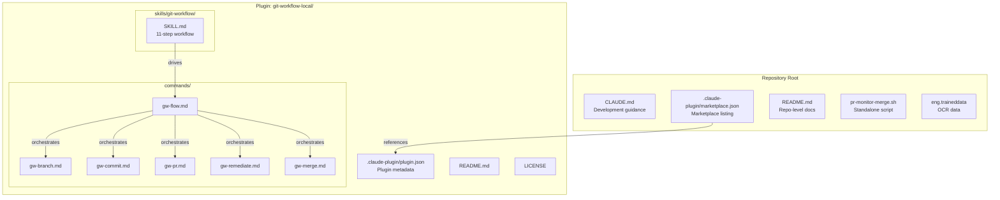
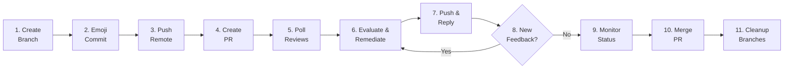

This page maps the complete repository topology — how every file, directory, and configuration layer fits together to deliver the **git-workflow** Claude Code plugin. Understanding this structure is essential before diving into individual workflow steps or contributing new plugin content. The repository is intentionally minimal: no build system, no compiled code, no dependency tree — only markdown-driven skill definitions, command templates, and metadata files that Claude Code consumes directly at runtime.

## High-Level Architecture

The repository operates as a **marketplace-ready plugin host**. Its root directory serves two roles simultaneously: it is the marketplace listing source (via `.claude-plugin/marketplace.json`) and the container for the installable plugin directory (`git-workflow-local/`). A single standalone bash script (`pr-monitor-merge.sh`) sits outside the plugin for use without Claude Code.



The marketplace configuration at the repository root points into the plugin directory via a relative `"source": "./git-workflow-local"` path. The `SKILL.md` file is the authoritative definition of the 11-step workflow, while individual command files provide focused entry points for each slash command. The full-workflow command (`gw-flow.md`) orchestrates the same sequence that the skill defines, ensuring consistency between natural-language invocation and slash-command invocation.

Sources: [marketplace.json](.claude-plugin/marketplace.json#L1-L34), [plugin.json](git-workflow-local/.claude-plugin/plugin.json#L1-L24), [SKILL.md](git-workflow-local/skills/git-workflow/SKILL.md#L1-L28), [CLAUDE.md](CLAUDE.md#L9-L29)

## Directory Structure in Detail

Every file in the repository has a specific role within the plugin delivery pipeline. The following table maps each path to its purpose and relationship to the broader system.

| Path | Type | Purpose |
|------|------|---------|
| `.claude-plugin/marketplace.json` | Marketplace config | Declares the marketplace listing; points `source` to the plugin directory; contains version, keywords, and author metadata |
| `git-workflow-local/` | Plugin directory | The self-contained installable unit — this is what Claude Code loads when the plugin is installed |
| `git-workflow-local/.claude-plugin/plugin.json` | Plugin metadata | Mirrors key metadata from marketplace.json; this is what Claude Code reads directly to identify and describe the plugin |
| `git-workflow-local/commands/` | Slash commands | Six markdown files, each defining a single slash command with YAML frontmatter (description, arguments) and instruction body |
| `git-workflow-local/skills/git-workflow/SKILL.md` | Skill definition | The complete 11-step workflow specification; Claude Code uses this to understand what actions to take when the skill is triggered |
| `git-workflow-local/README.md` | Plugin docs | Human-readable installation instructions, usage examples, and reference tables for the plugin |
| `git-workflow-local/LICENSE` | License | MIT license covering the plugin code and content |
| `CLAUDE.md` | Claude guidance | Provides architectural context, conventions, and development instructions to Claude Code when working *on* this repository |
| `README.md` | Repository docs | Top-level entry point for human readers browsing the repository on GitHub |
| `pr-monitor-merge.sh` | Standalone script | Bash script for PR monitoring and auto-merge; operates independently of Claude Code |
| `eng.traineddata` | Data file | Tesseract OCR training data (auxiliary, not part of the plugin) |

Sources: [CLAUDE.md](CLAUDE.md#L9-L29), [README.md](README.md#L1-L62), [git-workflow-local/README.md](git-workflow-local/README.md#L1-L200)

## The Dual Metadata Layer

A distinctive architectural pattern in this repository is the **two-file metadata configuration** — one at the marketplace level and one at the plugin level. These files contain overlapping but non-identical information, and both must be kept in sync when bumping versions.

The **marketplace configuration** ([marketplace.json](.claude-plugin/marketplace.json)) lives at the repository root under `.claude-plugin/`. It acts as the storefront entry: it declares the marketplace name (`git-workflow-local`), lists the available plugins (currently just one), and provides the relative `source` path that tells Claude Code where to find the installable plugin directory. It carries version `1.2.0`, category `development`, and keyword tags for discoverability.

The **plugin metadata** ([plugin.json](git-workflow-local/.claude-plugin/plugin.json)) lives inside the plugin directory itself under `git-workflow-local/.claude-plugin/`. Claude Code reads this file directly when loading the plugin. It mirrors the same version number (`1.2.0`), author, license, and keywords — but omits the marketplace-specific fields like `category` and `source`.

| Field | `marketplace.json` | `plugin.json` |
|-------|-------------------|---------------|
| `name` | `git-workflow` (plugin name) | `git-workflow` |
| `version` | `1.2.0` | `1.2.0` |
| `description` | Longer, marketplace-facing | Shorter, runtime-facing |
| `source` | `"./git-workflow-local"` | *(absent)* |
| `category` | `"development"` | *(absent)* |
| `keywords` | 8 tags | 10 tags |
| `author` | ✅ | ✅ |
| `license` | `"MIT"` | `"MIT"` |
| `homepage` | ✅ | ✅ |
| `repository` | ✅ | ✅ |

The development convention — enforced by the `CLAUDE.md` guidance file — requires that **both files must be version-bumped in tandem** whenever any plugin file (`commands/`, `skills/`, `.claude-plugin/`) is modified in a PR.

Sources: [marketplace.json](.claude-plugin/marketplace.json#L1-L34), [plugin.json](git-workflow-local/.claude-plugin/plugin.json#L1-L24), [CLAUDE.md](CLAUDE.md#L38)

## The Skill Definition: SKILL.md

The file [SKILL.md](git-workflow-local/skills/git-workflow/SKILL.md) is the **single source of truth** for the git workflow automation logic. It is a 659-line markdown document with YAML frontmatter that Claude Code parses to understand the skill's name, description, and trigger phrases.

```yaml
---
name: git-workflow
description: Complete git workflow automation for feature development. Use when creating feature branches...
---
```

The skill is structured as a sequential 11-step pipeline that covers the complete PR lifecycle:



Steps 6–8 form a **remediation loop** that repeats up to 5 iterations — fetching review comments, categorizing them, applying fixes, pushing, replying to reviewers, and re-checking for new feedback. This loop is the most complex architectural element of the skill, and it appears in three places: the `SKILL.md` skill definition, the `gw-remediate.md` command, and the `gw-flow.md` full-workflow command. All three implementations must remain behaviorally consistent.

Beyond the workflow steps, SKILL.md contains **commit type reference tables**, **PR template examples** (feature PRs, bug fix PRs), **status value documentation**, **merge conflict resolution guides**, and **example usage sessions**. It serves simultaneously as a skill instruction set for Claude Code and as human-readable reference documentation.

Sources: [SKILL.md](git-workflow-local/skills/git-workflow/SKILL.md#L1-L28), [SKILL.md steps 6-8](git-workflow-local/skills/git-workflow/SKILL.md#L282-L368), [SKILL.md status values](git-workflow-local/skills/git-workflow/SKILL.md#L396-L403)

## The Commands Directory

The `commands/` directory contains six markdown files, each defining a **slash command** — a structured shortcut that users can invoke directly in Claude Code via `/gw-*` syntax. Each command file follows a consistent three-part structure:

1. **YAML frontmatter** — Declares the command's `description`, `arguments` (with `name`, `description`, and `required` flag)
2. **Prose instructions** — Human-readable explanation of what the command does and its rules
3. **Bash code blocks** — Executable shell commands that Claude Code runs when the command is triggered

| Command File | Slash Command | Arguments | Responsibility |
|-------------|---------------|-----------|----------------|
| `gw-flow.md` | `/gw-flow` | `description` (required) | Full workflow orchestrator — all 6 sub-steps in sequence |
| `gw-branch.md` | `/gw-branch` | `name` (required) | Create a feature branch with auto-prefix detection |
| `gw-commit.md` | `/gw-commit` | `message`, `type` (both optional) | Stage and commit with emoji conventional format |
| `gw-pr.md` | `/gw-pr` | `title`, `draft` (both optional) | Create PR with structured markdown template |
| `gw-remediate.md` | `/gw-remediate` | `pr_number` (required), `wait_seconds` (optional) | Poll reviews, categorize, fix, push, reply, loop |
| `gw-merge.md` | `/gw-merge` | `pr_number` (required), `commit_subject` (optional) | Monitor CI status and squash-merge when clean |

The **command hierarchy** follows a clear pattern: `/gw-flow` is the orchestrator that invokes the full pipeline, while the other five commands are focused entry points for individual workflow stages. Notably, `gw-flow.md` embeds review remediation logic (Steps 5–6) inline rather than delegating to `gw-remediate.md`, because Claude Code processes each command file independently.

Each command file includes its own **auto-detection rules** and **fallback logic**. For example, `gw-branch.md` detects the branch type prefix from the argument name (e.g., `fix-*` → `fix/`), and `gw-commit.md` includes heuristics like "new files → `feat`" and "changes to `*.md` → `docs`". This means each command is **self-contained** — it carries all the context Claude Code needs without cross-referencing other files.

Sources: [gw-flow.md](git-workflow-local/commands/gw-flow.md#L1-L197), [gw-branch.md](git-workflow-local/commands/gw-branch.md#L1-L75), [gw-commit.md](git-workflow-local/commands/gw-commit.md#L1-L63), [gw-pr.md](git-workflow-local/commands/gw-pr.md#L1-L110), [gw-remediate.md](git-workflow-local/commands/gw-remediate.md#L1-L168), [gw-merge.md](git-workflow-local/commands/gw-merge.md#L1-L91)

## The Standalone Script: pr-monitor-merge.sh

Outside the plugin structure, [pr-monitor-merge.sh](pr-monitor-merge.sh) operates as a **pure bash utility** with no dependency on Claude Code. It implements the same PR monitoring and merge logic found in `gw-merge.md`, but can be invoked directly from any terminal.

```bash
./pr-monitor-merge.sh <PR_NUMBER> [commit-message]
```

The script follows a polling pattern: it checks `mergeStateStatus` via `gh pr view` every 10 seconds for up to 60 iterations (10 minutes total). When the status reaches `CLEAN`, it executes a squash merge with `--delete-branch`, switches to the default branch, pulls, and deletes the local feature branch. It handles three terminal states: `MERGED` (already done), `CLOSED` (error exit), and timeout after the polling loop exhausts all iterations.

This script exists because not every developer workflow involves Claude Code. Teams that prefer manual git operations or want to run PR monitoring in a background terminal can use it independently. It also serves as a **reference implementation** — the polling loop structure, status value handling, and cleanup sequence in this script are mirrored in both the `gw-merge.md` command and Step 9–11 of `SKILL.md`.

Sources: [pr-monitor-merge.sh](pr-monitor-merge.sh#L1-L75)

## The CLAUDE.md Development File

[CLAUDE.md](CLAUDE.md) is a **meta-configuration file** — it does not define the plugin's behavior for end users, but instead instructs Claude Code on how to work *within* this repository during development. When a developer opens this repository in Claude Code, the agent reads this file to understand the project's architecture, conventions, and testing procedures.

The file documents four categories of development guidance:

- **Project Overview** — States that the repository contains no compilable code, only markdown files
- **Architecture** — Reproduces the directory tree with inline annotations explaining each file
- **Conventions** — Defines the emoji conventional commit format, branch naming prefixes, PR template sections, squash merge policy, co-authored-by attribution, and the dual-file version bumping requirement
- **Development** — Lists installation commands for testing and the available slash commands

The version bumping convention is particularly noteworthy from an architectural perspective: any PR that modifies files under `commands/`, `skills/`, or `.claude-plugin/` must increment the version field in **both** `.claude-plugin/marketplace.json` and `git-workflow-local/.claude-plugin/plugin.json` using semantic versioning. This ensures that the marketplace listing and the installed plugin metadata never drift out of sync.

Sources: [CLAUDE.md](CLAUDE.md#L1-L61)

## No Build System: Architecture by Convention

This repository has no `package.json`, no `Makefile`, no bundler, and no test suite. The entire architecture is **convention-driven**: Claude Code discovers plugins by reading `.claude-plugin/plugin.json`, discovers commands by scanning the `commands/` directory, and discovers skills by scanning the `skills/` directory. Each file is a self-contained markdown document with YAML frontmatter and bash code blocks.

This minimal approach carries specific architectural implications:

| Aspect | Implication |
|--------|-------------|
| **Installation** | Users install directly from GitHub or local path — no compilation or transpilation step |
| **Consistency** | The remediation loop logic appears in three files (`SKILL.md`, `gw-flow.md`, `gw-remediate.md`); updates must be applied to all three manually |
| **Version management** | Two JSON files must be bumped in lockstep — no automation enforces this |
| **Testing** | Validation is done by installing the plugin and running slash commands; there is no automated test suite |
| **Extensibility** | Adding a new command means creating a new `.md` file in `commands/` with the standard frontmatter structure; adding a new skill means creating a directory under `skills/` with a `SKILL.md` file |

The `eng.traineddata` file — Tesseract OCR training data for English — is the only binary/data file in the repository and appears to be auxiliary to the plugin's core purpose. It does not participate in the plugin loading or execution pipeline.

Sources: [CLAUDE.md](CLAUDE.md#L42-L60), [README.md](README.md#L1-L62)

## Where to Go Next

Now that you understand how the repository is structured, the logical next step is to examine the marketplace configuration in detail and then follow the 11-step workflow through each stage:

- **[Marketplace Configuration and Plugin Metadata](6-marketplace-configuration-and-plugin-metadata)** — Deep dive into the dual JSON configuration files, their fields, and the versioning contract
- **[Branch Creation and Naming Conventions](7-branch-creation-and-naming-conventions)** — Start the 11-step workflow deep dive with Step 1
- **[The Standalone PR Monitor Script (pr-monitor-merge.sh)](13-the-standalone-pr-monitor-script-pr-monitor-merge-sh)** — Full analysis of the standalone bash script's polling and merge logic