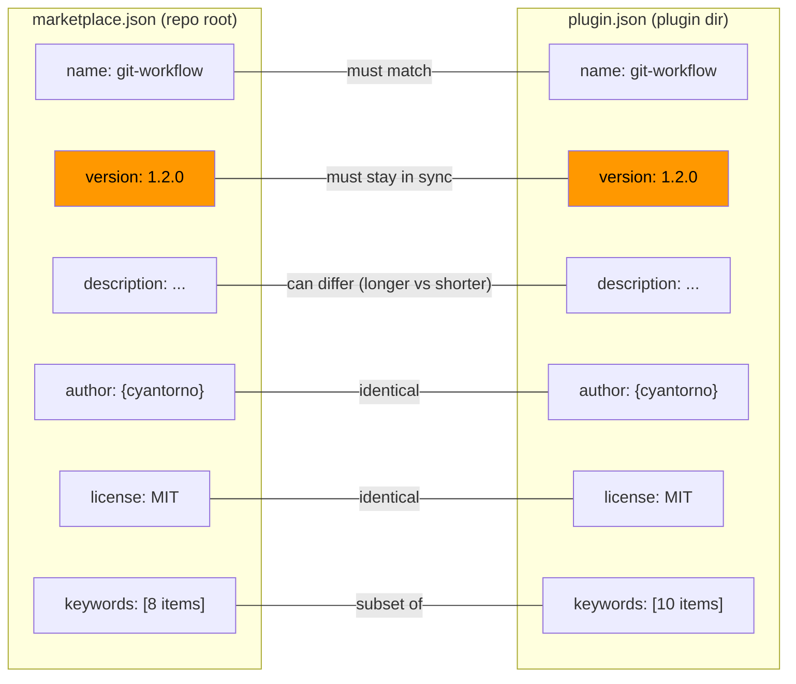
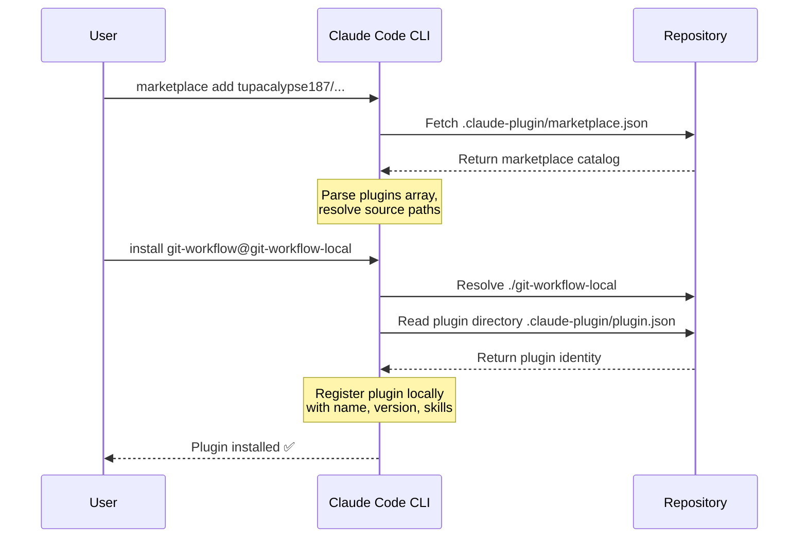

This repository uses a **dual-file metadata system** to publish the `git-workflow` plugin to the Claude Code plugin marketplace. One file lives at the repository root and acts as the marketplace catalog entry; the other lives inside the plugin directory and describes the plugin itself. Understanding how these two files relate — and what every field controls — is essential for anyone maintaining, versioning, or extending this plugin.

Sources: [CLAUDE.md](CLAUDE.md#L12-L16)

## The Dual-File Architecture

The plugin system separates **discovery** (how users find your plugin in a marketplace listing) from **identity** (what the plugin declares about itself once installed). This is accomplished through two JSON manifests placed at different levels of the repository tree.

```
.claude-plugin/
│   └── marketplace.json               # Marketplace listing (repo root)
git-workflow-local/                    # The plugin directory
├── .claude-plugin/
│   └── plugin.json                    # Plugin identity (inside plugin dir)
```

The **marketplace.json** file sits at the repository root under `.claude-plugin/`. When a user runs `claude plugin marketplace add tupacalypse187/tupacalypse187-claude-skills`, Claude Code reads this file to determine what plugins are available for installation. It functions as a catalog index — it can list multiple plugins, each pointing to a subdirectory containing the actual plugin code and its own `plugin.json`.

The **plugin.json** file sits inside the plugin directory itself (`git-workflow-local/.claude-plugin/`). This is the authoritative identity document for the plugin — it declares the plugin's name, version, author, keywords, and license independently of the marketplace listing. When Claude Code installs the plugin via `claude plugin install git-workflow@git-workflow-local`, this is the manifest that gets registered locally.

This separation means a single repository can host multiple plugins, each with its own `.claude-plugin/plugin.json`, while the root-level `marketplace.json` provides a unified entry point for discovery. The `plugins` array in the marketplace file explicitly maps each entry to a `source` directory containing the corresponding `plugin.json`.

Sources: [CLAUDE.md](CLAUDE.md#L12-L16), [marketplace.json](.claude-plugin/marketplace.json#L1-L34), [plugin.json](git-workflow-local/.claude-plugin/plugin.json#L1-L24)

## Marketplace Manifest: marketplace.json

The root-level marketplace manifest is responsible for **discovery and cataloging**. Here is the complete file with each field explained:

```json
{
  "name": "git-workflow-local",
  "description": "Local git workflow automation skills for feature development PR cycles",
  "owner": {
    "name": "cyantorno",
    "url": "https://github.com/tupacalypse187"
  },
  "plugins": [
    {
      "name": "git-workflow",
      "source": "./git-workflow-local",
      "description": "Complete git workflow automation skill...",
      "version": "1.2.0",
      "author": { "name": "cyantorno", "url": "https://github.com/tupacalypse187" },
      "category": "development",
      "keywords": ["git", "workflow", "pr", "merge", ...],
      "homepage": "https://github.com/tupacalypse187/tupacalypse187-claude-skills",
      "repository": "https://github.com/tupacalypse187/tupacalypse187-claude-skills",
      "license": "MIT"
    }
  ]
}
```

### Field-by-Field Reference

| Field | Level | Purpose | Value in This Repo |
|-------|-------|---------|-------------------|
| `name` | Root | Identifier for the marketplace listing | `"git-workflow-local"` |
| `description` | Root | One-line summary shown in marketplace search | `"Local git workflow automation skills..."` |
| `owner.name` | Root | Publishing identity | `"cyantorno"` |
| `owner.url` | Root | Link to publisher's profile | `https://github.com/tupacalypse187` |
| `plugins[]` | Root | Array of plugin entries — the catalog itself | Contains 1 entry |
| `plugins[].name` | Plugin | Must match the name in the plugin's own `plugin.json` | `"git-workflow"` |
| `plugins[].source` | Plugin | **Relative path** from repo root to the plugin directory | `"./git-workflow-local"` |
| `plugins[].description` | Plugin | Extended description for the marketplace listing | Full workflow summary |
| `plugins[].version` | Plugin | Current semver release | `"1.2.0"` |
| `plugins[].category` | Plugin | Taxonomic grouping in the marketplace | `"development"` |
| `plugins[].keywords` | Plugin | Search/discovery tags | `["git", "workflow", "pr", ...]` |
| `plugins[].license` | Plugin | SPDX license identifier | `"MIT"` |

The critical structural relationship is the **`source` field** — it tells the marketplace resolver where to find the plugin directory relative to the repository root. In this repository, `"./git-workflow-local"` points directly at the plugin directory that contains its own `.claude-plugin/plugin.json`.

Sources: [marketplace.json](.claude-plugin/marketplace.json#L1-L34)

## Plugin Manifest: plugin.json

Inside the plugin directory, the `plugin.json` file serves as the **self-contained identity card** for the plugin. Unlike the marketplace manifest (which is a catalog entry), this file travels with the plugin and is consulted during installation and runtime:

```json
{
  "name": "git-workflow",
  "version": "1.2.0",
  "description": "Git workflow automation skill for feature branch PR cycles",
  "author": { "name": "cyantorno", "url": "https://github.com/tupacalypse187" },
  "license": "MIT",
  "keywords": ["git", "workflow", "pr", "merge", "review", "remediation", ...],
  "repository": "https://github.com/tupacalypse187/tupacalypse187-claude-skills",
  "homepage": "https://github.com/tupacalypse187/tupacalypse187-claude-skills"
}
```

### Field-by-Field Reference

| Field | Purpose | Notes |
|-------|---------|-------|
| `name` | Plugin identifier | Must match `plugins[].name` in marketplace.json |
| `version` | Current release version (semver) | **Must stay synchronized** with marketplace.json |
| `description` | Short plugin description | Can differ from marketplace entry (more concise here) |
| `author` | Creator attribution | Object with `name` and `url` |
| `license` | SPDX identifier | `"MIT"` — must match the repo's LICENSE file |
| `keywords` | Search tags | Superset of marketplace keywords (includes `review`, `remediation`) |
| `repository` | Source code URL | Points to the GitHub repository |
| `homepage` | Documentation/project URL | Same as repository in this case |

Notice that the `keywords` array in `plugin.json` is slightly broader than the one in `marketplace.json` — it includes `review` and `remediation` which the marketplace entry omits. This is intentional: the marketplace listing uses curated tags for high-level discovery, while the plugin manifest uses exhaustive tags for in-tool search.

Sources: [plugin.json](git-workflow-local/.claude-plugin/plugin.json#L1-L24)

## Field Overlap and Synchronization

Several fields appear in **both** files and must be kept in sync. Failure to synchronize creates inconsistent metadata that can confuse both the marketplace indexer and the local plugin registry.



### Synchronized Fields

| Field | Sync Rule | Rationale |
|-------|-----------|-----------|
| `name` | **Must be identical** | The marketplace resolver matches `plugins[].name` to the plugin's `plugin.json` `name` |
| `version` | **Must be identical** | Both manifests declare the same semver — bumping one without the other causes drift |
| `author` | **Should be identical** | Attribution consistency across discovery and installation |
| `license` | **Should be identical** | Legal metadata must not conflict between listing and package |
| `keywords` | Marketplace is a **subset** | The plugin manifest can include more granular search terms |
| `description` | **May differ** | The marketplace entry is typically longer and more descriptive |

The most critical synchronization point is **`version`**. The project's convention, documented in [CLAUDE.md](CLAUDE.md#L38), mandates that both files must be bumped together whenever plugin files are modified. This is enforced through the development workflow: before pushing any PR that touches `commands/`, `skills/`, or `.claude-plugin/`, the version in both files must be incremented using semantic versioning.

Sources: [CLAUDE.md](CLAUDE.md#L38), [marketplace.json](.claude-plugin/marketplace.json#L13), [plugin.json](git-workflow-local/.claude-plugin/plugin.json#L3)

## How Installation Uses These Files

The dual-file architecture supports three installation paths, each resolving the metadata in a specific order:

**From GitHub (primary path):** When a user runs `claude plugin marketplace add tupacalypse187/tupacalypse187-claude-skills`, the CLI fetches the repository, reads `.claude-plugin/marketplace.json` to enumerate available plugins, then resolves `"./git-workflow-local"` to find the plugin directory and its `plugin.json`. The `plugin install git-workflow@git-workflow-local` command then registers the plugin locally using the identity declared in `plugin.json`.

**From a local clone:** The same resolution chain occurs, but instead of fetching from GitHub, the CLI reads the files directly from the local filesystem path. This is the recommended path for plugin development and testing.

**From a Claude Code session:** The `/plugin marketplace add` and `/plugin install` commands perform the identical resolution, just through the interactive session interface rather than the CLI.



Sources: [README.md](README.md#L12-L35), [git-workflow-local/README.md](git-workflow-local/README.md#L7-L42)

## Version Bumping Convention

The project enforces a strict **dual-file version bump** convention. The rule is simple but important: any PR that modifies plugin files — including `commands/`, `skills/`, or either `.claude-plugin/` manifest — must increment the `version` field in **both** `marketplace.json` and `plugin.json`.

This convention was introduced in commit `8a85b81` ("📝 docs: add version bumping convention") and bumps both files from `1.1.0` to `1.2.0` in a single commit. The version follows **semantic versioning** (semver): `MAJOR.MINOR.PATCH`.

| Change Type | Bump | Example |
|-------------|------|---------|
| New command or skill | `MINOR` | `1.1.0` → `1.2.0` |
| Bug fix to existing skill | `PATCH` | `1.2.0` → `1.2.1` |
| Breaking change to command interface | `MAJOR` | `1.2.0` → `2.0.0` |

The version bump is a **manual step** performed by the developer (or by Claude Code when instructed) as part of the commit. There is no automated CI check that validates synchronization — the convention is enforced through documentation in [CLAUDE.md](CLAUDE.md#L38) and the project's development workflow.

Sources: [CLAUDE.md](CLAUDE.md#L38), [marketplace.json](.claude-plugin/marketplace.json#L13), [plugin.json](git-workflow-local/.claude-plugin/plugin.json#L3)

## Historical Context: The Refactoring to Portability

The current dual-file structure was not always in place. Commit `277cbd6` ("♻️ refactor: make plugin portable for public sharing") restructured the repository to support GitHub-based installation. Prior to this refactoring, the `marketplace.json` may have lived inside the plugin directory alongside `plugin.json`. The refactoring moved it to the repository root to enable the `claude plugin marketplace add <owner>/<repo>` pattern, which expects the marketplace manifest at `.claude-plugin/marketplace.json` relative to the repository root.

This architectural decision is what enables the three installation paths described above and is the reason the `source` field exists — it bridges the gap between the repository-level catalog and the plugin-level identity.

Sources: [git show --stat 277cbd6](CLAUDE.md#L12-L16)

## Next Steps

With an understanding of how the marketplace and plugin metadata are structured, the following pages explore the operational workflow that this metadata enables:

- [Branch Creation and Naming Conventions](7-branch-creation-and-naming-conventions) — the first step in the 11-step feature development workflow
- [Repository Architecture and Plugin Structure](5-repository-architecture-and-plugin-structure) — for a broader view of the directory layout and how these files fit into it
- [Version Bumping and Development Workflow](17-version-bumping-and-development-workflow) — for the complete version management lifecycle