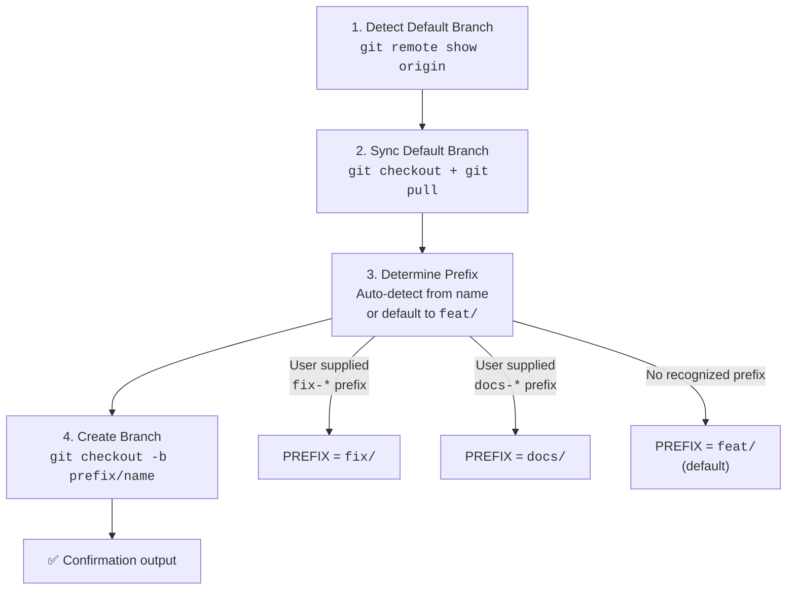
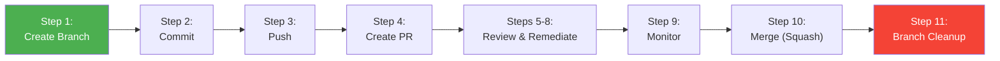

Branch creation is the first step in the plugin's 11-step feature development workflow — every pull request, every review cycle, every merge begins with a single `git checkout -b`. The **git-workflow** plugin standardizes this starting point through a strict prefix-based naming convention and an automated branch setup sequence that ensures every new branch originates from the latest commit on the default branch. This page explains the naming taxonomy, the prefix detection logic, and the exact sequence of operations performed when you create a branch — whether through the dedicated `/gw-branch` command or as Step 1 of the full `/gw-flow` pipeline.

Sources: [SKILL.md](git-workflow-local/skills/git-workflow/SKILL.md#L55-L74), [gw-branch.md](git-workflow-local/commands/gw-branch.md#L1-L31)

---

## The Branch Prefix Taxonomy

The plugin defines eight categorically distinct branch prefixes, each mapped to a specific change type. These prefixes serve as the first signal to collaborators about the nature of the work contained in the branch, and they propagate forward through the entire workflow: the prefix determines the emoji used in commit messages, the PR title format, and ultimately the squash-merge subject line.

| Prefix | Change Type | Emoji Counterpart | Example Branch Name |
|--------|-------------|-------------------|---------------------|
| `feat/` | New features | ✨ | `feat/user-authentication` |
| `fix/` | Bug fixes | 🐛 | `fix/login-timeout` |
| `docs/` | Documentation updates | 📝 | `docs/api-endpoints` |
| `refactor/` | Code refactoring | ♻️ | `refactor/auth-logic` |
| `perf/` | Performance improvements | ⚡️ | `perf/db-query-optimization` |
| `test/` | Test additions or changes | ✅ | `test/user-service-unit` |
| `chore/` | Maintenance tasks | 🔧 | `chore/update-dependencies` |
| `ci/` | CI/CD pipeline changes | 👷 | `ci/add-github-actions` |

The prefix-emoji alignment is deliberate. When a branch named `fix/memory-leak` produces a commit, the plugin auto-selects the 🐛 emoji. This one-to-one mapping eliminates ambiguity and keeps the entire git history visually scannable — a `feat/` branch will never produce a 🐛 commit unless the developer explicitly overrides it.

Sources: [gw-branch.md](git-workflow-local/commands/gw-branch.md#L13-L23), [SKILL.md](git-workflow-local/skills/git-workflow/SKILL.md#L66-L74), [CLAUDE.md](CLAUDE.md#L34-L34)

---

## The Branch Creation Sequence

Creating a branch through the plugin is not a simple `git checkout -b`. The process follows a deterministic four-phase sequence designed to prevent common failure modes: stale base branches, naming collisions, and incorrect prefix assignment.



### Phase 1: Default Branch Detection

The plugin never hardcodes `main` or `master`. Instead, it queries the remote to discover the HEAD branch dynamically:

```bash
DEFAULT_BRANCH=$(git remote show origin 2>/dev/null | grep 'HEAD branch' | sed 's/.*: //' || echo "main")
```

This one-liner parses `git remote show origin` output for the `HEAD branch` field, falling back to `main` only if the remote query fails entirely. This makes the workflow portable across repositories that use non-standard default branch names.

Sources: [gw-branch.md](git-workflow-local/commands/gw-branch.md#L43-L46), [gw-flow.md](git-workflow-local/commands/gw-flow.md#L32-L33), [SKILL.md](git-workflow-local/skills/git-workflow/SKILL.md#L58-L62)

### Phase 2: Base Branch Synchronization

Before creating any new branch, the plugin ensures the base is current:

```bash
git checkout "$DEFAULT_BRANCH"
git pull origin "$DEFAULT_BRANCH"
```

This two-step guard prevents the most insidious class of merge conflicts: those that arise when a feature branch was forked from an outdated commit. By forcing a pull before branching, the plugin guarantees that every new branch starts from the absolute latest state of the repository. The full workflow command (`/gw-flow`) condenses this into a single chained command (`git checkout "$DEFAULT_BRANCH" && git pull`) to reduce the chance of partial execution.

Sources: [gw-branch.md](git-workflow-local/commands/gw-branch.md#L45-L46), [gw-flow.md](git-workflow-local/commands/gw-flow.md#L33-L34), [SKILL.md](git-workflow-local/skills/git-workflow/SKILL.md#L60-L62)

### Phase 3: Prefix Detection Logic

The `/gw-branch` command implements an intelligent prefix auto-detection system. When you provide a branch name, the command checks whether it starts with a known type keyword (e.g., `fix-*`, `docs-*`) and strips the keyword to construct the full prefixed branch name. If no recognizable prefix is detected, it defaults to `feat/`.

The detection follows a cascading `if/elif` chain:

```bash
PREFIX="feat/"
if [[ "$BRANCH_NAME" == fix-* ]]; then
  PREFIX="fix/"
elif [[ "$BRANCH_NAME" == docs-* ]]; then
  PREFIX="docs/"
elif [[ "$BRANCH_NAME" == refactor-* ]]; then
  PREFIX="refactor/"
# ... remaining prefixes ...
fi

# Remove prefix if user included it
BRANCH_NAME="${BRANCH_NAME#$PREFIX}"
```

There is an important nuance here: the glob pattern `fix-*` matches names starting with `fix-` (hyphen separator), while the actual branch prefix uses a forward slash (`fix/`). The command accepts both `fix-memory-leak` and `fix/memory-leak` as input, normalizes them to the canonical `fix/memory-leak` format. Additionally, the `${BRANCH_NAME#$PREFIX}` parameter expansion strips any user-supplied prefix to prevent double-prefixing (e.g., `feat/feat/login`).

In contrast, the `/gw-flow` command takes a simpler approach — it always uses `feat/` and sanitizes the description string directly:

```bash
BRANCH_NAME="feat/$(echo "$1" | tr '[:upper:]' '[:lower:]' | sed 's/[^a-z0-9]/-/g' | sed 's/--*/-/g' | sed 's/^-\|-$//g')"
```

This pipeline transforms natural language input ("Add User Authentication") into a kebab-case branch name (`feat/add-user-authentication`) through four transformations: lowercase conversion, non-alphanumeric character replacement with hyphens, consecutive hyphen collapsing, and leading/trailing hyphen trimming.

Sources: [gw-branch.md](git-workflow-local/commands/gw-branch.md#L49-L71), [gw-flow.md](git-workflow-local/commands/gw-flow.md#L34-L35)

### Phase 4: Branch Creation and Confirmation

The final phase creates the branch and reports success:

```bash
FULL_BRANCH="${PREFIX}${BRANCH_NAME}"
git checkout -b "$FULL_BRANCH"
echo "✅ Created branch: $FULL_BRANCH"
```

The confirmation output serves a dual purpose: it gives the developer immediate feedback and provides the exact branch name for use in subsequent workflow steps. This name propagates forward as `$BRANCH_NAME` through the push, PR creation, and cleanup steps.

Sources: [gw-branch.md](git-workflow-local/commands/gw-branch.md#L70-L74)

---

## Two Paths to Branch Creation

The plugin offers two distinct commands for creating branches, each optimized for a different workflow context.

| Aspect | `/gw-branch <name>` | `/gw-flow` (Step 1) |
|--------|---------------------|---------------------|
| **Purpose** | Standalone branch creation | First step of full pipeline |
| **Prefix detection** | Auto-detects from input pattern | Always `feat/` |
| **Name sanitization** | Minimal (strip double-prefix) | Full kebab-case pipeline |
| **Stops after creation** | Yes — hands control to developer | No — continues to commit |
| **Use case** | Starting work manually | End-to-end automation |

The `/gw-branch` command is the precision tool — use it when you need a specific prefix (`fix/`, `docs/`) or when you want to create the branch and work incrementally. The `/gw-flow` command is the assembly line — it creates a `feat/` branch and immediately proceeds through all remaining workflow steps without stopping.

Sources: [gw-branch.md](git-workflow-local/commands/gw-branch.md#L1-L74), [gw-flow.md](git-workflow-local/commands/gw-flow.md#L28-L35), [README.md](git-workflow-local/README.md#L54-L56)

---

## Branch Naming Rules and Constraints

Beyond the prefix taxonomy, the plugin enforces several implicit naming conventions that emerge from the sanitization logic and the broader workflow integration:

**Kebab-case only.** The name segment after the prefix uses lowercase alphanumeric characters separated by hyphens. No underscores, no camelCase, no spaces. The `/gw-flow` pipeline explicitly enforces this through `tr '[:upper:]' '[:lower:]'` and `sed 's/[^a-z0-9]/-/g'`.

**No double hyphens.** Consecutive hyphens are collapsed to a single hyphen via `sed 's/--*/-/g'`, ensuring clean branch names even when the input contains multiple separator characters.

**No leading or trailing hyphens.** The final `sed 's/^-\|-$//g'` strips any hyphens that would appear at the boundaries of the name segment, preventing branch names like `feat/-login-`.

**Descriptive over terse.** The README examples consistently use multi-word descriptive names: `feat/user-authentication`, `feat/dark-mode-settings`, `fix/login-timeout`. The branch name carries context through the entire PR lifecycle — from the `git log` to the PR title to the squash-merge commit.

Sources: [gw-flow.md](git-workflow-local/commands/gw-flow.md#L34-L34), [README.md](git-workflow-local/README.md#L55-L57), [CLAUDE.md](CLAUDE.md#L36-L36)

---

## The Anti-Pattern: Committing Directly to the Default Branch

The plugin's convention file enforces a single hard rule: **never commit directly to the default branch**. Every change — no matter how small — must flow through a feature branch and a pull request. This is not merely a stylistic preference; it is an architectural requirement. The plugin's squash-merge strategy (`gh pr merge --squash --delete-branch`) assumes that all changes arrive via PRs. Direct commits bypass the structured commit format, the PR template, the review cycle, and the automated cleanup that the plugin provides.

Sources: [SKILL.md](git-workflow-local/skills/git-workflow/SKILL.md#L553-L554), [CLAUDE.md](CLAUDE.md#L36-L36)

---

## Branch Lifecycle Within the 11-Step Workflow

Branch creation is not an isolated operation — it is the first node in a directed workflow graph. Understanding where it sits relative to the other steps clarifies why the naming convention matters:



The branch name set in **Step 1** flows forward through push tracking (`git push -u origin "$BRANCH_NAME"`), appears in the PR metadata, and is ultimately used in **Step 11** for cleanup (`git branch -D "$HEAD_BRANCH"`). A poorly named branch creates friction at every subsequent step. The naming convention eliminates this friction by making the branch name predictable, parseable, and self-documenting.

Sources: [SKILL.md](git-workflow-local/skills/git-workflow/SKILL.md#L15-L27), [gw-flow.md](git-workflow-local/commands/gw-flow.md#L11-L21)

---

## Next Steps

Now that you understand how branches are created and named, the next logical step is to examine what happens after the branch exists — how changes are committed with the emoji conventional commit format that the branch prefix implies:

- **[Emoji Conventional Commits: Types, Format, and Best Practices](8-emoji-conventional-commits-types-format-and-best-practices)** — the commit format that pairs with each branch prefix
- **[Creating Pull Requests with Structured Templates](9-creating-pull-requests-with-structured-templates)** — how the branch name influences PR title and body generation
- **[Post-Merge Branch Cleanup](12-post-merge-branch-cleanup)** — how branches are deleted after the squash merge completes