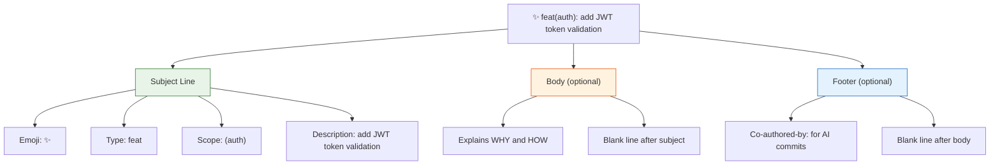
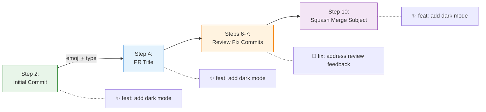

Every commit in this plugin's workflow carries a structured message that combines a visual emoji prefix with the Conventional Commits specification. This isn't decoration — it's a **semantic contract** that encodes the *intent* of each change directly into the git log. When you scan `git log --oneline`, the emoji-type pair tells you instantly whether a commit introduces a feature, patches a bug, or updates CI configuration, without reading a single word of the description. The `/gw-commit` slash command enforces this convention, and the full `/gw-flow` workflow carries the same emoji/type forward into PR titles, review remediation commits, and even squash-merge subjects — creating a consistent thread from first keystroke to merged code.

Sources: [gw-commit.md](git-workflow-local/commands/gw-commit.md#L1-L5), [SKILL.md](git-workflow-local/skills/git-workflow/SKILL.md#L77-L82)

## The Commit Type Taxonomy

The plugin defines **11 commit types**, each mapped to a unique emoji. This mapping is canonical across two authoritative sources — the skill definition and the commit command — and every type aligns with the conventional commit categories you'll find in the broader ecosystem. The table below presents the complete reference, including the `revert` type which appears in the skill definition but not in the shorter command file.

| Type | Emoji | Purpose | Example |
|------|-------|---------|---------|
| `feat` | ✨ | New feature or user-facing capability | `✨ feat(auth): add JWT token validation` |
| `fix` | 🐛 | Bug fix — correcting incorrect behavior | `🐛 fix(api): resolve memory leak in handler` |
| `docs` | 📝 | Documentation — markdown, comments, README | `📝 docs: update API endpoints documentation` |
| `style` | 🎨 | Code formatting, whitespace, semicolons — no logic change | `🎨 style: format code with prettier` |
| `refactor` | ♻️ | Structural improvement — no new feature or fix | `♻️ refactor: simplify authentication logic` |
| `perf` | ⚡️ | Performance optimization | `⚡️ perf: optimize database query performance` |
| `test` | ✅ | Adding or updating tests | `✅ test: add unit tests for user service` |
| `chore` | 🔧 | Maintenance — dependency bumps, tooling | `🔧 chore: update build dependencies` |
| `ci` | 👷 | CI/CD pipeline changes | `👷 ci: add github actions workflow` |
| `build` | 📦 | Build system or external dependency changes | `📦 build: upgrade to webpack 5` |
| `revert` | ⏪ | Reverting a previous commit | `⏪ revert: rollback payment integration` |

Sources: [SKILL.md](git-workflow-local/skills/git-workflow/SKILL.md#L85-L99), [gw-commit.md](git-workflow-local/commands/gw-commit.md#L18-L29)

## Commit Message Format

The format follows a strict grammar: **`<emoji> <type>[optional scope]: <description>`**. The emoji comes first (literally a Unicode character), followed by a space, then the conventional commit type, an optional parenthesized scope, a colon, a space, and the imperative-mood description. The scope narrows the commit's context to a specific module or subsystem — `feat(auth):` tells you the authentication layer changed, while `feat` without a scope indicates a project-wide addition.

Sources: [SKILL.md](git-workflow-local/skills/git-workflow/SKILL.md#L82-L82), [CLAUDE.md](CLAUDE.md#L32-L32)

### Simple Format (Default)

The simple format is a single-line subject — appropriate for self-explanatory changes that need no further elaboration. This is what you'll use for most day-to-day commits.

```
✨ feat(auth): add JWT token validation
```

Sources: [SKILL.md](git-workflow-local/skills/git-workflow/SKILL.md#L103-L105)

### Full Format (With Body and Footer)

When a commit warrants explanation — a non-trivial feature, a bug fix with root cause analysis, or any change where the "why" isn't obvious from the "what" — use the full format. A blank line separates the subject from the body, and another blank line separates the body from the footer. The body explains the rationale and implementation details; the footer carries metadata like the `Co-authored-by:` trailer for AI-assisted commits.

```
✨ feat(auth): add JWT token validation

Implement JWT token validation middleware that:
- Validates token signature and expiration
- Extracts user claims from payload
- Adds user context to request object

This improves security by ensuring all protected routes
validate authentication tokens properly.

Co-authored-by: Claude <noreply@anthropic.com>
```

The `Co-authored-by:` footer is **mandatory** for AI-assisted commits. It provides transparent attribution and is recognized by GitHub's contribution graph.

Sources: [SKILL.md](git-workflow-local/skills/git-workflow/SKILL.md#L107-L122), [gw-commit.md](git-workflow-local/commands/gw-commit.md#L49-L55)

### Anatomy of a Commit Message



Sources: [SKILL.md](git-workflow-local/skills/git-workflow/SKILL.md#L82-L122)

## Auto-Detection Rules

The `/gw-commit` command applies heuristics to automatically select the correct commit type based on which files changed and what keywords appear in the user's description. These rules operate as a priority-ordered decision tree: the first matching rule wins. Understanding them lets you predict what the command will choose — and when you should override with an explicit `type` argument.

| Pattern Detected | Auto-Selected Type | Rationale |
|------------------|-------------------|-----------|
| New files created | `feat` | New files imply new functionality |
| `*.md` files changed | `docs` | Markdown files are documentation |
| `*.css`, `*.tsx` UI changes | `style` | UI-only changes are stylistic |
| `package.json` changed | `chore` | Dependency modifications are maintenance |
| `*.yml`, `*.yaml` in `.github/` | `ci` | GitHub Actions config is CI/CD |
| Test files changed | `test` | Test files map to the test type |
| User says "fix", "bug", "error" | `fix` | Explicit fix language triggers bug-fix type |

Sources: [gw-commit.md](git-workflow-local/commands/gw-commit.md#L53-L62)

## Best Practices

The skill definition codifies six writing conventions for commit messages. These aren't arbitrary style preferences — they align with the Conventional Commits 1.0.0 specification and the conventions that `git log`, `git shortlog`, and changelog generators expect.

| Guideline | Correct | Incorrect |
|-----------|---------|-----------|
| **Present tense, imperative mood** | `add user authentication` | `added user authentication` |
| **Subject line ≤ 50 characters** (72 max) | `✨ feat: add OAuth2 flow` | `✨ feat: implement the complete OAuth2 authorization code flow with PKCE extension` |
| **Capitalize first letter** of description | `Add JWT token validation` | `add JWT token validation` |
| **No trailing period** | `✨ feat: add login page` | `✨ feat: add login page.` |
| **Use scope for context** when change is localized | `✨ feat(auth): add JWT validation` | `✨ feat: add JWT validation` (when auth context is relevant) |
| **Include `Co-authored-by:`** for AI-assisted commits | Footer present | Footer omitted |

Sources: [SKILL.md](git-workflow-local/skills/git-workflow/SKILL.md#L124-L130)

## How Commits Flow Through the Workflow

A single emoji-type decision doesn't live in isolation. The commit type chosen at **Step 2** of the 11-step workflow propagates forward through PR creation, review remediation, and even the final squash-merge subject line. This creates a semantic chain that makes the entire PR lifecycle readable at a glance.



The initial commit (Step 2) determines the PR title's emoji/type prefix at Step 4. During review remediation at Steps 6–8, fix commits use their own appropriate emoji — typically `🐛 fix:` for bug fixes requested by reviewers, but potentially `🎨 style:`, `✅ test:`, `📝 docs:`, or `⚡️ perf:` depending on the feedback category. Finally, the squash merge at Step 10 uses the **original** emoji/type from the primary commit, preserving the feature's semantic identity through to the main branch.

Sources: [SKILL.md](git-workflow-local/skills/git-workflow/SKILL.md#L77-L130), [gw-flow.md](git-workflow-local/commands/gw-flow.md#L56-L72), [gw-remediate.md](git-workflow-local/commands/gw-remediate.md#L95-L98)

## Remediation Commit Patterns

During review remediation, each reviewer comment gets its own commit. The commit type is chosen based on the *nature of the fix*, not the original feature type. The remediation command defines a clear mapping between review feedback categories and their corresponding commit types.

| Review Feedback Category | Commit Type | Example Commit |
|--------------------------|-------------|----------------|
| Bug or security issue | `🐛 fix:` | `🐛 fix: address review feedback - handle edge case` |
| Code style or formatting | `🎨 style:` | `🎨 style: fix indentation per review` |
| Missing tests requested | `✅ test:` | `✅ test: add edge case tests per review` |
| Documentation update needed | `📝 docs:` | `📝 docs: clarify function parameters` |
| Performance issue flagged | `⚡️ perf:` | `⚡️ perf: reduce unnecessary re-renders` |
| Structural refactoring requested | `♻️ refactor:` | `♻️ refactor: extract helper function` |

A critical rule during remediation: **one commit per logical fix**. Don't bundle unrelated review fixes into a single commit. Each fix should be independently reviewable and revertable. After all fixes are committed, push them as a single batch to avoid spamming CI.

Sources: [gw-remediate.md](git-workflow-local/commands/gw-remediate.md#L95-L98), [SKILL.md](git-workflow-local/skills/git-workflow/SKILL.md#L282-L308)

## Triggering Commits via Slash Commands and Natural Language

There are two ways to invoke the commit step. The explicit path is the `/gw-commit` slash command, which accepts an optional `message` argument and an optional `type` argument (defaulting to auto-detection). The implicit path is through natural language — phrases like "commit my changes with emoji conventional commits" or "commit these changes as a feature" trigger the same logic through the skill's natural language interface. Both paths produce identical output; the slash command simply gives you tighter control over the type and message.

```bash
# Slash command with explicit type
/gw-commit "add dark mode toggle" --type feat

# Slash command relying on auto-detection
/gw-commit "update README installation steps"

# Natural language equivalents
"Commit my changes with emoji conventional commits"
"Commit these styling changes"
```

Sources: [gw-commit.md](git-workflow-local/commands/gw-commit.md#L6-L11), [SKILL.md](git-workflow-local/skills/git-workflow/SKILL.md#L48-L50)

## Next Steps

With the commit convention established, the workflow proceeds to packaging those commits into a structured pull request. The PR template reuses the same emoji-type prefix and enforces its own content sections — summary, changes, verification steps, and source links.

→ Continue to [Creating Pull Requests with Structured Templates](9-creating-pull-requests-with-structured-templates)

For the complete commit command reference, see [Slash Commands Quick Reference](4-slash-commands-quick-reference). For details on the `Co-authored-by:` footer convention, see [Co-authored-by Attribution and AI-Assisted Commit Conventions](15-co-authored-by-attribution-and-ai-assisted-commit-conventions).