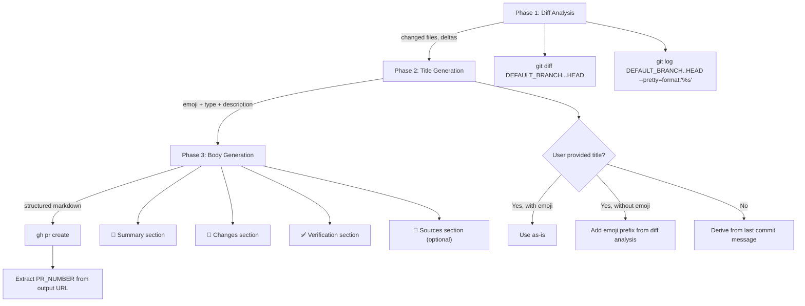

Step 4 of the 11-step feature development workflow transforms your committed changes into a structured, review-ready GitHub Pull Request. Rather than relying on manual template filling or boilerplate placeholders, this system enforces a diff-driven generation pipeline: it analyzes your actual branch changes, derives the PR title from commit history or user input, and populates every section of the body with real content extracted from the `git diff`. The result is a consistent, informative PR that reviewers can evaluate without deciphering vague descriptions or chasing down context.

Sources: [SKILL.md](git-workflow-local/skills/git-workflow/SKILL.md#L142-L184), [gw-pr.md](git-workflow-local/commands/gw-pr.md#L1-L110)

## The PR Creation Pipeline

The entire process follows a strict three-phase pipeline that ensures no placeholder text ever reaches the PR description. Each phase builds on the output of the previous one — the diff analysis informs the emoji selection, which then feeds into the title, and all three collectively determine the body content.



Sources: [gw-pr.md](git-workflow-local/commands/gw-pr.md#L17-L21), [SKILL.md](git-workflow-local/skills/git-workflow/SKILL.md#L144-L158)

## Phase 1: Analyzing the Actual Changes

Before any PR content is generated, the workflow mandates a thorough analysis of what actually changed in your branch. This is not optional — it is the factual foundation upon which the entire PR description rests. The system runs two commands against the default branch to build a complete picture: a full diff to understand file-level and line-level modifications, and a commit log to capture the narrative of changes.

The default branch is detected automatically using `git remote show origin`, which extracts the `HEAD branch` field. This avoids hardcoding assumptions about whether the repository uses `main`, `master`, or any other convention. The triple-dot syntax in `git diff "$DEFAULT_BRANCH"...HEAD` is deliberate — it shows changes on the current branch since it diverged from the default branch, excluding any changes that exist only on the default branch itself.

```bash
# Detect default branch automatically
DEFAULT_BRANCH=$(git remote show origin 2>/dev/null | grep 'HEAD branch' | sed 's/.*: //' || echo "main")

# See all changes in this branch vs the default branch
git diff "$DEFAULT_BRANCH"...HEAD

# See commit messages on this branch only
git log "$DEFAULT_BRANCH"..HEAD --pretty=format:"%s"
```

Sources: [gw-pr.md](git-workflow-local/commands/gw-pr.md#L27-L36), [SKILL.md](git-workflow-local/skills/git-workflow/SKILL.md#L144-L152)

## Phase 2: Title Generation with Emoji Prefixes

The PR title serves as the first signal to reviewers about the nature of the change. Every title **must** include an emoji prefix that corresponds to the type of change being introduced. The emoji/type mapping mirrors the same convention used in [Emoji Conventional Commits](8-emoji-conventional-commits-types-format-and-best-practices), maintaining visual consistency across the entire Git history — from individual commits to the final squash-merged result.

The title derivation logic follows a three-way decision tree based on user input and diff analysis:

| Scenario | Input | Resulting Title |
|----------|-------|-----------------|
| User provides title with emoji | `"✨ Add dark mode"` | Used as-is: `✨ Add dark mode` |
| User provides title without emoji | `"Add dark mode"` | Prefixed: `✨ feat: Add dark mode` |
| No title provided | *(none)* | Derived from last commit: `✨ feat: add dark mode to settings` |

The emoji is selected by analyzing the diff output against a fixed type registry. This is the same registry used for commit messages, ensuring that the PR title and the underlying commits tell a coherent story.

| Type | Emoji | Trigger Condition |
|------|-------|-------------------|
| `feat` | ✨ | New feature — new files, new functions, new modules |
| `fix` | 🐛 | Bug fix — error handling, edge cases, corrections |
| `docs` | 📝 | Documentation — markdown files, comments, README updates |
| `style` | 🎨 | Code formatting — whitespace, semicolons, linting fixes |
| `refactor` | ♻️ | Refactoring — restructuring without behavior change |
| `perf` | ⚡️ | Performance — query optimization, caching, algorithmic improvements |
| `test` | ✅ | Tests — unit tests, integration tests, test utilities |
| `chore` | 🔧 | Maintenance — dependency updates, config changes |
| `ci` | 👷 | CI/CD — workflow files, pipeline configuration |
| `build` | 📦 | Build system — webpack, babel, compilation tooling |

Sources: [gw-pr.md](git-workflow-local/commands/gw-pr.md#L38-L58), [gw-flow.md](git-workflow-local/commands/gw-flow.md#L81), [SKILL.md](git-workflow-local/skills/git-workflow/SKILL.md#L155-L157)

## Phase 3: The Structured PR Body Template

The PR body is divided into four sections, each serving a distinct purpose for reviewers and future maintainers. The **critical rule** — emphasized repeatedly across both the slash command definition and the skill documentation — is that every section must contain real, diff-derived content. Placeholder text like `[Please add a brief summary]` or `[List changes here]` is explicitly forbidden.

### 📝 Summary

A single, declarative sentence that captures the "what" and "why" of the PR. This is not a restatement of the title — it should provide enough context for a reviewer to understand the PR's purpose without reading the diff. The content is derived by synthesizing the commit messages and the actual file changes into one coherent statement.

### 🔄 Changes

A bulleted list where each item represents a meaningful, atomic change extracted from the diff. Each bullet includes an emoji prefix that categorizes the nature of that specific change — this allows reviewers to scan the list and quickly identify which changes are features, which are fixes, and which are supporting work. The granularity matters: a 500-line diff should not be reduced to a single bullet, nor should every trivial whitespace change get its own line.

### ✅ Verification

Specific, runnable verification steps that a reviewer can execute to confirm the changes work as intended. This section transforms the abstract "I tested it" into concrete, reproducible instructions. It should include exact commands (e.g., `npm run test:auth`), expected outcomes, and any manual steps required for UI changes. The content is derived from understanding what the diff changed and what test surfaces it affects.

### 🔗 Sources (Conditional)

Relevant external references that provide context for the change. This includes issue references using the `Closes #N` syntax (which auto-closes the issue on merge), links to design documents, related PRs, or external specifications. This section is **omitted entirely** when no relevant references exist — it is better to have no section than an empty one.

Sources: [gw-pr.md](git-workflow-local/commands/gw-pr.md#L85-L109), [SKILL.md](git-workflow-local/skills/git-workflow/SKILL.md#L158-L183)

## Invoking the PR Command

The PR creation can be triggered through two mechanisms: the dedicated `/gw-pr` slash command, or as Step 4 within the full `/gw-flow` pipeline. Both paths execute identical logic, but the slash command offers additional flexibility for ad-hoc PR creation.

### Via Slash Command: `/gw-pr`

The `/gw-pr` command accepts two optional arguments. The `title` argument allows you to specify a custom PR title — if omitted, the title is derived from the last commit message. The `draft` argument (`--draft` or `-d`) creates the PR as a GitHub draft, preventing accidental merges before the work is ready for review.

| Argument | Required | Description | Example |
|----------|----------|-------------|---------|
| `title` | No | PR title; auto-derived from commits if omitted | `"✨ feat: add OAuth2 flow"` |
| `draft` | No | Create as draft PR | `--draft` or `-d` |

Before creating the PR, the command performs a pre-flight check to verify that unpushed commits exist on the current branch. If there are no new commits to push, it warns the user rather than creating an empty PR.

```bash
# Check if there are commits to push
if [ -z "$(git log @{u}.. 2>/dev/null)" ] && [ -n "$(git rev-parse --abbrev-ref --symbolic-full-name @{u} 2>/dev/null)" ]; then
  echo "No new commits to push. Please push changes first."
  exit 1
fi
```

Sources: [gw-pr.md](git-workflow-local/commands/gw-pr.md#L1-L10), [gw-pr.md](git-workflow-local/commands/gw-pr.md#L62-L69)

### Via Full Workflow: `/gw-flow`

When invoked as Step 4 of the full workflow, the PR title is automatically aligned with the commit type determined in Step 2. This ensures that the emoji and type prefix in the PR title match the underlying commit, creating a consistent narrative from branch creation through merge. The workflow documentation explicitly warns: *"Use the same emoji/type from Step 2 for the PR title."*

The full workflow also introduces a critical post-creation step: extracting the PR number from the `gh pr create` output URL. This number is stored as `PR_NUMBER` and is used by all subsequent steps — [Review Remediation](10-review-remediation-polling-categorizing-and-fixing-feedback), [PR Status Monitoring](11-pr-status-monitoring-and-automated-merge), and [Post-Merge Cleanup](12-post-merge-branch-cleanup).

```bash
# Example output: https://github.com/owner/repo/pull/42
# Extract: PR_NUMBER=42
```

Sources: [gw-flow.md](git-workflow-local/commands/gw-flow.md#L68-L108), [SKILL.md](git-workflow-local/skills/git-workflow/SKILL.md#L18-L19)

## Template Examples by Change Type

The following examples demonstrate how the same four-section template adapts to different change types. Notice how each example derives its content from the actual diff — the feature PR references specific new functionality, the bug fix PR describes the root cause and its resolution, and the verification steps in each are tailored to the specific change being tested.

### Feature PR

```markdown
## 📝 Summary

Add OAuth2 authentication flow supporting Google and GitHub providers.

## 🔄 Changes

- ✨ Add OAuth2 authorization code flow with PKCE
- 🔐 Implement secure token storage with encrypted cookies
- 📝 Add user profile synchronization on first login
- 🎨 Update login UI with provider buttons

## ✅ Verification

1. Run locally: `npm run dev`
2. Visit `/login` and click "Sign in with Google"
3. Complete OAuth flow
4. Verify user profile is created correctly
5. Check token refresh works on page reload

## 🔗 Sources

- Closes #456
- OAuth 2.1 RFC: https://datatracker.ietf.org/doc/html/rfc6749
- Design doc: docs/design/oauth2-integration.md
```

### Bug Fix PR

```markdown
## 📝 Summary

Fix memory leak in event handler that caused increased memory usage over time.

## 🔄 Changes

- 🐛 Fix event listener not being properly removed
- ✅ Add cleanup in componentWillUnmount
- 📝 Add documentation for event handler lifecycle

## ✅ Verification

1. Open browser DevTools → Memory
2. Take heap snapshot
3. Navigate through app 10 times
4. Take another snapshot
5. Verify no detached DOM nodes

## 🔗 Sources

- Fixes #789
- Related issue: #123
```

Sources: [SKILL.md](git-workflow-local/skills/git-workflow/SKILL.md#L186-L245), [README.md](git-workflow-local/README.md#L171-L191)

## The Underlying `gh pr create` Command

All PR creation paths ultimately converge on the GitHub CLI's `gh pr create` command. The structured template is passed via the `--body` flag as a heredoc, and the title is passed via `--title`. For draft PRs, the `--draft` flag is appended. The command is constructed dynamically — the title and body are generated from the diff analysis, then injected into the shell command.

```bash
gh pr create $DRAFT_FLAG \
  --title "$TITLE" \
  --body "$(cat <<'EOF'
## 📝 Summary
[Real content from diff analysis]

## 🔄 Changes
[Real bullet points from diff analysis]

## ✅ Verification
[Real steps from diff analysis]

## 🔗 Sources
[Real references or omitted if none]
---
🤖 Generated with [Claude Code](https://claude.com/claude-code)
EOF
)"
```

The footer `🤖 Generated with [Claude Code](https://claude.com/claude-code)` is included in every PR body as an attribution marker, signaling that the PR was created with AI-assisted tooling. This is consistent with the `Co-authored-by:` attribution pattern used in individual commits, as documented in [Co-authored-by Attribution and AI-Assisted Commit Conventions](15-co-authored-by-attribution-and-ai-assisted-commit-conventions).

Sources: [gw-pr.md](git-workflow-local/commands/gw-pr.md#L84-L106), [gw-flow.md](git-workflow-local/commands/gw-flow.md#L83-L106)

## What Happens Next

After the PR is created, the workflow does not stop. The PR number extracted from the `gh pr create` output becomes the input for the next phases. The system immediately proceeds to [Review Remediation: Polling, Categorizing, and Fixing Feedback](10-review-remediation-polling-categorizing-and-fixing-feedback), where it waits for code reviews, categorizes each comment by severity, and applies minimal fixes. This is followed by [PR Status Monitoring and Automated Merge](11-pr-status-monitoring-and-automated-merge), which polls the `mergeStateStatus` field until it reaches `CLEAN`, then executes a squash merge with branch cleanup. The structured template you just created ensures that reviewers have the context they need to provide precise, actionable feedback — which the remediation loop can then process efficiently.